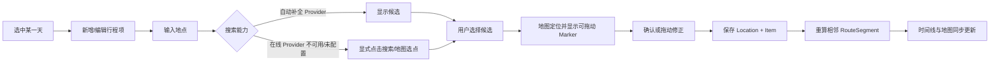
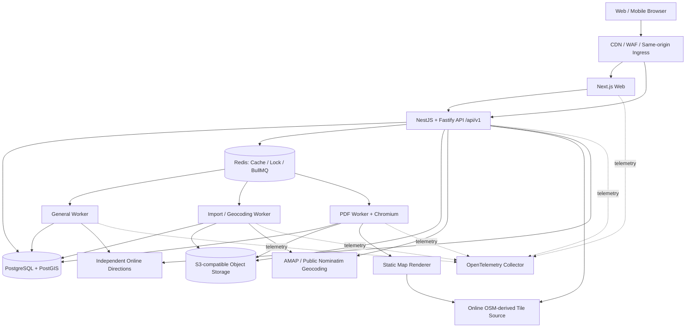
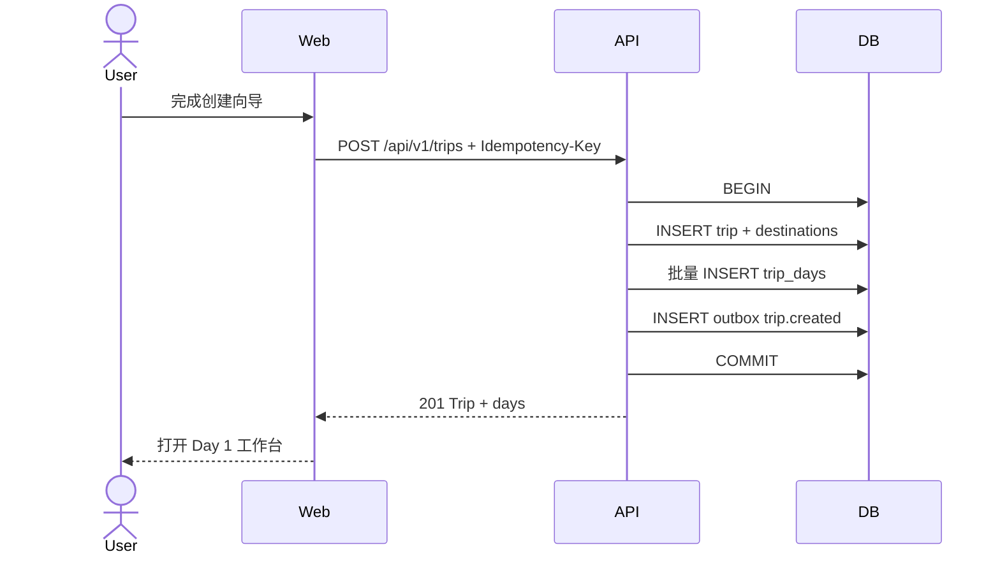
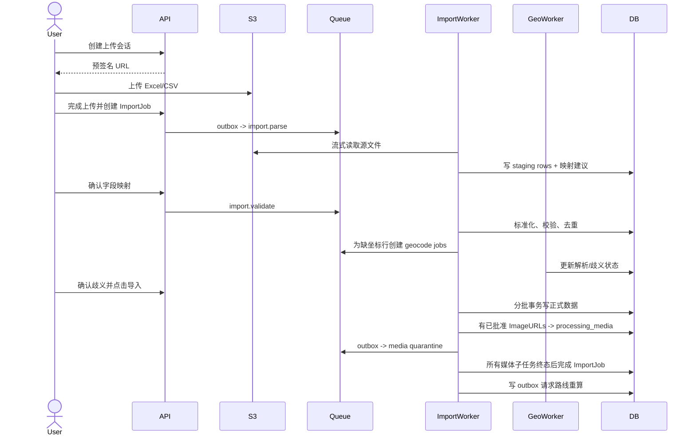
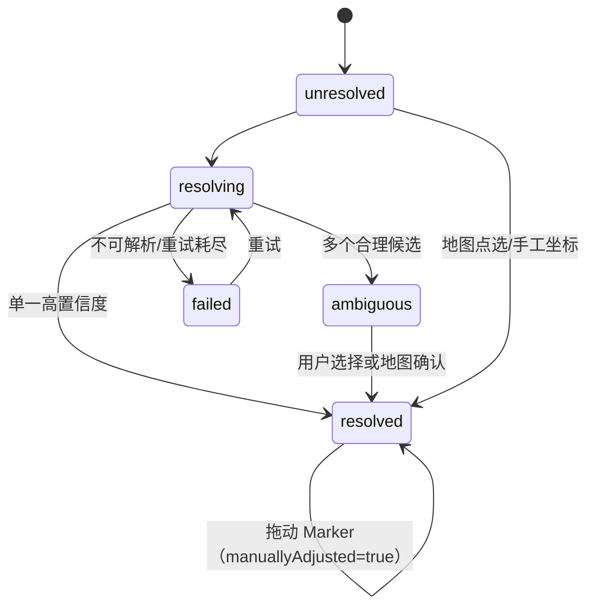
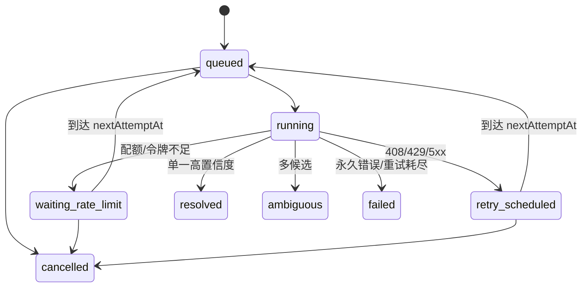
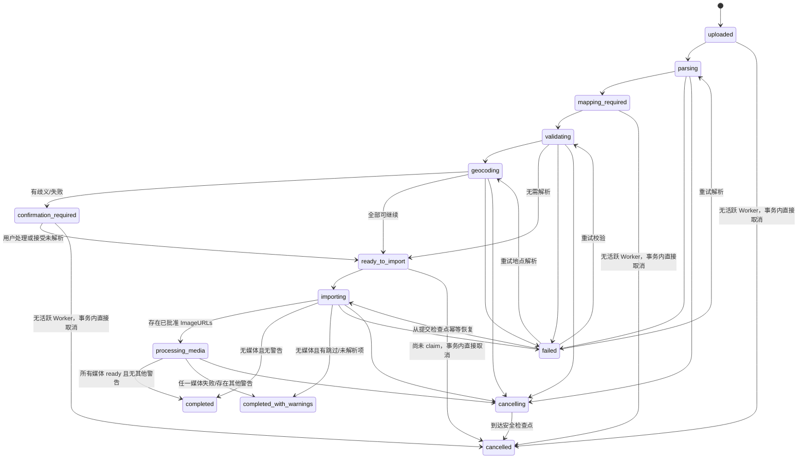
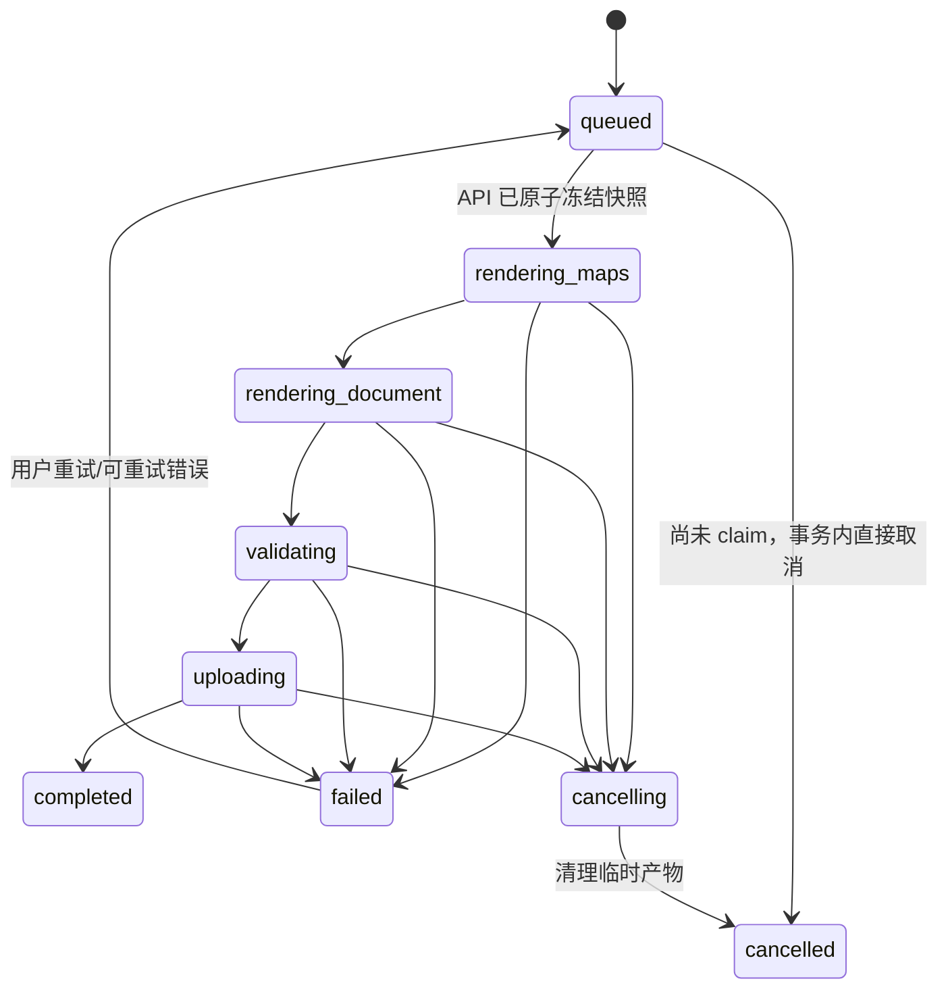
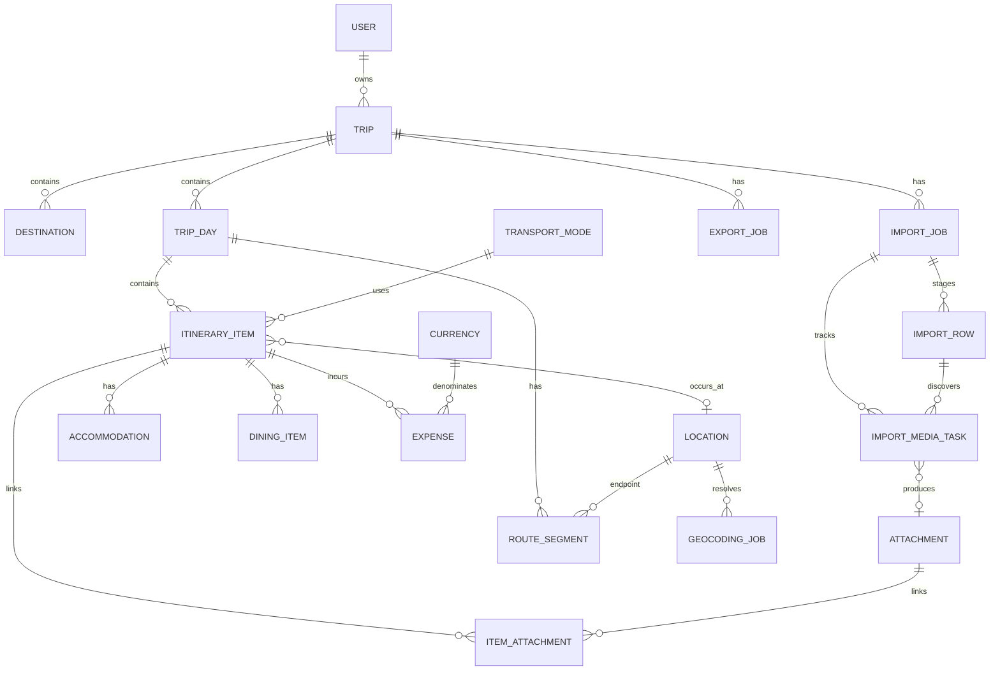

# On The Road 产品与技术设计文档

> 文档状态：已批准的 MVP 产品/架构基线；实现偏差必须通过 ADR 或计划更新记录
> 版本：0.3
> 初始日期：2026-07-26
> 状态复核：2026-08-14；M0–M4 Dev Track Gate 已完成，M5–M6 尚未宣称完成；当前成熟度见 [文档状态索引](./README.md)
> 文档范围：产品、UX 与目标技术设计；实现和 Gate 证据由计划、测试与报告文档记录。

## 0. 执行摘要

On The Road 是一个以“按天时间线 + 地图轨迹”为核心工作台的多目的地旅行规划产品。产品的最小可用闭环是：

> 创建旅行 → 自动生成每日计划 → 编辑并排序行程 → 搜索/确认地点 → 地图联动与路线生成 → 图片与费用管理 → Excel 导入 → 生成真实 PDF

推荐从“TypeScript 模块化单体 + 独立异步 Worker”起步：Next.js 负责 Web，NestJS + Fastify 负责 API，NestJS Worker 负责地理编码、路线、导入和 PDF 等耗时任务，PostgreSQL/PostGIS 保存业务和空间数据，Redis 承担队列、锁与短期缓存，S3 兼容存储保存图片、导入源文件和 PDF。开发依赖采用双轨制：macOS 日常开发默认运行本机原生服务，CI/staging 使用 Compose 验证 Linux 与发布环境等价性；生产环境按 Web、API、通用 Worker、PDF Worker 分别扩容。

设计遵循四条原则：

1. **地点先确认、路线后生成**：存在歧义或缺坐标的地点绝不静默连线。
2. **原始数据与派生数据分离**：Location、ItineraryItem、Expense 是事实；RouteSegment、统计和 PDF 是可重建派生物。
3. **外部供应商可替换**：地图展示、搜索、反向地理编码、路线和静态图均通过独立接口。
4. **耗时任务可观察、可重试、可取消**：导入、批量解析、路线和 PDF 都是显式 Job，不用假的成功提示。

---

## 1. 需求理解与必要假设

### 1.1 产品目标

目标用户是需要自行组织复杂自由行、家庭旅行或小团体旅行的人。他们需要在同一个项目中同时处理日期、地点、交通、住宿、餐饮、图片、费用和打印分享，而不是在表格、地图收藏和聊天记录之间来回切换。

产品价值不是单纯“记录行程”，而是建立三种一致视图：

- **时间视图**：每天何时、做什么、先后顺序如何。
- **空间视图**：地点在哪里、如何移动、哪些地点尚未确认。
- **交付视图**：可导入、可统计、可打印、可分享的完整旅行档案。

### 1.2 MVP 用户与权限假设

- MVP 以单个旅行所有者为主，可为同一账号保存多个 Trip。
- 数据模型从第一天保留 `owner_id` 和后续成员关系扩展点，但 MVP 不实现多人实时协作。
- MVP 先实现 Web；桌面端承担复杂映射与排版预览，手机端提供下文 §4.11 明确定义的核心闭环编辑能力。
- MVP 不连接真实机酒预订、天气、汇率或支付系统。

### 1.3 日期与天数假设

- `StartDate` 与 `EndDate` 是日历事实，`TotalDays = EndDate - StartDate + 1`。
- 需求中的“允许手动调整总天数”与“每一天都有具体日期”存在冲突。MVP 推荐通过修改结束日期调整总天数，不单独允许产生无日期的 Day。
- 如果产品必须保留手动模式，二期可增加 `day_count_mode = date_range | manual`；手动模式下必须同时定义日期跳过、重复或无日期 Day 的业务规则。
- 缩短日期范围时，如果被移除的 Day 已有内容，MVP 阻止直接提交并要求用户先“移动到其他 Day”或明确删除；二期可增加“未排期”收件箱。任何情况下都不静默删除。
- 每个 Trip 保存默认时区；跨时区行程项可单独保存 IANA 时区，显示时同时保留当地时间。
- 时间范围跨午夜时保存 `endDayOffset=1`（例如 23:00 → 次日 01:00），而不是把 01:00 判为非法或擅自换算 UTC。

### 1.4 工作日假设

- MVP 默认按周一至周五推导 `IsWorkday`，允许用户手动覆盖。
- 法定节假日、调休和跨国家工作日判断不在 MVP 自动处理；二期接入节假日日历后仍保留人工覆盖。

### 1.5 地图与坐标假设

- 数据库统一保存 WGS84（EPSG:4326）坐标。
- `dev`、`qa`、`prod` 默认使用在线地图运行时；`fixture` 只由 CI、离线回归、故障降级和确定性演示显式选择。
- 中国大陆地图供应商可能使用不同展示坐标系，转换只能发生在 Provider Adapter 内，业务层不得混用。
- 已选择且置信度足够的结果为 `resolved`；多个候选为 `ambiguous`；用户拖动或地图点选后为 `resolved + manually_adjusted`。
- 用户可保存纯文字地点，但只有两端坐标均已确认的相邻行程才生成 RouteSegment。
- 直线/弧线是无路线服务时的明确降级结果，UI 和 PDF 必须标注“示意路线”，不能伪装为真实导航路线。
- 一条 ItineraryItem 上的 `Mode` 默认解释为“从上一项到达本项的交通方式”；首项没有入站段。跨 Day 时，前一天最后一项到后一天第一项的 RouteSegment 归属到达日。这个方向必须在 Excel 模板、编辑器和 API 中保持一致。
- 全局路线可连接相邻 Day，但不会跨过一个未确认地点偷偷连接更远的两个点。
- 普通 Item 的有效终点是 `endLocation ?? location`。相邻 A→B 的入站段使用 `A.effectiveEnd → (B.startLocation ?? B.location)`。
- `item_type=transport` 且同时有 StartLocation/EndLocation 时，额外生成 `segment_kind=item_transport` 的内部段，Route 的 from/to item 都引用该 Item；相邻 connector 只在端点不同且均确认时生成，从而不重复画同一程。
- 非首项未选 Mode 时，RouteSegment 使用系统 `OTHER` 作为显式“未指定”降级并在 UI 提醒补充；交通类 Item 的内部段保存前要求选择 Mode 或确认 `OTHER`。

### 1.6 地点搜索服务假设

- 当前主动决策是移除 HERE：`cn_primary` 使用官方高德 Search/Reverse、Web JS 2.0、Directions 和 Static Map，`international_primary` 使用公共在线 Nominatim，`hybrid` 在中国使用高德、海外使用公共在线 Nominatim。
- Trip 创建时持久化 `mapProfile`。Provider 按 profile 和固定国家/边界规则决定，并把决定写入 Location/Route，不因超时、429 或空结果静默切换 Provider。
- 公共 Nominatim 通过 On The Road API 代理访问，适用于个人产品的低频显式搜索和反查；全应用遵守最多约 1 req/s、稳定 User-Agent/联系方式、缓存和 attribution 政策。
- Nominatim 不承担实时 autocomplete 或常规 Excel 批量解析。地点输入采用“提交搜索 → 候选 → 用户确认”；批量导入中的未解析地点进入受控任务和人工确认流程。
- `dev`、`qa`、`prod` 都使用在线 geocoding、在线交互式瓦片和独立在线 Directions endpoint；CI/离线运行才使用 fixture。Directions 和瓦片不是 Nominatim 能力，必须单独配置和监控。
- 在线瓦片不可用时使用本地中性网格、Marker、路线和图例，并明确标注“底图不可用 / 示意路线”；在线 Directions 不可用时只能进入 `pending/manual/approximate`，不能伪装成真实导航路线。

### 1.7 费用与汇率假设

- 金额使用十进制定点数，禁止浮点累计。
- 每笔 Expense 保存原币种；MVP 的结算币种汇率由用户手动维护。
- 汇总时保存或引用汇率快照，避免用户修改汇率后历史导出结果无解释地变化。
- `Trip.total_cost` 是查询/缓存结果，不作为独立事实由客户端写入。

### 1.8 图片与文件假设

- 图片、Excel 源文件和 PDF 从 MVP 起进入 S3 兼容对象存储；数据库只保存元数据。
- 本地开发使用 MinIO；不将 Base64 长期写入 PostgreSQL。
- MVP 默认单图不超过 15 MB、每行程 20 张、导入文件不超过 20 MB/5,000 行；均通过配置调整。
- Excel 中的远程图片 URL 不直接由 PDF Worker 任意访问，需经受控下载、SSRF 校验和对象存储归档。

### 1.9 导入与更新假设

- 导入先进入 staging，不直接写正式行程。
- MVP 默认“只新增并跳过重复”；更新已有记录需要稳定外部 ID，若文件没有外部 ID，不做模糊覆盖。
- 地理编码失败不阻断文字行程导入；未确认地点进入统一待办区，对应路线保持 `pending`。

### 1.10 PDF 假设

- PDF 由服务端 Playwright 使用专用打印 HTML 和 CSS 生成，不是浏览器截图。
- 中文字体随镜像固定安装/打包，渲染前等待字体、图片和地图资源完成。
- 导出使用创建任务时的 Trip 快照，保证任务运行期间继续编辑不会导致同一 PDF 前后页数据不一致。

---

## 2. 需要产品方确认的问题

下列问题不阻塞设计。若产品方暂未答复，研发按“推荐默认值”推进。

| # | 需确认问题 | 推荐默认值 | 不同选择的影响 |
|---|---|---|---|
| Q1 | MVP 是个人工具还是需要团队空间？ | 单账号单所有者，预留成员表 | 团队空间会增加邀请、角色、审计和行级权限 |
| Q2 | `TotalDays` 手动调整的准确语义是什么？ | 日期范围权威，修改 EndDate 调整 | 手动 Day 需定义无日期/跳日规则，并影响导出和排序 |
| Q3 | 首发市场与地图覆盖范围？ | `cn_primary` 为官方高德全链路，`international_primary` 为公共 Nominatim，`hybrid` 为中国高德/海外 Nominatim；每个 Trip 持久化 profile | 决定坐标系、服务政策、缓存/限流和测试矩阵；不做静默自动故障切换 |
| Q4 | 是否接受在线地点搜索不提供 autocomplete？ | 接受；所有环境使用显式搜索/反查，CI 使用 fixture | AMap/Nominatim 都不启用本产品的 autocomplete 交互；地点输入 UX 必须以提交搜索为主 |
| Q5 | 工作日是否需要中国法定调休和国际假日？ | MVP 周一至周五 + 人工覆盖 | 接入假日日历需国家、地区和年份数据源 |
| Q6 | Excel 导入遇到“疑似同一行程”时如何处理？ | 跳过并提示，不自动覆盖 | 自动更新需要外部 ID 或人工匹配界面 |
| Q7 | 是否允许从 ImageURLs 自动下载图片？ | 默认关闭；用户确认后受控下载 | 涉及 SSRF、版权、隐私、失败重试和存储成本 |
| Q8 | 图片/PDF 的保留周期和单项目配额？ | 原图长期；导出文件 30 天可重建 | 影响对象存储费用和生命周期策略 |
| Q9 | 是否需要公开分享链接？ | 二期 | 需要匿名访问令牌、撤销、脱敏与搜索引擎策略 |
| Q10 | 真实路线是否是 MVP 硬要求？ | `cn_primary` dev/qa/prod 使用官方 AMap Directions；不可用时明确降级 | 真实 key、配额和公网 smoke 仍是发布门禁；任何失败不得静默变成 fixture |
| Q11 | PDF 目录是否必须带准确页码？ | 必须；Sprint 0 验证实现路径，失败则采用两遍排版 | 可能需要 Paged.js/Vivliostyle 或两遍排版，但不能以不准确页码交付 |
| Q12 | 数据驻留和删除时限？ | 单区域部署；删除后 30 天内清除备份外副本 | 影响区域架构、备份、供应商与合规流程 |
| Q13 | 预期单 Trip 最大规模？ | 30 天、300 行程、1,000 图片 | 决定地图聚合、分页、PDF 切分与压测基线 |
| Q14 | 是否需要离线编辑？ | 二期 | 需本地数据库、冲突合并、附件补传和离线地图策略 |

---

## 3. 信息架构和主要用户流程

### 3.1 信息架构

```text
On The Road
├── 旅行列表
│   ├── 搜索 / 筛选 / 排序
│   ├── 新建 / 复制 / 删除
│   └── 快速导出
├── 新建旅行向导
│   ├── 基本信息
│   ├── 日期与人数
│   ├── 多目的地
│   └── 币种与预算
├── 旅行工作台
│   ├── 概览
│   ├── 行程（Day 列表 + 时间线 + 地图）
│   ├── 全局地图
│   ├── 成本
│   ├── 导入
│   ├── 导出
│   └── 设置
└── 全局任务中心
    ├── 导入任务
    ├── 地点待确认
    └── 导出任务
```

### 3.2 核心创建流程


创建 Trip 与生成所有 TripDay 必须在同一数据库事务中完成；任一步失败都不产生半成品 Trip。

### 3.3 行程编辑闭环



### 3.4 Excel 导入流程

上传文件 → 解析表头 → 自动推荐映射 → 用户调整映射 → 逐行标准化与校验 → 展示新增/更新/重复/错误 → 对缺坐标行批量解析 → 用户确认歧义地点 → 确认导入 → 分批事务写入 → 重算受影响路线。

任何解析、校验或地理编码失败都停留在 staging；候选选择和地图点选先写 `import_row.staged_location`，不提前创建正式 Location。正式 Location、Item、Expense 和 Attachment 关联只在用户点击“确认导入”后于同一 chunk 事务中创建。

Day/Date 规则：

- 有 Date 时以 Date 为权威并计算 Day；若同时填写 Day 且不一致，行报错。
- 只有 Day 时，可在 `1..TotalDays` 内根据 Trip 起始日推导 Date。
- DayOfWeek 只做一致性校验，不覆盖日期计算结果。
- IsWorkday 合法值可作为人工覆盖，否则按日期推导。
- Date 超出 Trip 范围时不静默扩展旅行；要求用户先修改 Trip 日期或跳过该行。

### 3.5 PDF 导出流程

选择模块/纸张/方向/质量 → 生成同源 HTML 预览 → 创建 ExportJob 和数据快照 → 生成静态地图 → 拉取并处理图片 → 打印排版 → 校验产物 → 保存对象存储 → 返回真实下载链接。

---

## 4. 页面结构与关键交互

### 4.1 首页 / 旅行列表

- 卡片显示封面、名称、日期、天数、目的地、预算/实际费用和未确认地点数量。
- 支持名称/目的地搜索，日期、状态和币种筛选。
- 卡片菜单提供编辑、复制、导出和删除。
- 删除必须二次确认，默认软删除并提供短时撤销。
- 空状态直接引导“创建第一个旅行”。Excel 必须导入到一个已存在的 Trip，因此导入入口在 Trip 内；首页可提供“先创建 Trip 再导入”的说明，但不能绕过归属选择。

### 4.2 新建旅行向导

- 四步向导，允许返回修改；草稿保存在服务端。
- 日期变化时即时显示将生成的 Day 数量。
- 目的地使用可排序 token 列表；此处只要求城市/区域文字即可，详细坐标可后补。
- 完成前展示摘要；提交按钮具备幂等键，避免双击创建两个 Trip。

### 4.3 旅行详情 / 行程工作台

桌面端采用三栏：

- 左栏 240–280px：Day、日期、工作日标签、地点、日费用、未确认计数。
- 中栏弹性宽度：当天时间线、行程卡片、拖拽排序、日详情。
- 右栏 36–42vw：地图、筛选、图例、全屏入口、未解析提示。

关键联动：

- 点击行程卡片：地图平滑定位并高亮 Marker。
- 点击 Marker：滚动到卡片并打开摘要。
- 点击轨迹：显示起终点、方式、出发时间、耗时、费用和备注。
- 交通方式字段显示“如何从上一站到这里”，避免用户误解为离开当前卡片的方式。
- 拖拽卡片：先在客户端预览新顺序，保存成功后重算相邻路线；失败则回滚。
- 未保存修改：表单内显示 `保存中 / 已保存 / 保存失败`；离开页面前提示未提交的大型编辑或上传。

平板改为“Day 抽屉 + 时间线/地图分屏”；手机改为底部分段导航“行程 / 地图 / 日详情”，避免狭窄三栏。

### 4.4 行程编辑器

字段分组而非长表单平铺：

1. 时间与事项：时间、Target、Desc、Duration。
2. 地点：可见 Location 输入、候选、解析状态、地图确认。
3. 交通：Mode、起点、终点、预订与联系信息。
4. 食宿：Hotel、Accommodation、Dining。
5. 费用：金额、币种、类别。
6. 图片与备注。

地点输入：

  - Nominatim 不发起逐键请求；用户完成输入后点击“搜索”才发起显式查询。300–500ms 防抖只适用于未来明确允许 autocomplete 的 Provider，不能用于公共 Nominatim。
- 候选项必须显示标准名、完整地址、国家/城市与来源。
- 候选不唯一时不预选第一项。
- 失败态固定提供：重新搜索、重新定位、地图选点、手工坐标、暂存文字。
- 纬经度默认隐藏在“高级信息”，但手动坐标入口始终可达。

### 4.5 每日 Detail

- 顶部：Day、日期、星期、工作日状态、当天目的地、日费用。
- 主体：完整时间线、食宿卡片、交通摘要、照片墙、日备注。
- 地图缩略图与当天路线可展开。
- 图片保持比例，支持排序、说明、删除、上传进度和灯箱浏览。

### 4.6 全局地图

- 筛选：全部旅程、某天、目的地、交通方式。
- Marker 使用 Day 色环 + 当日序号，避免只靠颜色表达。
- 飞机虚线弧线、步行点线、道路交通实线、船运蓝色航线、公共交通按模式配置。
- 自动适配有效坐标范围；无坐标时显示结构化空状态，不跳到世界地图默认点。
- 未解析地点固定显示在侧栏，点击直接进入确认流程。
- 全屏时仍保留返回、图例和键盘退出。

### 4.7 成本统计

- 顶部展示预算、折算后实际、剩余、汇率更新时间。
- 图表/表格维度：按天、目的地、类别、交通方式、原币种。
- 所有折算数字可回看原金额和使用的汇率。
- 缺汇率的费用不悄悄按 1:1 计算，而是进入“未折算”分组；此时顶部改为“已知实际成本”和“暂定剩余”，并明确提示剩余预算尚不可精确计算，不能用正常绿色余额造成误导。

### 4.8 Excel 导入

- 步骤条：上传 → 映射 → 校验 → 地点确认 → 导入结果。
- 预览至少显示原始值、标准化值、行状态和错误原因。
- 字段映射同时显示“源列示例值”和目标字段说明。
- 用户可选择跳过错误行，但必须确认跳过数量。
- 汇总和逐行状态必须分别显示 `新增 / 更新 / 重复 / 错误`；只有稳定 ExternalId 才允许标记为更新。
- 批量解析显示完成数、总数、限流状态和预计剩余量，不伪造精确时间。

### 4.9 PDF 导出预览

- 左侧选择包含模块、A4 方向、图片质量和地图范围。
- 右侧使用和 Worker 相同的打印模板预览。
- 选择图片时先显示 `ready / processing / failed` 数量；默认 `require_all`，所有未被用户明确拒绝/排除的图片都必须为 `ready`，`failed` 与任何非终态同样阻止导出并提供重试/等待。用户可明确选择“仅导出已就绪图片”，预览与 PDF 都必须列出全部非 ready 遗漏项，不能静默缺图。
- 显示数据快照时间、预计页数/文件大小（可标注估算）。
- 真实 ExportJob 创建后展示阶段进度；只有产物校验成功才出现下载按钮。

### 4.10 状态、无障碍与防误操作

- Loading 使用骨架或局部进度，不遮蔽整个工作台。
- Error 给出发生位置、可恢复动作和错误追踪 ID。
- Geocoding、Importing、Exporting 都有明确状态文案。
- 颜色不是唯一状态信号；Marker、路线、工作日标签同时使用形状/文字。
- 所有拖拽操作提供键盘“上移/下移”替代。
- 地图操作不会阻断使用屏幕阅读器编辑文字行程。
- TripDay 不提供直接删除：用户只能清空当天内容，或通过“日期变更预览 → 明确迁移/删除受影响内容 → 应用日期范围”调整 Day。
- 删除 Trip、Item、Attachment 使用不同强度确认；不可逆的永久删除仅在回收站中提供。

### 4.11 手机端 MVP 边界

手机端 P0 必须可完成：浏览 Trip/Day；新增、编辑、复制、删除和上下移动 Item；编辑时间、Target、Desc、Mode、Duration、Cost/Currency、Remark 等核心字段；上传/查看图片；选择地点候选；地图点选与拖动 Marker；查看任务状态并重试；使用默认选项创建 PDF 并下载。

下列高密度操作在 MVP 仅保证桌面端完整体验：Excel 任意列的复杂字段映射、大批量未确认地点表格审核、PDF 逐页版式预览。手机端仍可上传标准模板、查看导入结果/错误、逐个确认地点，以及使用已保存映射和默认 PDF 方案；遇到复杂映射时明确提示转到桌面端，而不是展示不可操作的缩小版表格。

---

## 5. 推荐总体架构

### 5.1 架构风格

MVP 采用**模块化单体 API + 可独立扩容 Worker**，而不是一开始拆微服务。

- 业务事务仍集中在一个 PostgreSQL，避免跨服务分布式事务。
- API 和 Worker 复用 domain/application 包，但以不同进程运行。
- 地理编码、路线、导入、图片处理和 PDF 通过队列隔离。
- 当某一队列达到独立的容量或安全边界时，再把对应 Worker 拆成服务。

### 5.2 逻辑组件

- **Web**：Next.js App Router、React、TypeScript。
- **API**：NestJS + Fastify，REST `/api/v1`，OpenAPI 生成客户端。
- **Worker**：NestJS Application Context + BullMQ consumers。
- **Database**：PostgreSQL + PostGIS。
- **Cache/Queue**：Redis，缓存、令牌桶、分布式锁、BullMQ。
- **Object Storage**：S3 兼容；开发 MinIO。
- **Map Client**：MapLibre GL JS（可替换 Leaflet）。
- **Providers**：Geocoding、Reverse Geocoding、Directions、Static Map 分离。
- **PDF**：Playwright Chromium + 专用打印页面 + 固定 CJK 字体。
- **Excel**：MVP 使用 SheetJS 在隔离 Worker 中解析；大文件场景可演进到 Spring Batch + Apache POI。

### 5.3 前端状态管理

- 服务端状态：TanStack Query，统一缓存键和 mutation invalidation。
- 表单：React Hook Form + Zod。
- 拖拽：dnd-kit，带键盘传感器。
- 局部 UI 状态：React state；仅地图选中项、临时编辑器状态可用小型 Zustand store。
- 不把 Trip 业务数据以 localStorage 作为事实来源；仅保存主题、面板宽度等设备偏好。

### 5.4 后端模块边界

```text
Identity
Trip
Destination
TripDay
Itinerary
Location
Routing
Attachment
Expense
Import
Export
Provider
Job
Audit
```

模块通过应用服务和 domain event 协作，不跨模块直接访问对方表的内部细节。

---

## 6. 技术选型及取舍

### 6.1 推荐栈：TypeScript 优先

| 层 | 选择 | 理由 | 主要替代 |
|---|---|---|---|
| Runtime | Node.js 26.0.0 | 前后端和 Worker 统一语言；项目统一锁定 Node 26.0.0，避免运行时漂移 | JVM 25/21 LTS（按组织基线） |
| Web | Next.js App Router + React | 路由、SSR、流式状态和成熟生态；可用 Node/Docker 部署 | Vite SPA；Nuxt |
| API | NestJS + Fastify | 模块边界、DTO/DI/OpenAPI；Fastify 适合高并发 I/O | Fastify 原生；Spring Boot |
| Data access | Drizzle + 参数化空间 SQL | 类型安全迁移；空间查询可明确审查 | Kysely；jOOQ |
| DB | PostgreSQL + PostGIS | 关系事务、JSONB 与空间索引统一 | MySQL Spatial；托管 Supabase |
| Queue/cache | Redis + BullMQ | Node 生态成熟，支持延迟、重试和队列隔离 | RabbitMQ；SQS |
| Object | S3 / MinIO | 上传、源文件、地图快照和 PDF 统一接口 | R2；OSS/COS |
| Map | MapLibre GL JS + Provider adapters | 开源展示层、矢量能力好、供应商解耦 | Leaflet；Mapbox GL |
| Excel | SheetJS Worker | 同时覆盖 xlsx/xls/csv，MVP 交付快 | Apache POI；ExcelJS |
| PDF | Playwright Node Worker | 使用真实 HTML/CSS 打印、支持 A4/页眉页脚 | Playwright Java；PrinceXML |
| UI | Tailwind CSS + Radix/shadcn 模式 | 可访问 primitives、易形成设计系统 | MUI；Ant Design |
| Observability | OpenTelemetry + Prometheus/Grafana + Sentry | 日志、指标、链路和前端错误统一关联 | Datadog；New Relic |

Node 官方建议生产应用使用 Active 或 Maintenance LTS；本项目当前统一锁定 Node 26.0.0。Nest 官方提供 FastifyAdapter，但使用 Fastify 时必须选择对应插件，不能默认假设 Express 中间件兼容。

### 6.2 为什么 MVP 不同时引入 Spring Batch、Apache POI 和 Java PDF Worker

这些技术都可行，但与 NestJS Worker 同时引入会立即形成双语言构建、部署、监控和共享契约成本。MVP 的文件规模基线（20 MB/5,000 行）用 Node Worker 足够。

建议的演进触发条件：

- Excel 超过 50,000 行、公式/复杂格式处理或组织已有成熟 JVM 平台时，迁移 Import Worker 到 Spring Batch + POI。
- PDF 日均量大、模板体系由 Java 团队维护或 Chromium 隔离需要独立平台时，迁移 PDF Worker 到 Playwright Java。
- API 契约和队列消息保持语言无关 JSON Schema，迁移不影响 Web。

### 6.3 备选栈 A：JVM 优先

- Next.js + Spring Boot WebFlux/MVC + Spring Batch + Apache POI + Playwright Java。
- PostgreSQL/PostGIS + Redis + S3。
- 优点：大型批处理、强类型服务端、企业治理成熟。
- 代价：前后端双语言、迭代速度较慢、地图前端仍需 TypeScript。
- 适用：团队已有 Java 平台、运维和批处理标准。

### 6.4 备选栈 B：精简托管型

- Next.js 全栈 + 托管 PostgreSQL/PostGIS + 托管队列 + S3/R2 + 独立 PDF Function。
- 优点：早期运维最少、适合小团队验证。
- 代价：重型 PDF/Excel 的执行时限、浏览器依赖和供应商锁定更明显。
- 适用：低流量验证版；不建议把大批量导入和 PDF 塞进短时 Edge Function。

### 6.5 MVP 与生产级差异

| 维度 | MVP | 生产级演进 |
|---|---|---|
| 架构 | 模块化单体 API + 分进程 Worker | 只按容量/安全边界拆 Worker 服务 |
| 身份 | 单所有者、基础 OIDC/开发登录 | 团队、RBAC、分享、组织审计 |
| 地图 | `dev/qa/prod` 使用在线 geocoding/tiles；`fixture` 只用于 CI/离线/降级；`mapProfile` 只决定地点 Provider | 瓦片 SLA、缓存、attribution、熔断与成本治理 |
| 路线 | 使用独立在线 Directions endpoint；不可用时标注示意线 | 非 HERE 的在线 provider、道路级质量、配额和熔断策略 |
| Excel | 20 MB/5,000 行、SheetJS Worker | Spring Batch/POI、大文件 checkpoint/partition |
| PDF | 单模板、Node Playwright、受控并发 | 浏览器池/Java Worker、多模板与更高 SLA |
| 存储 | S3/MinIO、基础生命周期 | 跨区复制、配额、版本与合规保留 |
| 可靠性 | DB Job + outbox + 重试/调和 | 多区域容灾、自动扩容和更严格 SLO |
| 可观测性 | 结构化日志、核心指标/Trace | 全量 SLO、成本/配额预测、自动化 Runbook |

---

## 7. Mermaid 总体架构图



---

### 7.1 三环境在线地图运行时

本地开发使用 `dev` profile；其 Native/Compose 运行时与 `dev` 共享在线配置。
`dev`、`qa`、`prod` 的默认能力矩阵如下；CI/离线模式不属于产品运行环境，继续使用 `fixture`：

| 能力 | dev | qa | prod | 责任边界 |
|---|---|---|---|---|
| 地点搜索/反查 | 官方 AMap Web Service（`cn_primary`） | 官方 AMap Web Service（`cn_primary`） | 官方 AMap Web Service（`cn_primary`） | API proxy、独立缓存/限流；其他 profile 保留显式 Nominatim |
| 交互式图层 | 官方 AMap JS 2.0 标准/卫星/RoadNet | 官方 AMap JS 2.0 标准/卫星/RoadNet | 官方 AMap JS 2.0 标准/卫星/RoadNet | Web 同源运行时配置；不使用未文档化 XYZ |
| 路径规划 | AMap Directions API 2.0 | AMap Directions API 2.0 | AMap Directions API 2.0 | Worker；WGS84/GCJ02 只在边界转换 |
| 静态地图/PDF | AMap Static Map 或几何降级 | AMap Static Map 或几何降级 | AMap Static Map 或几何降级 | PDF Worker 服务端调用；禁止浏览器任意 URL |

`cn_primary` 地图运行时使用 `AMAP_API_KEY`、浏览器公开的
`AMAP_JS_API_KEY`/`AMAP_JS_SECURITY_CODE`、`OTR_MAP_DEFAULT_LAYER`、
`OTR_DIRECTIONS_BASE_URL`、`OTR_STATIC_MAP_BASE_URL` 和对应 attribution。
浏览器只获得同源端点提供的 JS 配置，不获得数据库、Session 或 Web Service key。

AMap Web Service 只负责显式 Search/Reverse，Web JS 负责交互式图层，Directions 与
Static Map 分别由 Worker/PDF Worker 调用。所有请求必须遵守独立 timeout、缓存/限流、
attribution 和响应上限；Provider 失败只能进入可解释 error/degraded 状态。

## 8. 同步流程

### 8.1 请求约定

- 浏览器通过同源 `/api/v1` 访问 API。
- 身份由 OIDC Session/BFF Cookie 或短时访问令牌表达；浏览器不保存长期 API 密钥。
- 所有写请求支持 `Idempotency-Key`；可编辑资源返回 `ETag`/`version`。
- 更新请求带 `If-Match`，版本不一致返回 `409 VERSION_CONFLICT` 和最新资源摘要。
- 响应错误遵循 RFC 9457 风格 Problem Details，并包含 `traceId`。

### 8.2 创建旅行



### 8.3 保存地点与行程

- 用户选择候选后，前端提交标准化 Location 和 Item 表单。
- API 在同一事务中 upsert Location、更新 Item、标记旧相邻 RouteSegment 为 obsolete，并写 outbox。
- 对“地图拖动”请求，API 强制写 `manually_adjusted=true`、`geocoding_status=resolved`，保留原 Provider 信息和审计记录。
- API 立即返回保存后的 Item；真实路线在异步任务完成后补齐，直线预览由前端根据已确认坐标绘制。

### 8.4 排序

前端提交完整有序 ID 数组而不是逐条加减序号。API 校验所有 ID 都属于同一个 TripDay，使用事务和稀疏序号/窗口重编号更新，并写一次 `itinerary.reordered` 事件。

---

## 9. 异步流程

### 9.1 Outbox 到队列

API 事务只写业务表和 `outbox_event`。独立 Dispatcher 使用 `FOR UPDATE SKIP LOCKED` 拉取未发布事件，以不可变且符合 BullMQ 限制的 `jobId = outbox-{event.id}` 发布后标记 `published_at`（自定义 job ID 不使用冒号）。每个消费者在同一业务事务中先插入 `(consumer_name, event_id)` 到 `inbox_event`；唯一键冲突表示已经处理。`aggregate_version` 用于拒绝过期结果，`schema_version` 用于消息演进。这样同一 aggregate 的多个 chunk 事件不会因共用 eventType 而互相吞掉。

### 9.2 地理编码

1. Item 只有文字地点时创建 GeocodingJob。
2. Worker 按 Provider 令牌桶取任务。
3. 缓存命中则直接标准化；未命中才请求供应商。
4. 单一高置信度结果更新 Location 为 `resolved`。
5. 多候选更新为 `ambiguous` 并保存候选快照，等待用户选择。
6. 失败按错误类型重试；最终 `failed` 仍保留文字。
7. Job 保存创建时的非空 Location version；写回使用 `UPDATE ... WHERE version = :inputVersion AND manually_adjusted = false`，影响行数为 0 即丢弃旧响应，绝不能覆盖用户稍后拖动 Marker 的结果。
8. 地点确认事件触发相邻路线重算。

### 9.3 导入



ImageURLs 是受父 ImportJob 跟踪的最终一致子流程。解析阶段为每个 URL 持久化一条 `import_media_task(awaiting_approval)`，只保存加密 URL、URL hash、来源行和序号，不发网络请求；批准/拒绝接口以事务写入决策人和时间。Import commit 创建目标 Item 后先把获批任务关联到 Item；所有文字 chunk 完成时，在同一事务把父任务改为 `processing_media`、把关联完成的 `approved` 子任务改为 `queued` 并写逐任务 outbox。

Media Worker 按子任务 ID 重读数据库，使用 SSRF-safe fetch 下载到 quarantine，校验/扫描/生成衍生图，再关联为 `ready` Attachment；失败 URL 仍有持久化 `failed` 子任务。对本次确实入队的子任务，只有数据库中全部进入 `ready/failed` 终态，聚合器才 CAS 把父任务写为 `completed` 或 `completed_with_warnings`；`rejected/cancelled` 不计入待处理总数，但会保留原因。Redis 丢失时 reconciliation 根据 DB 状态重新投递；单 URL 在密文保留期内可用独立 endpoint 增加 retry generation，父 Job 的历史终态不被改写。单个 URL 失败不回滚文字行程；PDF 默认要求所选图片全部 `ready`，用户显式选择 ready-only 时才允许带遗漏清单导出。这样终态不会在异步失败后被非法改写。

### 9.4 PDF

1. API 在可重复读事务中验证选项和媒体完整性策略，冻结完整 Trip 快照，并计算规范化 `snapshotHash`；该哈希覆盖 Trip、Day、Item、Location、Route、Expense、Attachment 的 immutable version/checksum 及显式遗漏清单，而不只依赖 `trip.version`。
2. Worker 生成全局/每日静态地图并保存到临时对象。
3. Worker 将内部 print route 渲染成 HTML；只允许访问自身静态资源和受控对象 URL。
4. 等待 `document.fonts.ready`、图片解码和地图完成信号。
5. Playwright 按 A4、方向、页眉页脚、背景和 CSS page size 生成 PDF。
6. 校验 `%PDF`、非零页数、文件大小、关键中文文本和资源清单。
7. 成功后写 S3 及 ExportJob；失败不产生“可下载”状态。

`POST /exports` 在一个可重复读事务中生成并持久化快照、`snapshotHash` 和 `templateVersion` 后才返回 `queued` Job，因此不存在“queued 但无 snapshot”。可复用产物键为 `snapshotHash + templateVersion + optionsHash`，子实体修改一定改变快照哈希；`tripVersion` 只用于审计。`expiresAt` 只描述产物可用性，不是渲染状态：到期后 Job 仍为 `completed`，下载接口返回 `410 ARTIFACT_EXPIRED`，用户可用原选项重新导出。

### 9.5 路线重算

任何可能改变相邻关系的业务事务先原子递增受影响 Day/边界 Day 的 `route_generation`、同步把旧 Segment 标为 `obsolete`，再把期望 generation 写入 outbox；不能留下“generation 已变但旧 resolved 仍可见”的窗口。Rebuild Worker 可在事务外计算草案，但提交时必须 `FOR UPDATE` 锁定窗口 Day，确认全部 generation 仍与事件一致，然后在同一事务完成 blocker、obsolete、approximate/pending Segment 和 directions outbox；过期 rebuild 整体丢弃，不能在新结果之后写回旧 active 段。

路线应用服务的 Dispatcher 只发布 `{segmentId, sourceVersion}`；RouteSegment 的 `source_context` 持久化窗口 Day ID/generation。`sourceVersion` 覆盖窗口 `route_generation`、两端 Item ID/version/Day version/sortOrder、两端 Location ID/version/坐标、Mode、segment kind 和归属 Day。Directions Worker 必须按 ID 重读数据库；外部调用完成后的最终事务按统一顺序“排序后的 source-context Day → RouteSegment”加锁，验证 generation、真实相邻关系和 sourceVersion 后才写回，否则丢弃/标 obsolete。Rebuild 使用同一锁顺序；deadlock/serialization failure 只做带抖动的安全重试。网络调用前的检查只能节省请求，不能作为正确性门禁。Redis 中不携带可被误当成事实的完整旧 Segment。无 Location 的 Item 形成显式路线缺口且不建段，也绝不跨过它连接更远 Item。

---

## 10. 任务状态机

### 10.1 Location



Location 状态是用户可见的地点事实。UI 主标签显示它；后台 Job 的排队/限流不会把已经 resolved 的地点改回 resolving。

### 10.2 GeocodingJob



Job 状态只显示为 Location 标签旁的次级进度，例如“待处理 / 限流等待 / 第 2 次重试”；用户仍以 Location 的 `待确认 / 已确认 / 失败` 判断能否生成路线。

### 10.3 ImportJob



### 10.4 ExportJob



### 10.5 RouteSegment、Attachment 与 ImportMediaTask

| 对象 | 状态 | 说明 |
|---|---|---|
| RouteSegment | `pending` | 相邻项已知但等待坐标或队列 |
| RouteSegment | `resolving` | 正在请求 Directions |
| RouteSegment | `resolved` | 真实路线已保存 |
| RouteSegment | `manual` | 用户线路或明确的直线/弧线降级 |
| RouteSegment | `failed` | 请求耗尽；可继续显示提示 |
| RouteSegment | `obsolete` | 排序、坐标或方式变化后的旧版本 |
| Attachment | `pending_upload` | 已创建元数据，二进制未完成 |
| Attachment | `uploaded` | 等待扫描/处理 |
| Attachment | `processing` | 校验、缩略图和元数据提取 |
| Attachment | `ready` | 可以显示和导出 |
| Attachment | `failed` | 不合规或处理失败 |
| Attachment | `deleted` | 逻辑删除，等待对象清理 |
| ImportMediaTask | `awaiting_approval → approved/rejected` | 解析只登记，不下载；决定持久化 |
| ImportMediaTask | `approved → queued → fetching → quarantined → scanning → processing` | 获批且已关联正式 Item 后处理 |
| ImportMediaTask | `fetching/... → retry_scheduled → queued` | 仅瞬时错误自动退避；未耗尽前不是聚合终态 |
| ImportMediaTask | `ready / failed` | 可聚合终态；失败仍保留错误和重试次数 |
| ImportMediaTask | `failed → retry_scheduled` | 用户在 URL 保留期内显式重试；父 ImportJob 历史终态不变 |
| ImportMediaTask | `cancelling → cancelled` | 活跃处理协作式停止；尚未运行可直接取消 |

状态迁移只能由应用服务执行，客户端不得提交任意目标状态。

取消按状态处理：没有活跃 Worker 的 `uploaded/mapping_required/confirmation_required/ready_to_import/queued` 在 API 事务中直接 CAS 为 `cancelled`，并把尚未运行的子任务一并写为 `cancelled`；活跃状态才进入 `cancelling`。Worker 在每个 chunk、媒体子任务和导出阶段前后检查；只有从预期阶段且仍非 `cancelling` 时才能 CAS 到下一阶段/终态。Maintenance reconciler 定期扫描超时 `cancelling`，若无租约/活跃子任务则完成清理并写 `cancelled`，否则重新投递取消检查，因此不会永久卡住。

Import 若已提交部分 chunk，不执行危险的全量回滚；UI 必须显示 `committedRows`。`cancelled` 是终态，不能在原 Job 上“复活”；用户点击“继续剩余项”时创建带 `resumed_from_job_id` 的新 ImportJob，复用/复制尚在保留期的 staging 与未完成媒体任务，或在 staging 已清理时从保留的源文件重放并重新确认已擦除的 URL 决策。Ledger lookup 返回原 `itinerary_item_id`：命中已提交文字行时不再写 Item，但把新 Job 获批媒体 task 绑定回原 Item，确保续跑图片不会被当作未关联任务取消。Fingerprint claim 保证文字不重复。Export 收到取消后不会把取消异常写成 `failed`，会删除未完成产物并 CAS 为 `cancelled`；若上传与取消竞争，完成事务必须再次确认状态，失败方删除孤儿对象，下载接口保持不可用。

---

## 11. REST API 详细设计

### 11.1 通用规范

- Base path：`/api/v1`
- Content-Type：`application/json`；文件使用预签名直传。
- ID：普通 UUID；MVP 由 PostgreSQL `gen_random_uuid()` 生成 v4。若后续需要索引局部性，再以 ADR 统一迁移到应用层 UUIDv7。
- 绝对时间使用 RFC 3339 UTC；旅行日期使用 `YYYY-MM-DD`；Item 的 `startTime/endTime` 是其 `timeZone` 下的当地墙上时间，不能附加 `Z` 当成 UTC。
- 分页：游标 `?cursor=&limit=`，默认 20、最大 100。
- 排序：白名单字段，禁止把任意 SQL 表达式传给后端。
- API 版本演进：破坏性变更进 `/v2`；向后兼容字段只能新增，废弃字段至少保留两个客户端发布周期。
- 请求日志不得记录图片二进制、地址全文、联系方式或 Provider Key。

错误示例：

```json
{
  "type": "https://ontheroad.app/problems/version-conflict",
  "title": "资源已被其他修改覆盖",
  "status": 409,
  "code": "VERSION_CONFLICT",
  "detail": "Trip version 12 is newer than If-Match version 11.",
  "traceId": "01J...",
  "errors": []
}
```

### 11.2 Trip 与 Day

| Method | Path | 用途 |
|---|---|---|
| GET | `/trips` | 搜索/筛选旅行 |
| POST | `/trips` | 创建 Trip、Destination 和 TripDay |
| GET | `/trips/{tripId}` | 获取旅行概览 |
| PATCH | `/trips/{tripId}` | 编辑基础信息；日期变更返回 Day 影响预览 |
| POST | `/trips/{tripId}/date-change-preview` | 预览日期调整会新增/删除哪些 Day |
| POST | `/trips/{tripId}/apply-date-change` | 确认应用日期变化 |
| POST | `/trips/{tripId}/duplicate` | 复制旅行，可选附件 |
| DELETE | `/trips/{tripId}` | 软删除 |
| POST | `/trips/{tripId}/restore` | 恢复 |
| GET | `/trips/{tripId}/days` | Day 摘要列表 |
| GET | `/trips/{tripId}/days/{dayId}` | 日详情 |
| PATCH | `/trips/{tripId}/days/{dayId}` | 工作日覆盖、日封面、备注 |

创建请求示例：

```json
{
  "name": "海风与城市：上海—舟山 5 日",
  "startDate": "2026-10-01",
  "endDate": "2026-10-05",
  "travelers": 2,
  "defaultCurrency": "CNY",
  "budget": "9000.00",
  "timezone": "Asia/Shanghai",
  "mapProfile": "cn_primary",
  "destinationNames": ["上海", "舟山"]
}
```

`mapProfile` 必须是 `/system/capabilities` 返回的已配置 profile；创建时解析并持久化，后续不会因一次 Provider 超时被静默改写。

### 11.3 Destination 与 Itinerary

| Method | Path | 用途 |
|---|---|---|
| POST | `/trips/{tripId}/destinations` | 添加目的地 |
| PATCH | `/trips/{tripId}/destinations/{id}` | 编辑目的地 |
| DELETE | `/trips/{tripId}/destinations/{id}` | 删除未被引用的目的地 |
| POST | `/trips/{tripId}/days/{dayId}/items` | 新增行程 |
| GET | `/trips/{tripId}/days/{dayId}/items` | 当日有序时间线 |
| GET | `/trips/{tripId}/items/{itemId}` | 行程完整详情 |
| PATCH | `/trips/{tripId}/items/{itemId}` | 编辑行程 |
| POST | `/trips/{tripId}/items/{itemId}/duplicate` | 复制到指定 Day |
| DELETE | `/trips/{tripId}/items/{itemId}` | 软删除行程并失效相邻路线 |
| PUT | `/trips/{tripId}/days/{dayId}/items/order` | 原子重排 |
| GET | `/trips/{tripId}/transport-modes` | 系统 + 旅行内自定义方式 |
| POST | `/trips/{tripId}/transport-modes` | 新建旅行内方式 |
| PATCH | `/trips/{tripId}/transport-modes/{modeId}` | 编辑标签、图标、颜色和线型 |
| DELETE | `/trips/{tripId}/transport-modes/{modeId}` | 停用未引用的自定义方式 |

排序请求：

```json
{
  "orderedItemIds": ["019b...a", "019b...b", "019b...c"],
  "baseDayVersion": 8
}
```

### 11.4 Location、地图和路线

| Method | Path | 用途 |
|---|---|---|
| GET | `/locations/search?q=&tripId=&locale=` | 候选搜索；能力由 Provider 决定 |
| POST | `/locations/resolve` | 显式解析文字地址 |
| POST | `/locations/reverse` | 经纬度反查地址 |
| POST | `/locations` | 保存候选/地图点选结果 |
| PATCH | `/locations/{id}/coordinates` | Marker 拖动/手工修正 |
| GET | `/trips/{tripId}/map?dayId=&destinationId=` | 地图聚合数据 |
| GET | `/trips/{tripId}/unresolved-locations` | 待确认地点 |
| POST | `/geocoding-jobs/{jobId}/candidate-selection` | 选择歧义候选 |
| POST | `/geocoding-jobs/{jobId}/retry` | 重试 |
| POST | `/trips/{tripId}/routes/recalculate` | 重算范围内路线 |
| GET | `/route-segments/{id}` | 轨迹详情 |
| PATCH | `/route-segments/{id}` | 保存人工路线/备注 |

搜索响应必须返回 Provider 能力，前端据此决定是否启用自动补全：

```json
{
  "provider": "nominatim",
  "capabilities": {
    "autocomplete": false,
    "reverseGeocoding": true,
    "directions": false
  },
  "candidates": [
    {
      "candidateId": "opaque-token",
      "name": "上海迪士尼乐园",
      "formattedAddress": "中国上海市浦东新区川沙新镇",
      "country": "中国",
      "countryCode": "CN",
      "city": "上海市",
      "district": "浦东新区",
      "latitude": 31.1434,
      "longitude": 121.6570,
      "providerPlaceId": "..."
    }
  ]
}
```

`candidateId` 是短时、签名的不透明令牌；客户端不能伪造 Provider 原始字段。

### 11.5 图片与费用

| Method | Path | 用途 |
|---|---|---|
| POST | `/attachments/upload-sessions` | 创建预签名上传 |
| POST | `/attachments/{id}/complete` | 确认上传并触发处理 |
| PATCH | `/attachments/{id}` | 编辑说明 |
| DELETE | `/attachments/{id}` | 删除 |
| PUT | `/items/{itemId}/attachments/order` | 图片排序 |
| POST | `/items/{itemId}/expenses` | 新增费用 |
| PATCH | `/expenses/{id}` | 编辑费用 |
| DELETE | `/expenses/{id}` | 删除费用 |
| GET | `/trips/{tripId}/cost-summary?groupBy=` | 费用汇总 |
| PUT | `/trips/{tripId}/exchange-rates/{currency}` | 手工汇率 |

### 11.6 Import

| Method | Path | 用途 |
|---|---|---|
| GET | `/import-templates/itinerary.xlsx` | 下载标准模板 |
| POST | `/imports/upload-sessions` | 创建源文件上传 |
| POST | `/trips/{tripId}/imports` | 创建 ImportJob |
| GET | `/imports/{jobId}` | 状态与计数 |
| GET | `/imports/{jobId}/columns` | 表头、样例和映射建议 |
| PUT | `/imports/{jobId}/mapping` | 保存字段映射并校验 |
| GET | `/imports/{jobId}/rows?status=` | 分页预览 |
| POST | `/imports/{jobId}/geocode` | 批量解析缺坐标行 |
| GET | `/imports/{jobId}/unresolved` | 待确认行 |
| POST | `/imports/{jobId}/rows/{rowId}/location` | 选择/手工确认 |
| POST | `/imports/{jobId}/external-images/approval` | 批准/拒绝受控归档 ImageURLs |
| GET | `/imports/{jobId}/media-tasks` | 逐 URL 状态、错误、遗漏与重试能力 |
| POST | `/import-media-tasks/{taskId}/retry` | 幂等重试单个失败 URL |
| POST | `/imports/{jobId}/confirm` | 以幂等方式写正式数据 |
| POST | `/imports/{jobId}/retry` | 仅 `failed` Job 从记录的检查点重试 |
| POST | `/imports/{jobId}/resume` | 为 `cancelled` Job 创建续跑 Job，不复活原 Job |
| POST | `/imports/{jobId}/cancel` | 请求协作式取消；提交中返回已提交行数并在下一个安全检查点停止 |

`/imports/{jobId}/rows/{rowId}/location` 只更新 staging JSON/candidate reference；它不创建正式 Location。若 Excel 含 ImageURLs，用户需通过 `/imports/{jobId}/external-images/approval` 明确批准受控下载。Job `retry` 对非 `failed` 返回 `409 INVALID_JOB_TRANSITION`；`resume` 对非 `cancelled` 返回 409，并在源文件与 staging 均已过期时返回 `410 IMPORT_SOURCE_EXPIRED`，要求重新上传。

单 URL retry 要求 task 为 `failed` 且加密源 URL 尚在保留期；API 在事务中使用 `Idempotency-Key`，先把旧 error/attempt 摘要写审计，再原子执行 `retry_generation += 1, attempt_count = 0, next_attempt_at = now(), error_* = null, version += 1, status = retry_scheduled` 并写 outbox。`attempt_count` 是当前 generation 的预算，Worker 每次尝试同时递增它与只增不减的 `lifetime_attempt_count`。其他状态返回 `409 MEDIA_TASK_NOT_RETRYABLE`，ciphertext 已擦除返回 `410 MEDIA_SOURCE_EXPIRED`。父 ImportJob 保持 `completed_with_warnings` 这一历史终态；task 成功后 UI 将对应 warning 标为“已修复”，Attachment 可被后续 PDF 使用。

### 11.7 Export

| Method | Path | 用途 |
|---|---|---|
| POST | `/trips/{tripId}/exports/preview` | 生成同模板预览 |
| POST | `/trips/{tripId}/exports` | 创建 ExportJob |
| GET | `/exports/{jobId}` | 状态、阶段、进度和错误 |
| GET | `/exports/{jobId}/events` | SSE 状态更新 |
| GET | `/exports/{jobId}/download` | 302 到短时签名 URL |
| POST | `/exports/{jobId}/retry` | 重试 |
| POST | `/exports/{jobId}/cancel` | 取消 |

创建导出请求：

```json
{
  "format": "A4",
  "orientation": "portrait",
  "include": {
    "cover": true,
    "overview": true,
    "globalMap": true,
    "dailyMaps": true,
    "images": true,
    "costs": true,
    "remarks": true
  },
  "imageQuality": "print",
  "imageReadinessPolicy": "require_all",
  "mapScope": "all"
}
```

`imageReadinessPolicy=require_all` 时，只要所选范围内任何未明确排除的媒体 task/Attachment `status != ready`（包括 `failed` 及全部等待/处理中状态）就返回 `409 MEDIA_NOT_READY` 与各状态计数。只有用户显式改为 `ready_only` 才创建快照；此时 `ExportJob.warnings` 和 PDF“未包含资源”清单固定记录所有非 ready 图片的状态、数量与来源 Item。`exclude` 则等价于 `include.images=false`。

### 11.8 任务进度与健康检查

- Job 查询返回 `stage`、`completedUnits`、`totalUnits`、`retryable`、`warnings`、`lastErrorCode`，不声称无法准确测量的百分比。
- `/health/live` 仅检查进程；`/health/ready` 检查 DB/Redis 和必要配置，不把第三方地图短暂故障变成实例重启风暴。
- Provider 能力和降级状态由 `/api/v1/system/capabilities` 返回。

---

## 12. 数据模型与实体关系

### 12.1 核心关系



### 12.2 建模原则

- TransportMode、Currency、CostCategory 使用集中 lookup/config，不散落硬编码；允许 trip 级自定义 Mode。
- `Location` 是规范化并可复用的地点事实，ItineraryItem 不重复保存经纬度。
- `Accommodation`、`DiningItem`、`Expense` 独立建模，以支持一条行程多个费用/餐饮及后续统计。
- `RouteSegment` 引用相邻 Item 与两端 Location，并保存生成时两端版本；坐标变化后旧段进入 `obsolete`。
- 附件采用关联表，可在 Item、Day 封面和 Trip 封面之间复用。
- 任务表保存用户可见状态；BullMQ 不是业务状态唯一来源。

### 12.3 PostgreSQL / PostGIS SQL DDL

以下是逻辑完整的基线 DDL。正式实现应拆成有序 migration，并为开发/测试提供种子数据。

```sql
CREATE EXTENSION IF NOT EXISTS postgis;
CREATE EXTENSION IF NOT EXISTS pgcrypto;

CREATE TABLE app_user (
  id uuid PRIMARY KEY DEFAULT gen_random_uuid(),
  email text NOT NULL UNIQUE,
  display_name text,
  created_at timestamptz NOT NULL DEFAULT now(),
  updated_at timestamptz NOT NULL DEFAULT now()
);

CREATE TABLE currency (
  code varchar(3) PRIMARY KEY,
  name text NOT NULL,
  symbol text,
  decimals smallint NOT NULL DEFAULT 2 CHECK (decimals BETWEEN 0 AND 6),
  enabled boolean NOT NULL DEFAULT true
);

CREATE TABLE cost_category (
  code text PRIMARY KEY,
  label text NOT NULL,
  icon_key text NOT NULL,
  enabled boolean NOT NULL DEFAULT true
);

CREATE TABLE trip (
  id uuid PRIMARY KEY DEFAULT gen_random_uuid(),
  owner_id uuid NOT NULL REFERENCES app_user(id),
  name text NOT NULL CHECK (char_length(name) BETWEEN 1 AND 160),
  start_date date NOT NULL,
  end_date date NOT NULL CHECK (end_date >= start_date),
  total_days integer
    GENERATED ALWAYS AS ((end_date - start_date) + 1) STORED,
  travelers smallint NOT NULL DEFAULT 1 CHECK (travelers BETWEEN 1 AND 999),
  default_currency varchar(3) NOT NULL REFERENCES currency(code),
  budget numeric(18,2) CHECK (budget IS NULL OR budget >= 0),
  timezone text NOT NULL DEFAULT 'UTC',
  map_profile text NOT NULL DEFAULT 'cn_primary',
  description text,
  cover_attachment_id uuid,
  status text NOT NULL DEFAULT 'active'
    CHECK (status IN ('draft','active','archived','deleted')),
  version integer NOT NULL DEFAULT 1,
  created_at timestamptz NOT NULL DEFAULT now(),
  updated_at timestamptz NOT NULL DEFAULT now(),
  deleted_at timestamptz
);

CREATE INDEX trip_owner_status_idx ON trip(owner_id, status, updated_at DESC);

CREATE TABLE transport_mode (
  id uuid PRIMARY KEY DEFAULT gen_random_uuid(),
  trip_id uuid REFERENCES trip(id) ON DELETE CASCADE,
  owner_user_id uuid REFERENCES app_user(id),
  code text NOT NULL,
  label text NOT NULL,
  icon_key text NOT NULL,
  color varchar(9) NOT NULL,
  line_style text NOT NULL CHECK (line_style IN ('solid','dashed','dotted','arc')),
  is_system boolean NOT NULL DEFAULT false,
  enabled boolean NOT NULL DEFAULT true,
  created_at timestamptz NOT NULL DEFAULT now(),
  CHECK (
    (is_system AND trip_id IS NULL AND owner_user_id IS NULL) OR
    (NOT is_system AND trip_id IS NOT NULL AND owner_user_id IS NOT NULL)
  )
);

CREATE UNIQUE INDEX transport_mode_system_code_uq
  ON transport_mode(code) WHERE is_system;
CREATE UNIQUE INDEX transport_mode_trip_code_uq
  ON transport_mode(trip_id, code) WHERE NOT is_system;

CREATE TABLE destination (
  id uuid PRIMARY KEY DEFAULT gen_random_uuid(),
  trip_id uuid NOT NULL REFERENCES trip(id) ON DELETE CASCADE,
  name text NOT NULL,
  country_code varchar(2),
  city text,
  region text,
  sort_order integer NOT NULL,
  location_id uuid,
  created_at timestamptz NOT NULL DEFAULT now(),
  updated_at timestamptz NOT NULL DEFAULT now(),
  UNIQUE (trip_id, sort_order)
);

CREATE TABLE trip_day (
  id uuid PRIMARY KEY DEFAULT gen_random_uuid(),
  trip_id uuid NOT NULL REFERENCES trip(id) ON DELETE CASCADE,
  day_number integer NOT NULL CHECK (day_number > 0),
  local_date date NOT NULL,
  is_workday boolean NOT NULL,
  workday_source text NOT NULL DEFAULT 'derived'
    CHECK (workday_source IN ('derived','manual','calendar_provider')),
  primary_destination_id uuid REFERENCES destination(id) ON DELETE SET NULL,
  cover_attachment_id uuid,
  remark text,
  version integer NOT NULL DEFAULT 1,
  route_generation bigint NOT NULL DEFAULT 0 CHECK (route_generation >= 0),
  created_at timestamptz NOT NULL DEFAULT now(),
  updated_at timestamptz NOT NULL DEFAULT now(),
  UNIQUE (trip_id, day_number),
  UNIQUE (trip_id, local_date)
);

CREATE TABLE location (
  id uuid PRIMARY KEY DEFAULT gen_random_uuid(),
  trip_id uuid NOT NULL REFERENCES trip(id) ON DELETE CASCADE,
  owner_id uuid NOT NULL REFERENCES app_user(id),
  input_text text NOT NULL,
  name text NOT NULL,
  formatted_address text,
  country text,
  country_code varchar(2),
  province text,
  city text,
  district text,
  geom geometry(Point, 4326),
  provider text NOT NULL DEFAULT 'none',
  provider_place_id text,
  source_crs text NOT NULL DEFAULT 'EPSG:4326'
    CHECK (source_crs IN ('EPSG:4326','GCJ02','BD09')),
  geocoding_status text NOT NULL DEFAULT 'unresolved'
    CHECK (geocoding_status IN
      ('unresolved','resolving','resolved','ambiguous','failed')),
  confidence numeric(5,4) CHECK (confidence IS NULL OR confidence BETWEEN 0 AND 1),
  manually_adjusted boolean NOT NULL DEFAULT false,
  provider_payload jsonb,
  version integer NOT NULL DEFAULT 1,
  created_at timestamptz NOT NULL DEFAULT now(),
  updated_at timestamptz NOT NULL DEFAULT now(),
  CHECK (
    geom IS NULL OR (
      ST_SRID(geom) = 4326
      AND ST_Y(geom) BETWEEN -90 AND 90
      AND ST_X(geom) BETWEEN -180 AND 180
    )
  ),
  CHECK (geocoding_status <> 'resolved' OR geom IS NOT NULL),
  CHECK (NOT manually_adjusted OR (geocoding_status = 'resolved' AND geom IS NOT NULL))
);

CREATE INDEX location_geom_gist_idx ON location USING GIST (geom);
CREATE INDEX location_trip_status_idx ON location(trip_id, geocoding_status);
CREATE INDEX location_trip_provider_place_idx
  ON location(trip_id, provider, provider_place_id)
  WHERE provider_place_id IS NOT NULL;

ALTER TABLE destination
  ADD CONSTRAINT destination_location_fk
  FOREIGN KEY (location_id) REFERENCES location(id) ON DELETE SET NULL;

CREATE TABLE itinerary_item (
  id uuid PRIMARY KEY DEFAULT gen_random_uuid(),
  trip_id uuid NOT NULL REFERENCES trip(id) ON DELETE CASCADE,
  trip_day_id uuid NOT NULL REFERENCES trip_day(id) ON DELETE CASCADE,
  item_type text NOT NULL DEFAULT 'activity'
    CHECK (item_type IN ('activity','attraction','dining','hotel','transport','other')),
  time_kind text NOT NULL DEFAULT 'unscheduled'
    CHECK (time_kind IN ('clock','range','period','unscheduled')),
  start_time time,
  end_time time,
  end_day_offset smallint NOT NULL DEFAULT 0 CHECK (end_day_offset IN (0,1)),
  time_zone text,
  time_period text CHECK (time_period IS NULL OR time_period IN (
    'early_morning','morning','noon','afternoon',
    'evening','night','late_night'
  )),
  target text,
  description text,
  duration_minutes integer CHECK (duration_minutes IS NULL OR duration_minutes >= 0),
  destination_id uuid REFERENCES destination(id) ON DELETE SET NULL,
  location_id uuid REFERENCES location(id) ON DELETE SET NULL,
  start_location_id uuid REFERENCES location(id) ON DELETE SET NULL,
  end_location_id uuid REFERENCES location(id) ON DELETE SET NULL,
  transport_mode_id uuid REFERENCES transport_mode(id),
  booking_info text,
  contact_info_ciphertext bytea,
  contact_info_key_version text,
  remark text,
  external_source text,
  external_id text,
  sort_order integer NOT NULL,
  version integer NOT NULL DEFAULT 1,
  created_at timestamptz NOT NULL DEFAULT now(),
  updated_at timestamptz NOT NULL DEFAULT now(),
  deleted_at timestamptz,
  CHECK (
    coalesce(nullif(btrim(target), ''), nullif(btrim(description), '')) IS NOT NULL
  ),
  CHECK (
    end_day_offset = 1 OR end_time IS NULL OR start_time IS NULL OR end_time >= start_time
  ),
  CHECK (time_kind = 'range' OR end_day_offset = 0),
  CHECK (
    (time_kind = 'clock' AND start_time IS NOT NULL) OR
    (time_kind = 'range' AND start_time IS NOT NULL AND end_time IS NOT NULL) OR
    (time_kind = 'period' AND time_period IS NOT NULL) OR
    (time_kind = 'unscheduled')
  )
);

CREATE UNIQUE INDEX itinerary_day_order_uq
  ON itinerary_item(trip_day_id, sort_order)
  WHERE deleted_at IS NULL;
CREATE INDEX itinerary_location_idx ON itinerary_item(location_id);
CREATE UNIQUE INDEX itinerary_external_id_uq
  ON itinerary_item(trip_id, external_source, external_id)
  WHERE external_source IS NOT NULL
    AND external_id IS NOT NULL
    AND deleted_at IS NULL;

CREATE TABLE accommodation (
  id uuid PRIMARY KEY DEFAULT gen_random_uuid(),
  itinerary_item_id uuid NOT NULL REFERENCES itinerary_item(id) ON DELETE CASCADE,
  location_id uuid REFERENCES location(id) ON DELETE SET NULL,
  name text NOT NULL,
  details text,
  check_in_at timestamptz,
  check_out_at timestamptz,
  booking_info text,
  contact_info_ciphertext bytea,
  contact_info_key_version text,
  created_at timestamptz NOT NULL DEFAULT now()
);

CREATE TABLE dining_item (
  id uuid PRIMARY KEY DEFAULT gen_random_uuid(),
  itinerary_item_id uuid NOT NULL REFERENCES itinerary_item(id) ON DELETE CASCADE,
  meal_type text CHECK (meal_type IN ('breakfast','lunch','dinner','snack','other')),
  name text NOT NULL,
  details text,
  location_id uuid REFERENCES location(id) ON DELETE SET NULL,
  created_at timestamptz NOT NULL DEFAULT now()
);

CREATE TABLE trip_exchange_rate (
  trip_id uuid NOT NULL REFERENCES trip(id) ON DELETE CASCADE,
  from_currency varchar(3) NOT NULL REFERENCES currency(code),
  to_currency varchar(3) NOT NULL REFERENCES currency(code),
  rate numeric(24,10) NOT NULL CHECK (rate > 0),
  source text NOT NULL DEFAULT 'manual',
  effective_at timestamptz NOT NULL DEFAULT now(),
  updated_at timestamptz NOT NULL DEFAULT now(),
  PRIMARY KEY (trip_id, from_currency, to_currency)
);

CREATE TABLE expense (
  id uuid PRIMARY KEY DEFAULT gen_random_uuid(),
  trip_id uuid NOT NULL REFERENCES trip(id) ON DELETE CASCADE,
  trip_day_id uuid REFERENCES trip_day(id) ON DELETE CASCADE,
  itinerary_item_id uuid REFERENCES itinerary_item(id) ON DELETE CASCADE,
  destination_id uuid REFERENCES destination(id) ON DELETE SET NULL,
  category_code text NOT NULL REFERENCES cost_category(code),
  transport_mode_id uuid REFERENCES transport_mode(id),
  amount numeric(18,2) NOT NULL CHECK (amount >= 0),
  currency varchar(3) NOT NULL REFERENCES currency(code),
  settlement_amount numeric(18,2),
  settlement_currency varchar(3) REFERENCES currency(code),
  exchange_rate numeric(24,10),
  remark text,
  incurred_at timestamptz,
  created_at timestamptz NOT NULL DEFAULT now(),
  updated_at timestamptz NOT NULL DEFAULT now(),
  CHECK (
    (settlement_amount IS NULL AND exchange_rate IS NULL) OR
    (settlement_amount IS NOT NULL AND settlement_currency IS NOT NULL AND exchange_rate > 0)
  )
);

CREATE INDEX expense_trip_day_idx ON expense(trip_id, trip_day_id);
CREATE INDEX expense_trip_category_idx ON expense(trip_id, category_code);

CREATE TABLE route_segment (
  id uuid PRIMARY KEY DEFAULT gen_random_uuid(),
  trip_day_id uuid NOT NULL REFERENCES trip_day(id) ON DELETE CASCADE,
  segment_kind text NOT NULL DEFAULT 'between_items'
    CHECK (segment_kind IN ('between_items','item_transport')),
  from_itinerary_item_id uuid NOT NULL REFERENCES itinerary_item(id) ON DELETE CASCADE,
  to_itinerary_item_id uuid NOT NULL REFERENCES itinerary_item(id) ON DELETE CASCADE,
  from_location_id uuid NOT NULL REFERENCES location(id),
  to_location_id uuid NOT NULL REFERENCES location(id),
  transport_mode_id uuid NOT NULL REFERENCES transport_mode(id),
  departure_time timestamptz,
  duration_minutes integer CHECK (duration_minutes IS NULL OR duration_minutes >= 0),
  distance_meters integer CHECK (distance_meters IS NULL OR distance_meters >= 0),
  cost numeric(18,2) CHECK (cost IS NULL OR cost >= 0),
  currency varchar(3) REFERENCES currency(code),
  route_geometry geometry(Geometry, 4326),
  route_provider text,
  provider_route_id text,
  route_quality text NOT NULL DEFAULT 'unknown'
    CHECK (route_quality IN ('actual','approximate','manual','unknown')),
  status text NOT NULL DEFAULT 'pending'
    CHECK (status IN ('pending','resolving','resolved','failed','manual','obsolete')),
  source_version text NOT NULL,
  source_context jsonb NOT NULL,
  remark text,
  created_at timestamptz NOT NULL DEFAULT now(),
  updated_at timestamptz NOT NULL DEFAULT now(),
  CHECK (
    (segment_kind = 'between_items' AND from_itinerary_item_id <> to_itinerary_item_id) OR
    (segment_kind = 'item_transport' AND from_itinerary_item_id = to_itinerary_item_id)
  )
);

CREATE INDEX route_day_idx ON route_segment(trip_day_id, status);
CREATE INDEX route_geometry_gist_idx ON route_segment USING GIST (route_geometry);
CREATE UNIQUE INDEX route_active_pair_uq
  ON route_segment(
    trip_day_id, segment_kind, from_itinerary_item_id, to_itinerary_item_id
  )
  WHERE status <> 'obsolete';

CREATE TABLE attachment (
  id uuid PRIMARY KEY DEFAULT gen_random_uuid(),
  owner_id uuid NOT NULL REFERENCES app_user(id),
  storage_provider text NOT NULL,
  bucket text NOT NULL,
  object_key text NOT NULL,
  object_version text,
  original_filename text NOT NULL,
  content_type text NOT NULL,
  byte_size bigint CHECK (byte_size IS NULL OR byte_size >= 0),
  checksum_sha256 text,
  width integer,
  height integer,
  caption text,
  alt_text text,
  status text NOT NULL DEFAULT 'pending_upload'
    CHECK (status IN ('pending_upload','uploaded','processing','ready','failed','deleted')),
  created_at timestamptz NOT NULL DEFAULT now(),
  updated_at timestamptz NOT NULL DEFAULT now(),
  deleted_at timestamptz,
  UNIQUE (bucket, object_key),
  CHECK (
    status <> 'ready' OR (
      object_version IS NOT NULL
      AND checksum_sha256 IS NOT NULL
      AND byte_size IS NOT NULL
    )
  )
);

ALTER TABLE trip
  ADD CONSTRAINT trip_cover_attachment_fk
  FOREIGN KEY (cover_attachment_id) REFERENCES attachment(id) ON DELETE SET NULL;
ALTER TABLE trip_day
  ADD CONSTRAINT trip_day_cover_attachment_fk
  FOREIGN KEY (cover_attachment_id) REFERENCES attachment(id) ON DELETE SET NULL;

CREATE TABLE item_attachment (
  itinerary_item_id uuid NOT NULL REFERENCES itinerary_item(id) ON DELETE CASCADE,
  attachment_id uuid NOT NULL REFERENCES attachment(id) ON DELETE CASCADE,
  sort_order integer NOT NULL,
  is_cover boolean NOT NULL DEFAULT false,
  PRIMARY KEY (itinerary_item_id, attachment_id),
  UNIQUE (itinerary_item_id, sort_order)
);

CREATE TABLE import_job (
  id uuid PRIMARY KEY DEFAULT gen_random_uuid(),
  trip_id uuid NOT NULL REFERENCES trip(id) ON DELETE CASCADE,
  resumed_from_job_id uuid REFERENCES import_job(id) ON DELETE SET NULL,
  created_by uuid NOT NULL REFERENCES app_user(id),
  source_attachment_id uuid NOT NULL REFERENCES attachment(id),
  source_sha256 text NOT NULL,
  importer_type text NOT NULL
    CHECK (importer_type IN ('xlsx','xls','csv','pdf','image','text','ai')),
  importer_version text NOT NULL,
  mapping jsonb,
  mapping_hash text,
  status text NOT NULL CHECK (status IN (
    'uploaded','parsing','mapping_required','validating','geocoding',
    'confirmation_required','ready_to_import','importing','processing_media',
    'completed','completed_with_warnings','failed','cancelling','cancelled'
  )),
  stage text NOT NULL,
  total_rows integer NOT NULL DEFAULT 0 CHECK (total_rows >= 0),
  valid_rows integer NOT NULL DEFAULT 0 CHECK (valid_rows >= 0),
  new_rows integer NOT NULL DEFAULT 0 CHECK (new_rows >= 0),
  update_rows integer NOT NULL DEFAULT 0 CHECK (update_rows >= 0),
  duplicate_rows integer NOT NULL DEFAULT 0 CHECK (duplicate_rows >= 0),
  error_rows integer NOT NULL DEFAULT 0 CHECK (error_rows >= 0),
  unresolved_rows integer NOT NULL DEFAULT 0 CHECK (unresolved_rows >= 0),
  committed_rows integer NOT NULL DEFAULT 0 CHECK (committed_rows >= 0),
  error_code text,
  error_detail text,
  idempotency_key text NOT NULL,
  created_at timestamptz NOT NULL DEFAULT now(),
  updated_at timestamptz NOT NULL DEFAULT now(),
  completed_at timestamptz,
  UNIQUE (trip_id, idempotency_key)
);

CREATE INDEX import_job_trip_idx ON import_job(trip_id, created_at DESC);

CREATE TABLE import_row (
  id uuid PRIMARY KEY DEFAULT gen_random_uuid(),
  import_job_id uuid NOT NULL REFERENCES import_job(id) ON DELETE CASCADE,
  sheet_name text NOT NULL,
  row_number integer NOT NULL,
  source_row_key text NOT NULL,
  raw_data jsonb NOT NULL,
  normalized_data jsonb,
  fingerprint text,
  status text NOT NULL
    CHECK (status IN (
      'pending','new','update','duplicate','error',
      'unresolved','ready','imported','skipped'
    )),
  errors jsonb NOT NULL DEFAULT '[]'::jsonb,
  staged_location jsonb,
  imported_item_id uuid REFERENCES itinerary_item(id),
  created_at timestamptz NOT NULL DEFAULT now(),
  UNIQUE (import_job_id, sheet_name, row_number),
  UNIQUE (import_job_id, source_row_key)
);

CREATE INDEX import_row_job_status_idx ON import_row(import_job_id, status, row_number);

CREATE TABLE import_media_task (
  id uuid PRIMARY KEY DEFAULT gen_random_uuid(),
  import_job_id uuid NOT NULL REFERENCES import_job(id) ON DELETE CASCADE,
  -- 下列三个 ID 故意不设 FK：staging/Item/Attachment 的清理不能抹掉
  -- URL 任务审计；Repository 仍校验同 Trip，原对象删除后保留历史 ID。
  import_row_id uuid NOT NULL,
  source_row_key text NOT NULL,
  itinerary_item_id uuid,
  attachment_id uuid,
  url_ordinal integer NOT NULL CHECK (url_ordinal >= 0),
  source_url_sha256 text NOT NULL,
  source_url_ciphertext bytea,
  status text NOT NULL CHECK (status IN (
    'awaiting_approval','approved','rejected','queued','fetching',
    'quarantined','scanning','processing','retry_scheduled','ready','failed',
    'cancelling','cancelled'
  )),
  decision_by uuid REFERENCES app_user(id),
  decided_at timestamptz,
  cancelled_by uuid REFERENCES app_user(id),
  cancelled_actor text,
  cancelled_at timestamptz,
  attempt_count integer NOT NULL DEFAULT 0 CHECK (attempt_count >= 0),
  lifetime_attempt_count integer NOT NULL DEFAULT 0 CHECK (lifetime_attempt_count >= 0),
  retry_generation integer NOT NULL DEFAULT 0 CHECK (retry_generation >= 0),
  max_attempts integer NOT NULL DEFAULT 4 CHECK (max_attempts > 0),
  next_attempt_at timestamptz,
  lease_owner text,
  lease_token uuid,
  lease_expires_at timestamptz,
  version integer NOT NULL DEFAULT 1,
  error_code text,
  error_detail text,
  created_at timestamptz NOT NULL DEFAULT now(),
  updated_at timestamptz NOT NULL DEFAULT now(),
  completed_at timestamptz,
  UNIQUE (import_job_id, source_row_key, url_ordinal),
  CHECK (
    (status = 'awaiting_approval' AND decision_by IS NULL AND decided_at IS NULL) OR
    (status = 'cancelled'
      AND (
        (decision_by IS NULL AND decided_at IS NULL)
        OR
        (decision_by IS NOT NULL AND decided_at IS NOT NULL)
      )) OR
    (status NOT IN ('awaiting_approval','cancelled')
      AND decision_by IS NOT NULL
      AND decided_at IS NOT NULL)
  ),
  CHECK (
    (status = 'cancelled' AND cancelled_actor IS NOT NULL AND cancelled_at IS NOT NULL) OR
    (status <> 'cancelled'
      AND cancelled_by IS NULL
      AND cancelled_actor IS NULL
      AND cancelled_at IS NULL)
  ),
  CHECK (status <> 'ready' OR attachment_id IS NOT NULL),
  CHECK (
    status IN ('ready','failed','rejected','cancelled') OR
    source_url_ciphertext IS NOT NULL
  ),
  CHECK (
    status IN ('awaiting_approval','approved','rejected','cancelled') OR
    itinerary_item_id IS NOT NULL
  ),
  CHECK (
    (status IN ('fetching','quarantined','scanning','processing')
      AND lease_owner IS NOT NULL
      AND lease_token IS NOT NULL
      AND lease_expires_at IS NOT NULL)
    OR
    (status = 'cancelling'
      AND (
        (lease_owner IS NOT NULL AND lease_token IS NOT NULL AND lease_expires_at IS NOT NULL)
        OR
        (lease_owner IS NULL AND lease_token IS NULL AND lease_expires_at IS NULL)
      ))
    OR
    (status NOT IN ('fetching','quarantined','scanning','processing','cancelling')
      AND lease_owner IS NULL
      AND lease_token IS NULL
      AND lease_expires_at IS NULL)
  )
);

CREATE INDEX import_media_task_job_status_idx
  ON import_media_task(import_job_id, status, next_attempt_at);

CREATE TABLE import_commit_ledger (
  id uuid PRIMARY KEY DEFAULT gen_random_uuid(),
  trip_id uuid NOT NULL REFERENCES trip(id) ON DELETE CASCADE,
  import_job_id uuid NOT NULL,
  import_row_id uuid NOT NULL,
  itinerary_item_id uuid REFERENCES itinerary_item(id) ON DELETE SET NULL,
  source_sha256 text NOT NULL,
  importer_version text NOT NULL,
  mapping_hash text NOT NULL,
  source_row_key text NOT NULL,
  row_fingerprint text NOT NULL,
  decision_scope text NOT NULL DEFAULT 'default',
  override_decision_id uuid,
  override_reason text,
  action text NOT NULL CHECK (action IN ('insert','update','skip')),
  committed_at timestamptz NOT NULL DEFAULT now(),
  CHECK (action = 'skip' OR itinerary_item_id IS NOT NULL),
  CHECK (
    (decision_scope = 'default'
      AND override_decision_id IS NULL
      AND override_reason IS NULL)
    OR
    (decision_scope LIKE 'override:%'
      AND override_decision_id IS NOT NULL
      AND override_reason IS NOT NULL)
  ),
  UNIQUE (
    trip_id, source_sha256, importer_version, mapping_hash,
    source_row_key, decision_scope
  ),
  UNIQUE (import_job_id, import_row_id, decision_scope)
);

CREATE INDEX import_commit_ledger_trip_fingerprint_idx
  ON import_commit_ledger(trip_id, row_fingerprint, committed_at DESC);

-- 默认导入路径必须先原子占用 trip-wide fingerprint。不同源文件的并发
-- ImportJob 只能有一个获得 'default' claim；显式允许重复时使用经审计的
-- 'override:<decision-id>'，因此不会意外绕过唯一约束。
CREATE TABLE import_fingerprint_claim (
  id uuid PRIMARY KEY DEFAULT gen_random_uuid(),
  trip_id uuid NOT NULL REFERENCES trip(id) ON DELETE CASCADE,
  row_fingerprint text NOT NULL,
  claim_scope text NOT NULL DEFAULT 'default',
  override_decision_id uuid UNIQUE,
  import_job_id uuid NOT NULL,
  import_row_id uuid NOT NULL,
  itinerary_item_id uuid REFERENCES itinerary_item(id) ON DELETE SET NULL,
  override_reason text,
  claimed_at timestamptz NOT NULL DEFAULT now(),
  CHECK (
    (claim_scope = 'default' AND override_decision_id IS NULL AND override_reason IS NULL) OR
    (claim_scope LIKE 'override:%' AND override_decision_id IS NOT NULL AND override_reason IS NOT NULL)
  ),
  UNIQUE (trip_id, row_fingerprint, claim_scope),
  UNIQUE (import_job_id, import_row_id)
);

CREATE TABLE geocoding_job (
  id uuid PRIMARY KEY DEFAULT gen_random_uuid(),
  trip_id uuid NOT NULL REFERENCES trip(id) ON DELETE CASCADE,
  location_id uuid REFERENCES location(id) ON DELETE CASCADE,
  import_row_id uuid REFERENCES import_row(id) ON DELETE CASCADE,
  provider text NOT NULL,
  query text NOT NULL,
  context jsonb NOT NULL DEFAULT '{}'::jsonb,
  input_location_version integer,
  status text NOT NULL CHECK (status IN (
    'queued','running','waiting_rate_limit','retry_scheduled',
    'resolved','ambiguous','failed','cancelled'
  )),
  candidates jsonb,
  attempt_count integer NOT NULL DEFAULT 0,
  max_attempts integer NOT NULL DEFAULT 4,
  next_attempt_at timestamptz,
  error_code text,
  created_at timestamptz NOT NULL DEFAULT now(),
  updated_at timestamptz NOT NULL DEFAULT now(),
  completed_at timestamptz,
  CHECK (location_id IS NOT NULL OR import_row_id IS NOT NULL),
  CHECK (location_id IS NULL OR input_location_version IS NOT NULL)
);

CREATE INDEX geocoding_ready_idx
  ON geocoding_job(status, next_attempt_at)
  WHERE status IN ('queued','retry_scheduled');

CREATE TABLE export_job (
  id uuid PRIMARY KEY DEFAULT gen_random_uuid(),
  trip_id uuid NOT NULL REFERENCES trip(id) ON DELETE CASCADE,
  created_by uuid NOT NULL REFERENCES app_user(id),
  trip_version integer NOT NULL,
  snapshot jsonb NOT NULL,
  snapshot_hash text NOT NULL,
  template_version text NOT NULL,
  options jsonb NOT NULL,
  options_hash text NOT NULL,
  status text NOT NULL CHECK (status IN (
    'queued','rendering_maps','rendering_document',
    'validating','uploading','completed','failed','cancelling','cancelled'
  )),
  stage text NOT NULL,
  artifact_attachment_id uuid REFERENCES attachment(id),
  page_count integer,
  warnings jsonb NOT NULL DEFAULT '[]'::jsonb,
  error_code text,
  error_detail text,
  idempotency_key text NOT NULL,
  created_at timestamptz NOT NULL DEFAULT now(),
  updated_at timestamptz NOT NULL DEFAULT now(),
  expires_at timestamptz,
  completed_at timestamptz,
  UNIQUE (trip_id, idempotency_key)
);

CREATE INDEX export_reuse_idx
  ON export_job(trip_id, snapshot_hash, template_version, options_hash, created_at DESC)
  WHERE status = 'completed';

CREATE TABLE outbox_event (
  id uuid PRIMARY KEY DEFAULT gen_random_uuid(),
  aggregate_type text NOT NULL,
  aggregate_id uuid NOT NULL,
  aggregate_version integer,
  event_type text NOT NULL,
  schema_version integer NOT NULL DEFAULT 1,
  payload jsonb NOT NULL,
  occurred_at timestamptz NOT NULL DEFAULT now(),
  published_at timestamptz,
  publish_attempts integer NOT NULL DEFAULT 0
);

CREATE INDEX outbox_unpublished_idx
  ON outbox_event(occurred_at)
  WHERE published_at IS NULL;

CREATE TABLE inbox_event (
  consumer_name text NOT NULL,
  event_id uuid NOT NULL,
  processed_at timestamptz NOT NULL DEFAULT now(),
  result_hash text,
  PRIMARY KEY (consumer_name, event_id)
);

CREATE TABLE idempotency_record (
  owner_id uuid NOT NULL REFERENCES app_user(id),
  scope text NOT NULL,
  idempotency_key text NOT NULL,
  request_hash text NOT NULL,
  response_status integer,
  response_body jsonb,
  locked_until timestamptz,
  expires_at timestamptz NOT NULL,
  created_at timestamptz NOT NULL DEFAULT now(),
  PRIMARY KEY (owner_id, scope, idempotency_key)
);

CREATE TABLE audit_log (
  id uuid PRIMARY KEY DEFAULT gen_random_uuid(),
  actor_id uuid REFERENCES app_user(id),
  trip_id uuid REFERENCES trip(id) ON DELETE SET NULL,
  action text NOT NULL,
  resource_type text NOT NULL,
  resource_id uuid,
  before_data jsonb,
  after_data jsonb,
  trace_id text,
  occurred_at timestamptz NOT NULL DEFAULT now()
);

CREATE INDEX audit_trip_time_idx ON audit_log(trip_id, occurred_at DESC);
```

种子数据：

- 币种：`CNY/RMB, USD, EUR, JPY, KRW, PHP, THB, SGD, MYR, VND, IDR, HKD, TWD, AUD, GBP`。
- 费用类别：`TRANSPORT, ACCOMMODATION, DINING, TICKET, SHOPPING, ENTERTAINMENT, VISA, INSURANCE, OTHER`。
- 交通方式：`WALK, BICYCLE, MOTORCYCLE, SELF_DRIVE, TAXI, RIDE_HAILING, CHARTER_CAR, BUS, COACH, PUBLIC_BUS, METRO, LIGHT_RAIL, TRAIN, HIGH_SPEED_RAIL, FLIGHT, SHIP, PUBLIC_BOAT, CHARTER_BOAT, FERRY, CABLE_CAR, SHUTTLE, OTHER`。

业务代码引用集中常量 code，中文/英文展示文案、图标、颜色和线型从配置读取；持久化币种统一使用 ISO `CNY`，`RMB` 仅作输入/显示别名。

普通外键无法表达所有“同一 Trip”不变量。Repository/Service 的每次写入必须同时约束 `trip_id`，并用集成测试或 deferred constraint trigger 保证：Item 的 Day/Destination/Location/Mode 属于同一 Trip；Attachment 与封面/Item 所有者一致；Expense 的关联对象属于同一 Trip；续跑 ImportJob 与原 Job 同 Trip，ImportMediaTask 的 row/item/attachment 同属该导入链；`between_items` Route 两端是旅行序列中真实相邻项（允许前一日末项 → 后一日首项），`item_transport` Route 的 from/to 是同一交通 Item；两者写回时 Location/Item/window generation 仍与 `source_version` 一致。Item 连 Location 实体都没有时不创建 RouteSegment，只在地图读模型返回 `LOCATION_MISSING` blocker；已有 Location 但未确认坐标时才持久化 `pending` 段。

---

## 13. 队列、重试、幂等和一致性设计

### 13.1 队列划分

| 队列 | 任务 | 并发原则 |
|---|---|---|
| `geocoding` | 搜索解析、反向解析 | 按 Provider 独立令牌桶 |
| `directions` | 路线计算 | 按 Provider 配额与交通模式 |
| `import` | 解析、校验、提交 | CPU/内存受控，文件级并发 |
| `media` | 图片校验、缩略图、远程归档 | 受控网络出口 |
| `pdf` | 地图快照、HTML 打印、校验 | 低并发、独立高内存 Worker |
| `maintenance` | outbox、清理、重算 | 低优先级 |

### 13.2 重试策略

- 网络超时、429、供应商 5xx：指数退避 + 全抖动，优先遵守 `Retry-After`。
- 参数错误、认证失败、文件格式不支持：不自动重试，直接进入可解释失败。
- 公共 Nominatim：`dev/qa/prod` 的在线显式搜索/反查都受全应用最多约 1 req/s、稳定 User-Agent/联系方式、缓存和当期政策约束；自动补全与常规批处理禁用。CI 和周期性合成任务不得访问公共 Nominatim。
- 默认最多 4 次；PDF 只对资源短暂失败自动重试，模板/字体错误需修复后人工重试。
- 每次重试记录 error code、Provider、耗时和 attempt，不在日志写 Key。

### 13.3 幂等

- HTTP 写请求：`owner + endpoint scope + Idempotency-Key` 唯一。
- 队列投递：`jobId = outbox-{outbox_event.id}`；消费幂等由 `inbox_event` 保证，领域层另用 aggregate/source version 拒绝过期写。
- 导入源：`trip_id + source_sha256 + importer_version + mapping_hash` 标识同一解释版本；逐行提交再写 `import_commit_ledger`，即使 staging 清理或换新 Job 也能识别已提交行。
- 导入行：优先外部 ID；否则使用标准化日期、时间、地点、Target 的 fingerprint。精确重放键使用 `source_sha256 + importerVersion + mappingHash + sourceRowKey + decisionScope`，其中 `sourceRowKey` 是稳定的 sheet + row 身份，不用 fingerprint 代替源行。Insert 在同一事务原子 claim trip-wide fingerprint；未获得者降级为 duplicate。Stable ExternalId update 也必须先锁目标 Item 并执行 owner-aware claim：无 owner 时绑定该 Item、同 Item owner 可复用、其他 Item owner 则报 `FINGERPRINT_OWNED_BY_OTHER_ITEM`，因此并发 update/insert 不能制造重复。只有用户明确“仍然新增”、提交一次性决策 ID 和审计原因时，insert 的 ledger/claim 才同时使用 `override:<decision-id>` scope；update 不允许借 override 变成另一个 Item 的重复副本。
- PDF：只有 `snapshotHash + templateVersion + optionsHash` 相同才可复用未过期产物；`tripVersion` 不参与正确性判断。

### 13.4 一致性

- 创建 Trip/Day、重排 Item、确认 Import 使用数据库事务。
- 业务表与 outbox 同事务；队列投递至少一次，消费者必须幂等。
- Job 状态以 PostgreSQL 为权威，Redis 队列丢失可由 reconciliation job 恢复。
- Import 媒体总数、审批和终态以 `import_media_task` 为权威；队列只携带 task ID，聚合器不得用“收到多少消息”推断完成。活跃处理使用带 expiry 的 lease token + version fencing；过期重投会换 token，旧 Worker 无权写回或关联 Attachment。
- 路线、统计、缩略图和 PDF 是最终一致；UI 显示明确的 `pending/processing`。
- Item 重排或 Location 版本变化时，先将受影响 RouteSegment 标为 `obsolete`，再异步重建；旧路线不冒充当前路线。
- RouteSegment 的 `route_quality` 明确区分 `actual / approximate / manual`；实际费用汇总只聚合 Expense，Route 上的 cost 只是路线展示快照，避免重复统计。
- 删除附件先逻辑删除元数据并撤销关联，对象物理删除由清理任务完成。
- Attachment 对象键是 append-only：上传使用随机新 key 和条件写，禁止覆盖；`ready` 必须同时持久化内容 SHA-256 与 S3 version ID（无原生版本时用内容哈希作为 object version）。PDF 快照绑定这两个值。

---

## 14. 安全设计

### 14.1 身份与授权

- 使用 OIDC/OAuth 2.1 Authorization Code + PKCE；服务端 HttpOnly、Secure、SameSite Cookie。
- 所有资源查询同时约束 `owner_id/tenant_id`，不只在路由层检查。
- 身份验证采用双轨制：日常开发使用仅非生产可启用的开发身份和本地 mock OIDC；发布前必须在 staging 使用真实 IdP、HTTPS 回调/登出和外置 Secret 完成 smoke 与密钥轮换。两轨输出相同 Principal/Session/owner 语义，业务代码不得按轨道分支。
- Dev Track 全绿可完成当前 A05 并放行后续开发；真实 Staging IdP gate 未通过时不得正式发布，mock 结果不能豁免该门禁。
- 二期角色：Owner、Editor、Viewer；导出、删除、分享和成员管理单独授权。
- 敏感操作写不可变 AuditLog。

### 14.2 Web 与 API

- CSRF token/Origin 校验、严格 CORS、CSP、HSTS、速率限制。
- DTO 白名单验证，HTML/Markdown 输出净化，参数化 SQL。
- 联系信息和精确地址在日志、指标标签、错误平台中脱敏。
- 联系电话等 ContactInfo 使用应用层信封加密并记录密钥版本；数据库/对象存储同时启用静态加密。
- Provider Key 只在服务端 Secret Manager，前端只拿短时 token 或经过代理的结果。
- 预签名 URL 时间短、限定对象键、大小和 content type。

### 14.3 文件与 Excel

- 先检查大小、扩展名和 magic bytes，再解析。
- 禁止宏执行、外部链接求值和公式执行；公式按文本/缓存值策略明确处理。
- 防 ZIP bomb、超大 shared strings、超多 sheet/row/cell 和压缩比攻击。
- 导出 CSV/Excel 时对 `= + - @` 开头的用户文本防公式注入。
- 上传进入 quarantine prefix，通过恶意软件扫描和图片解码后才变 `ready`。

### 14.4 远程 URL 与 PDF

- ImageURLs 下载解析 DNS 后阻止 loopback、link-local、私网、metadata IP 和重定向绕过；限定协议、端口、大小和次数。
- 原始远程 URL 可能包含签名参数，只以应用层加密 ciphertext + 不可逆 hash 持久化，日志/UI 错误默认只显示去参数后的 host/path 摘要；解密仅授权给隔离 Media Worker。
- PDF Chromium 使用非特权容器、只读文件系统、临时目录配额和网络 allowlist。
- Print route 使用一次性内部令牌，不接受任意 HTML、任意 URL 或用户脚本。
- PDF 资源只从已验证对象存储和内部静态资源加载。

### 14.5 隐私与供应商

- 在发往地理编码服务前提示地址会交给第三方，禁止提交个人敏感信息。
- 保存 Provider 来源、条款版本/归属信息和必要 attribution。
- 对删除/导出个人数据提供后台任务和审计。
- 中国大陆地图与坐标处理上线前需完成专项合规评审；转换逻辑只在适配层。

---

## 15. 临时存储及自动清理设计

### 15.1 对象前缀

```text
quarantine/{ownerId}/{uploadId}/...
attachments/{ownerId}/{tripId}/{attachmentId}/original
attachments/.../thumb-{size}
imports/{ownerId}/{tripId}/{jobId}/source
exports/{ownerId}/{tripId}/{jobId}/trip.pdf
temporary/maps/{jobId}/...
```

对象键由服务端生成，不使用原文件名作为路径。

### 15.2 生命周期

| 数据 | 默认保留 | 清理方式 |
|---|---:|---|
| 未完成上传 | 24 小时 | DB 扫描 + S3 lifecycle |
| quarantine 失败文件 | 72 小时 | lifecycle |
| Import 源文件 | 30 天 | 可配置；Job 元数据长期留摘要 |
| Import staging rows | 完成后 7 天 | 分批 DB 清理 |
| Import media URL ciphertext | 任务终态后 30 天 | 擦除 ciphertext；长期仅留 hash、状态与错误摘要 |
| Import media task 审计元数据 | 与 ImportJob/Trip 同生命周期 | 不随 staging、Item 或 Attachment 清理级联删除 |
| Import ledger / fingerprint claim | 与 Trip 同生命周期 | 不随 source/staging 清理；这是跨 Job 幂等事实 |
| 地理编码候选快照 | 30 天 | 去除原始 payload，保留最终 Location |
| 临时地图/打印资源 | 24 小时 | Job finally + lifecycle 双保险 |
| 导出 PDF | 30 天 | 到期删除对象；Job 保留可重建记录 |
| 软删除附件 | 30 天 | reconciliation 确认无引用后物理删除 |
| Idempotency record | 24–72 小时 | 定时删除 |
| 已处理 Outbox/Inbox | 30 天 | 按事件时间分批归档/删除 |
| Audit log | 依合规，默认 1 年 | 分区/归档 |

清理任务必须幂等，先确认数据库引用再按 `bucket + key + objectVersion` 删除精确版本；每天执行 orphan reconciliation，报告“DB 有记录无对象/版本不符”和“对象无记录”。

---

## 16. 部署与扩容方案

### 16.1 单机开发

本地依赖使用双轨制，应用层只消费统一的 URL、凭据和 capability/readiness 契约：

- **Native Track（默认）**：macOS 原生运行 PostgreSQL/PostGIS、Redis、MinIO 和 ClamAV；项目脚本管理隔离的数据目录、端口、PID、日志、初始化和停止，不要求 Docker。
- **Compose Track（显式）**：当前环境尽力运行，CI/staging 以及发布前强制验证；覆盖 Linux 镜像、服务 DNS、权限、持久卷、资源限额和故障恢复。
- Native Track 的启动、恢复和 fail-closed Case 全绿即可完成当前 A02；Compose parity gate 未通过时不得正式发布。

```text
Native:  web + api + worker + pdf-worker
         localhost postgres/postgis + redis + minio + clamav

Compose: application integration probes
         service-DNS postgres/postgis + redis + minio + clamav
```

- `cn_primary` 的 `dev/qa/prod` 使用在线 AMap；Provider 使用 mock/fixture 只在 CI、离线回归或明确降级模式启用。
- 本地开发和 QA 不启动本地 Nominatim；通过环境配置访问公共 endpoint，并将真实在线 smoke 与确定性 required-case 分离。
- 两条轨道执行同一套 migration、bucket initializer、Redis/S3/PostGIS/ClamAV 探针和固定五日 fixture。
- ClamAV 统一通过 TCP adapter 访问；应用不得依赖 macOS binary 路径、Unix socket 或 Compose service name。
- CJK 字体、Chromium 与生产镜像保持一致，避免“本地能导出、线上缺字”。
- 使用固定种子数据创建 5 天、多目的地示例。

### 16.2 生产基线

- Web/API/Worker 均为无状态容器；托管 PostgreSQL、Redis 和 S3。
- 同域 Ingress 路由 `/` 到 Web、`/api` 到 API。
- API 按 CPU/延迟水平扩容。
- Geocoding/Direction Worker 按配额而非纯 CPU 扩容。
- Import Worker 按内存与队列长度扩容。
- PDF Worker 独立节点池，限制每实例 Chromium 并发，防止内存争抢。
- 在线地图运行时由 API/Worker/PDF Worker 统一代理：AMap Search/Reverse 使用独立令牌桶和缓存，Web 只接收公开 JS 配置，Directions/Static Map 使用服务端官方 endpoint。高德异常时必须保留可解释降级状态，不能静默切换为 fixture。

### 16.3 发布和数据库

- 镜像不可变，配置与 Secret 外置。
- migration 作为发布前单独 Job；使用向后兼容的 expand/migrate/contract。
- Web 与 API 支持至少一个版本窗口，滚动或蓝绿发布。
- Provider Adapter 支持 feature flag 和快速切换。
- 备份：PostgreSQL PITR + S3 版本/生命周期；基线目标 RPO 15 分钟、RTO 4 小时，待业务确认。

### 16.4 扩容触发点

- `geocoding` p95 排队时间持续 > 30 秒：先检查 Provider 配额，再扩 Worker。
- `pdf` p95 排队时间 > 2 分钟：增加独立 PDF Worker；不提高单实例无界并发。
- 5,000 行 Import 超过 10 分钟：分析解析/地理编码拆分；批量地理编码受 Provider 限制时扩容无效。
- 空间查询 p95 > 300ms：检查 GIST 索引、范围过滤和地图聚合，而非先拆数据库。

---

## 17. 可观测性方案

### 17.1 关联标识

全链路携带：

- `trace_id`
- `request_id`
- `user_id`（内部 ID，不用邮箱）
- `trip_id`
- `job_id`
- `provider`

### 17.2 指标

| 领域 | 关键指标 |
|---|---|
| API | request rate、error rate、p50/p95/p99、DB pool |
| Trip | create/update 冲突率、自动保存失败率 |
| Geocoding | cache hit、候选数、ambiguous/failed、429、按 Provider 延迟 |
| Routing | resolved/manual/failed 比例、重算积压 |
| Import | 文件/行数、各阶段耗时、错误/重复/未解析比例 |
| PDF | 排队/渲染耗时、页数、文件大小、字体/图片/地图失败 |
| Storage | 上传失败、孤儿对象、生命周期删除量 |
| Queue | depth、oldest age、retry、dead-letter |

高基数 ID 进入日志/Trace，不进入 Prometheus label。

### 17.3 日志、Trace 与告警

- Pino/JSON 结构化日志，集中采集；敏感字段默认 redact。
- OpenTelemetry 覆盖 Web → API → DB/Redis → Worker → Provider。
- 前端异常和性能进入 Sentry/等价平台，并携带 trace ID。
- 告警优先围绕用户结果：导入失败率、导出失败率、队列最老任务、Provider 429 和上传失败。

### 17.4 上线前容量门禁与上线后 SLO

除非产品方通过 ADR 明确调整，下列前六项是 G05 可在 staging 重复证明的发布门禁：

- 环境：API 2 vCPU/4 GB，Import Worker 4 vCPU/8 GB，PDF Worker 4 vCPU/8 GB；固定 PostgreSQL/Redis/S3 staging 规格。
- 核心读取/普通写 API：20 个并发虚拟用户、持续 15 分钟，p95 分别 `< 300ms / 500ms`，5xx `< 0.5%`。
- 5,000 行、无外部地理编码的 xlsx：20 次运行中 p95 解析+校验 `< 3 分钟`，Worker 峰值 RSS `< 1.5 GB`。
- 300 行已有坐标的 Import commit：20 次运行中 p95 `< 2 分钟`；外部地理编码只验配额/退避，不承诺脱离 Provider 配额的完成时间。
- 30 天/300 Item/100 张已生成打印衍生图、目标 PDF 不超过 100 页：20 次运行中 p95 `< 5 分钟`，失败率 `< 2%`。
- 桌面端 300 Marker/299 Segment 的地图：固定测试设备冷启动 p95 `< 2.5 秒`，筛选交互 p95 `< 200ms`。

以下是生产运行 SLO，不作为上线前“伪证明”的门禁：核心读取 API 月可用性目标 99.9%；Job 终态通知投递成功率 > 99.9%。上线后按 30 天滚动窗口和 error-budget burn rate 观察，样本不足时只报告“数据不足”，不能判绿；连续快燃烧触发暂停放量或回滚。

---

## 18. 地图、地理编码、Excel 与 PDF 专项策略

### 18.1 Provider 接口

```ts
interface MapProvider {
  getClientConfig(context: MapContext): Promise<MapClientConfig>;
  getAttribution(): ProviderAttribution;
}

interface GeocodingProvider {
  capabilities(): { autocomplete: boolean; fuzzy: boolean };
  search(query: GeocodeQuery): Promise<PlaceCandidate[]>;
}

interface ReverseGeocodingProvider {
  reverse(point: GeoPoint, locale?: string): Promise<PlaceCandidate | null>;
}

interface DirectionsProvider {
  route(request: RouteRequest): Promise<RouteResult>;
}

interface StaticMapProvider {
  render(request: StaticMapRequest): Promise<StaticMapAsset>;
}
```

Provider 边界补充：Nominatim 只实现 `GeocodingProvider`/`ReverseGeocodingProvider`；
`MapProvider` 的瓦片配置和 `DirectionsProvider` 的路线 endpoint 独立注入。
`MAP_PROFILE` 不得被用作瓦片或路线 provider 的隐式选择器。

Provider DTO 只使用 WGS84 领域模型；供应商字段、CRS 转换、签名和错误码映射留在 adapter。

### 18.2 搜索排序与歧义

候选综合评分：

```text
providerScore
+ trip country match
+ active day city/destination match
+ viewport/bounding box proximity
+ locale/language match
+ exact normalized name match
- cross-country penalty
```

阈值只决定“单一高置信度是否可标 resolved”，不能在存在多个相近候选时替用户选择。候选列表展示足够地理上下文。

### 18.3 缓存

- Search key：provider + normalized query + locale + country/city/bbox context。
- Reverse key：provider + geohash/rounded coordinate + locale。
- Directions key：provider + adapter version + `fromLocationId:version` + `toLocationId:version` + 两端量化后的 WGS84 坐标 + mode + route options hash。版本号不能单独使用，因为不同 Location 都可能是 version 1。
- Redis 做热缓存；已选择结果永久进入 Location；必要时 PostgreSQL 保存可审计缓存摘要。
- 负缓存短 TTL，429 不做长期负缓存。

### 18.4 Excel 规范化

Importer 统一接口：

```ts
interface Importer {
  supports(file: FileDescriptor): boolean;
  inspect(stream: Readable): Promise<WorkbookInspection>;
  readRows(stream: Readable, sheet: string): AsyncIterable<RawImportRow>;
  normalize(row: RawImportRow, mapping: FieldMapping): NormalizedImportRow;
  validate(row: NormalizedImportRow, context: ImportContext): ValidationIssue[];
}
```

标准模板固定列：

`Day, Date, DayOfWeek, IsWorkday, Place, Time, Target, Desc, Hotel, Dining, Duration, Mode, StartLocation, EndLocation, Cost, Currency, CostCategory, Remark, Address, Latitude, Longitude, ImageURLs`。

首版别名字典至少包含：

| 源列常见名称 | 系统字段 |
|---|---|
| 目的地、地点、Place | `Place` |
| 日期、出行日期、Date | `Date` |
| 时间、Time | `Time` |
| 描述、详情、Desc | `Desc` |
| 酒店、住宿、Hotel | `Hotel` |
| 耗时、时长、Duration、Dur | `Duration` |
| 交通方式、交通、Mode | `Mode` |
| 费用、金额、Cost | `Cost` |
| 币种、货币、Currency | `Currency` |
| 备注、Remark | `Remark` |
| 地址、Address | `Address` |
| 经度、Longitude、Lng | `Longitude` |
| 纬度、Latitude、Lat | `Latitude` |

字段别名字典集中维护并版本化。日期要处理 Excel 1900/1904 date system、serial、ISO 和本地格式；金额去除千位符但不猜测不明小数分隔符；经纬度必须校验范围；交通方式先匹配 code/中英文别名，未知值进入自定义确认；ImageURLs 按逗号或换行拆分并逐个校验。工作簿公式不执行，只按明示策略读取缓存值或报错。

### 18.5 PDF 排版

- Snapshot 按稳定字段/数组顺序生成 canonical JSON，再以 SHA-256 计算 `snapshotHash`；Attachment 使用 immutable object version/checksum，不能只哈希会过期的签名 URL。
- 专用 `/internal/print/trips/{snapshotId}`，不复用交互工作台 DOM。
- `@page` 控制 A4 和边距；`break-inside: avoid` 保护卡片/图片；大表格重复表头。
- 页眉/页脚包含旅行名、日期、页码；章节自动分页。
- Noto Sans CJK SC 固定版本，并在构建时做字体子集/许可检查。
- 地图先成为高清 PNG/WebP 资产，包含 Marker、轨迹、图例和 attribution。
- 照片使用预生成适合打印的衍生图，保持 `object-fit: contain`。
- 目录必须显示准确页码。技术 Spike 比较 Paged.js/Vivliostyle 与两遍渲染；若单遍方案无法稳定解析目标页，正式实现必须先生成无目录页码的草稿、解析锚点物理页，再回填目录并二次渲染。测试逐条比较目录数字与对应章节锚点最终物理页，不能只检查“页面上有页码”。
- ExportJob 未到 `completed` 时下载接口返回 `409/425` 和真实状态；只有 PDF 校验、上传和 checksum 记录全部成功后才提供签名下载。

无 Static Map API 时，PDF Worker 打开固定版本的内部只读 MapLibre 页面，将快照中的 GeoJSON 渲染为 2x PNG。`dev/qa/prod` 只能访问配置过的 tile host；公共 OSM 瓦片不能被 PDF 任务批量预取，CI 使用本地 fixture。底图超时则切换到中性网格，但仍必须包含 Marker、Route、Legend、比例/范围和 attribution/降级说明，并通过空白图检测。

---

## 19. 参考依据

- [Node.js 官方发布周期与 LTS 状态](https://nodejs.org/en/about/previous-releases)
- [NestJS 官方 Fastify Adapter 说明](https://docs.nestjs.com/techniques/performance)
- [Next.js App Router 官方文档](https://nextjs.org/docs/app)
- [Next.js 官方部署方式](https://nextjs.org/docs/app/getting-started/deploying)
- [PostGIS 官方空间索引说明](https://postgis.net/documentation/faq/spatial-indexes/)
- [OpenStreetMap Nominatim 使用政策](https://operations.osmfoundation.org/policies/nominatim/)
- [OpenStreetMap Tile 使用政策](https://operations.osmfoundation.org/policies/tiles/)
- [Playwright `page.pdf()` 官方文档](https://playwright.dev/docs/api/class-page#page-pdf)
- [BullMQ 自定义 Job ID 规则](https://docs.bullmq.io/guide/jobs/job-ids)
- [Apache POI Spreadsheet 官方说明](https://poi.apache.org/components/spreadsheet/index)
