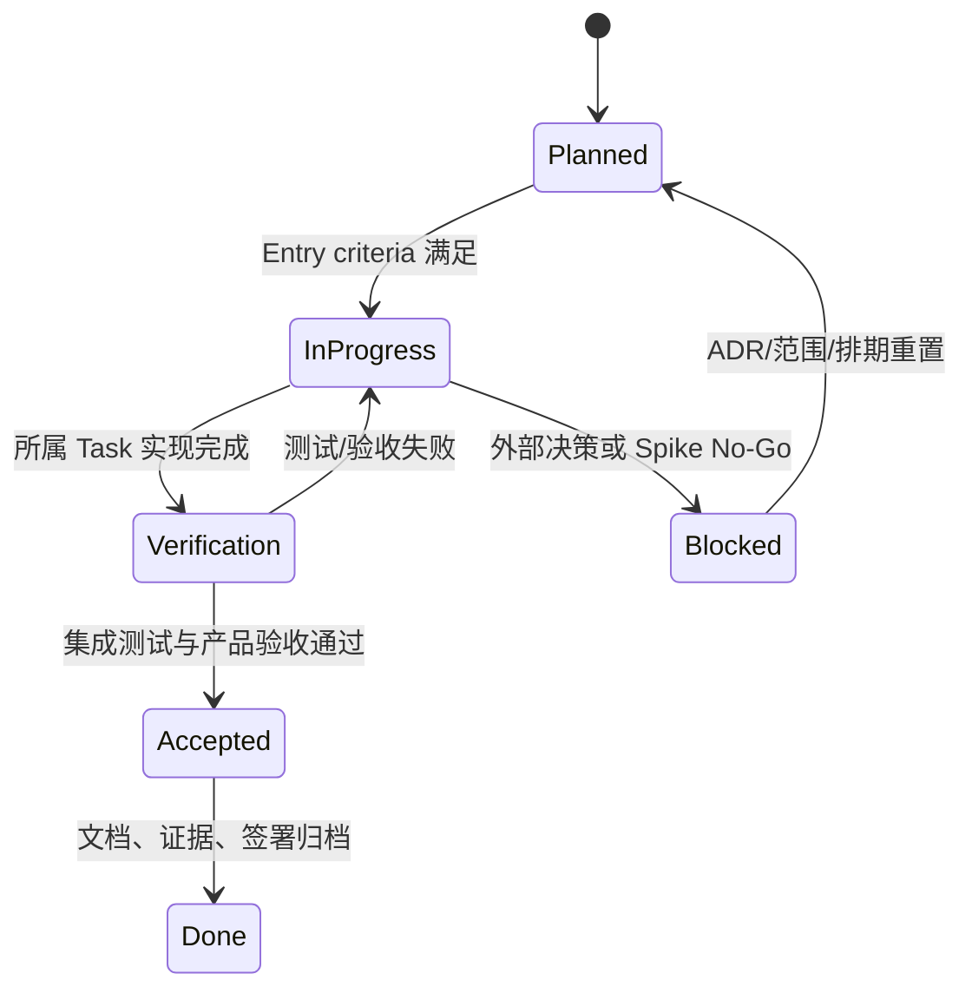

# On The Road 开发里程碑与任务验收计划

> 版本：0.1
> 日期：2026-07-26
> 依赖文档：[DESIGN.md](./DESIGN.md)、[DEVELOPMENT_PLAN.md](./DEVELOPMENT_PLAN.md)
> 计划基线：58 个有效 P0 任务，合计约 223 理想人日；G08 以 Deprecated 历史编号保留但不计入任务数/人日；1 周 Sprint 0 + 5 个两周功能 Sprint + 2 周稳定/灰度，第 14 周为显式缓冲。
> 文档用途：研发排期、TDD、里程碑评审、演示验收及 Go/No-Go 签署。

## 0. 需求理解、假设与执行口径

### 0.1 产品闭环

MVP 必须形成真实、可恢复、可验证的完整链路：

> 创建旅行 → 原子生成每日计划 → 编辑与排序行程 → 搜索/确认地点 → 地图联动与路线重算 → 图片和费用 → Excel staging/确认导入 → 冻结快照 → 生成并下载真实 PDF

地图、地理编码、导入和导出均不是前端演示状态。PostgreSQL 保存业务事实与 Job 状态，Redis/BullMQ 仅负责任务传递；外部服务不可用时允许明确降级，但禁止静默伪造成功。

### 0.2 必要假设

1. 日期范围是权威事实，`TotalDays` 派生；缩短日期且受影响 Day 有内容时必须阻止或显式迁移/删除。
2. MVP 为单所有者模型，但所有业务查询从第一天按 `owner_id` 约束。
3. 领域坐标统一为 WGS84；GCJ-02/BD-09 转换只能存在于 Provider Adapter。
4. 公共 Nominatim 仅用于低频显式搜索/反查，不用于自动补全或生产批量解析。
5. 地点可只保存文字；歧义地点不得静默选中，未确认坐标不得生成可用路线。
6. 导入先进入 staging；无稳定 ExternalId 不更新既有 Item。
7. ImageURLs 默认不下载，必须经用户批准和 SSRF-safe 媒体流水线。
8. PDF 使用服务端打印模板和冻结快照；只有产物校验与上传成功后才可下载。
9. 本文“预计修改的文件”是目标目录/文件清单；首次落地时可按模块生成多个同名测试文件，但不得跨越既定模块边界。
10. 任何 Spike 的 No-Go 都必须生成 ADR 并重新估算后续任务，不以降低验收标准维持原日期。

### 0.3 优先级与完成语义

| 标记 | 含义 | 排程规则 |
|---|---|---|
| `P0 / Critical` | 关键路径、数据正确性或安全门禁 | 未完成时依赖任务不得宣称完成，里程碑默认 No-Go |
| `P0 / High` | MVP 用户闭环必需 | 必须在所属里程碑关闭，不得无记录顺延 |
| `P0 / Normal` | MVP 质量、运营或文档闭环 | 可并行，但发布前必须完成 |

单个 Task 的“完成”同时要求：实现范围完成、列出的自动化测试通过、异常路径有真实状态、验收证据可复现、代码/契约/migration/文档同步。仅 UI 可见或仅本机手测不算完成。

### 0.4 里程碑总览与依赖

| Milestone | 时间盒 | 任务 | 理想人日 | 核心产物 |
|---|---:|---|---:|---|
| M0 风险定案与工程基线 | Sprint 0，1 周 | A01–A04、A08–A12 | 21 | CI、契约、四类 Spike、最小 fixture |
| M1 旅行基础与异步底座 | Sprint 1，2 周 | A05–A07、B01–B04、C01、C03、D01 | 33 | Trip/Day、身份、Job、Location/Storage 契约 |
| M2 行程编辑与地点确认 | Sprint 2，2 周 | B05–B09、C02、C04–C06、D02、D04、E01–E02 | 55 | 可持久编辑的一天、地点确认、媒体安全底座、导入入口 |
| M3 路线、图片、费用与导入 staging | Sprint 3，2 周 | C07–C09、D03、D05、E03–E05 | 36 | 地图路线联动、图片 UX、费用统计、Excel 校验预览 |
| M4 Excel 闭环与 PDF 骨架 | Sprint 4，2 周 | E06–E09、F01–F03、F05 | 40 | 幂等正式导入、媒体子任务、冻结快照、可运行打印 Worker |
| M5 PDF 闭环与功能冻结 | Sprint 5，2 周 | F04、F06–F07、G01 | 15 | 中文完整 PDF、下载/取消/重试、完整五日样例 |
| M6 稳定、灰度与 GA 门禁 | 稳定/灰度 2 周 | G02–G07 | 23 | E2E/安全/容量证据、监控 Runbook、发布签署 |

---

## M0：风险定案与工程基线

### M0.1 目标与边界

用可重复实验关闭地图/坐标、MapLibre 交互、5,000 行工作簿和中文复杂 PDF 四项最高技术风险，同时建立可持续开发的 monorepo、CI、配置和 API 契约。M0 不交付业务 CRUD 或精装修 UI。

### A01 建立 monorepo、质量脚本和 CI（2 人日）

- **优先级**：`P0 / Critical`
- **目标**：建立所有应用与共享包的可安装、可构建、可测试基线。
- **实现范围**：pnpm workspace、Turbo pipeline、Node 24 锁定、strict TypeScript、lint/typecheck/unit/build 脚本、缓存策略和 CI required checks。
- **不在范围内**：生产发布流水线、Kubernetes、业务模块实现。
- **预计修改的文件**：`package.json`、`pnpm-workspace.yaml`、`turbo.json`、`.nvmrc`、`tsconfig.base.json`、`.github/workflows/ci.yml`、`apps/*/package.json`、`packages/*/package.json`。
- **异常情况**：锁文件漂移、Node/pnpm 版本不符、缓存污染、单个 workspace 循环依赖；均需快速失败并指出 workspace。
- **测试要求**：干净 checkout 执行 install/lint/typecheck/unit/build；验证缓存命中和故意类型错误会阻断 CI。
- **验收标准**：CI 在支持的 Node 24 环境全绿；分支保护可引用稳定 check 名称。
- **完成标准**：脚本在本机和 CI 输出一致；开发文档写明版本与命令；无被跳过的空测试命令。

### A02 双轨依赖栈：原生开发 + Compose 验证（6 人日）

- **优先级**：`P0 / Critical`
- **目标**：开发者可在 macOS 不使用容器启动 PostGIS、Redis、MinIO 和 ClamAV；CI/staging 使用 Compose 验证与发布环境一致的集成行为。
- **轨道定义**：
  - **Native Track**：日常开发默认轨道；一条命令发现或启动本机服务，使用项目隔离的数据目录、端口、PID 和日志，提供幂等初始化与统一健康检查。
  - **Compose Track**：当前阶段尽力验证、发布前强制轨道；优先在当前环境尝试短生命周期 Compose，若容器环境不可用则记录阻塞并把完整验证转入发布 checklist。
- **共同契约**：两条轨道使用相同的环境变量、PostgreSQL migration/PostGIS extension、Redis 认证、S3-compatible bucket 初始化、ClamAV TCP adapter 和 readiness 输出；应用代码不得感知当前轨道。
- **实现范围**：原生服务发现/进程编排、Compose、健康检查、隔离数据目录/持久卷、非默认开发凭据、初始化 bucket、PostGIS extension、ClamAV signature/健康状态、服务网络与资源限额。
- **不在范围内**：生产 HA、托管服务采购、跨区备份。
- **预计修改的文件**：`infra/local-stack.env.example`、`infra/native/*`、`infra/compose/docker-compose.yml`、`infra/compose/init/*`、`scripts/dev-up.*`、`scripts/dev-down.*`、`.env.example`、`docs/runbooks/local-stack.md`。
- **异常情况**：缺少本机 binary、版本不兼容、端口占用、残留 PID、异常退出后的孤儿进程、ClamAV signature 未就绪、MinIO bucket 重复初始化、镜像架构不兼容；启动脚本需幂等且给出可行动错误。
- **测试要求**：
  - Native Track：干净数据目录首次启动、重复启动、保留数据重启、显式停止与异常残留恢复；SQL 验证 PostGIS，S3 put/get，Redis ping，EICAR 扫描阻断。
  - Compose Track：当前环境可用时验证空卷首次启动、保留卷重启、单服务重启、Linux 服务名/权限/只读边界与资源限额，并执行同一组 PostGIS、S3、Redis、ClamAV 探针；当前环境不可用时必须保存失败原因和发布前待办，不得伪造通过。
  - Release Parity Gate：发布前相同 `.env` 契约和 fixture 在两条轨道得到相同 capability/readiness 结果；不得用纯 mock 替代任一持久化或扫描断言。
- **验收标准**：本机新环境按文档一条命令进入 `Native Ready`，Native Track 的启动、持久化、恢复和 fail-closed Case 全绿，即可标记当前阶段 `A02 Complete`。Compose Track 必须在本轮尝试；成功则保存证据，因环境原因失败则登记到发布 checklist，不阻断当前 A02。
- **完成标准**：健康检查可供 API readiness 使用；应用只依赖 URL/凭据/capability，不依赖本机路径或 Compose DNS；migration 和 bucket 初始化在两轨幂等；敏感默认值不进入生产配置。
- **下游放行规则**：`A02 Complete` 放行后续开发和当前 Milestone Gate；正式发布前必须完成 Compose Track parity/release checklist，否则不得发布。

### A03 配置分层、Secret 校验与 `.env.example`（1 人日）

- **优先级**：`P0 / High`
- **目标**：让 Web/API/Worker/PDF Worker 以同一规则加载、校验和脱敏配置。
- **实现范围**：环境 schema、必需/可选配置、Provider capability flag、Secret redaction、启动时 fail-fast、测试覆盖。
- **不在范围内**：云 Secret Manager 接入、自动密钥轮换。
- **预计修改的文件**：`packages/config/src/env.ts`、`packages/config/src/index.ts`、`apps/*/src/config.*`、`.env.example`、`docs/configuration.md`。
- **异常情况**：缺变量、非法 URL/端口、相互冲突的 map profile、生产使用开发凭据；错误不得打印 Secret 值。
- **测试要求**：合法最小配置、各必需变量缺失、格式错误、日志脱敏快照。
- **验收标准**：四类进程使用同一 schema；缺必需配置在监听端口前退出并返回字段级错误。
- **完成标准**：`.env.example` 无真实密钥且覆盖无 Key 降级；配置变更有类型和文档。

### A04 OpenAPI v1、Problem Details 与生成客户端（2 人日）

- **优先级**：`P0 / Critical`
- **目标**：冻结前后端可演进的 REST 契约和统一错误格式。
- **实现范围**：`/api/v1`、RFC 9457 风格错误、ID/日期/分页/ETag/Idempotency 约定、OpenAPI 生成及 typed client、契约 diff。
- **不在范围内**：完整业务 endpoint、GraphQL。
- **预计修改的文件**：`packages/contracts/openapi.yaml`、`packages/contracts/src/generated/*`、`apps/api/src/common/problem-details/*`、`scripts/generate-client.*`、`.github/workflows/ci.yml`。
- **异常情况**：生成文件未提交、破坏性 schema 变化、未知错误泄露堆栈、客户端与 spec 不同步。
- **测试要求**：schema lint、生成结果无 diff、Problem Details 集成测试、breaking-change CI fixture。
- **验收标准**：示例 endpoint 可由生成客户端调用；所有错误含 `code/status/traceId`。
- **完成标准**：契约变更流程写入贡献文档；CI 阻止未生成或破坏性变更。

### A08 地图、地理编码与坐标系 Spike（3 人日）

- **优先级**：`P0 / Critical`
- **目标**：验证候选搜索、反查、WGS84/GCJ-02/BD-09 边界和 attribution 路径。
- **实现范围**：至少 10 个中外 golden 点、中文/英文/同名地点、Provider error mapping、确定性 `mapProfile`、转换精度测量和 ADR。
- **不在范围内**：生产 SLA、自动故障切换、完整地点 UI。
- **预计修改的文件**：`spikes/provider/*`、`packages/test-fixtures/src/geo/*`、`docs/adr/002-coordinate-provider.md`、`docs/reports/provider-spike.md`。
- **异常情况**：无 Key、429、超时、跨国同名、来源坐标未声明、转换后越界；不得静默切换 Provider。
- **测试要求**：fixture contract、转换 round-trip 容差、缓存键隔离、无 Key/429/反查失败测试。
- **验收标准**：每个 golden 点结果可重复；领域输出全部为 WGS84；Provider 能力和限制有量化结论。
- **完成标准**：形成 Go/No-Go ADR、推荐 Provider 与降级方案；No-Go 时给出替代方案和重估。

### A09 MapLibre 点选、拖动、线型和无底图 Spike（2 人日）

- **优先级**：`P0 / Critical`
- **目标**：验证地图核心交互与外部底图失效时的可用降级。
- **实现范围**：Marker、点选、拖动、fit bounds、飞机/步行/道路/船运线型、fixture tile、中性网格、图例与 attribution。
- **不在范围内**：正式工作台、真实 Directions、聚类。
- **预计修改的文件**：`spikes/maplibre/*`、`packages/test-fixtures/src/maps/*`、`docs/reports/maplibre-spike.md`。
- **异常情况**：WebGL 不可用、tile 超时、0/1 个坐标、相同坐标、越界坐标、移动端拖动与滚动冲突。
- **测试要求**：组件交互、浏览器截图、tile 被阻断的离线测试、键盘可达性检查。
- **验收标准**：两种底图模式均能显示 Marker/Route/Legend；拖动回调返回合法 WGS84。
- **完成标准**：交互和渲染策略写成 ADR；截图基线与可运行 harness 入库。

### A10 xlsx/xls/csv 5,000 行安全与内存 Spike（2 人日）

- **优先级**：`P0 / Critical`
- **目标**：证明 SheetJS 在 MVP 文件上限内可控解析，并识别格式/资源风险。
- **实现范围**：三种格式、5,000 行、多 sheet、日期系统、BOM/编码、公式策略、ZIP bomb/损坏文件/资源上限和基准报告。
- **不在范围内**：字段映射 UI、正式 staging、50,000 行 SLA。
- **预计修改的文件**：`spikes/importer/*`、`packages/test-fixtures/imports/*`、`docs/reports/import-spike.md`。
- **异常情况**：加密文件、宏、超大 shared strings、合并单元格、损坏 ZIP、公式无缓存值、进程 OOM。
- **测试要求**：格式 golden、恶意 fixture、超时/内存测量、错误码快照；不得调用公式执行器。
- **验收标准**：在固定环境内完成 5,000 行测试并记录峰值 RSS；超限输入可预测失败而非拖垮进程。
- **完成标准**：Go/No-Go 和 Node Worker 上限确定；No-Go 时明确 POI/Spring Batch Plan B。

### A11 CJK、静态地图与 50 页 PDF Spike（4 人日）

- **优先级**：`P0 / Critical`
- **目标**：尽早验证中文字体、复杂分页、地图资产、目录精确页码和 Playwright 打印路径。
- **实现范围**：固定 Noto Sans CJK、50 页中英混排、超长文本/图片、A4 横纵、页眉页脚、地图 PNG、逐条目录页码核对、PDF 解析和逐页渲染。
- **不在范围内**：正式 ExportJob、S3 下载、全部业务章节。
- **预计修改的文件**：`spikes/pdf/*`、`apps/pdf-worker/fonts/*`、`packages/test-fixtures/pdf/*`、`docs/reports/pdf-spike.md`。
- **异常情况**：字体未加载、空白页、图片未解码、目录偏页、Chromium OOM、资源超时。
- **测试要求**：`%PDF`/parser/页数/文本提取、逐页 PNG diff、空白/裁切检测、目录锚点物理页逐条比对。
- **验收标准**：固定环境重复生成结果稳定，中文无缺字，目录数字准确；失败时不生成成功标记。
- **完成标准**：单遍排版或“两遍渲染”方案以 ADR 冻结，镜像字体许可/版本记录完整。

### A12 最小 5 天契约 fixture 与 golden 资产（2 人日）

- **优先级**：`P0 / Critical`
- **目标**：为所有 Spike 与后续契约测试提供同一稳定、可版本化的数据源。
- **实现范围**：上海→舟山/普陀山 5 天最小 Trip/Day/Location/Route、地图 GeoJSON、三格式表格、固定本地图片和 PDF 文本。
- **不在范围内**：25+ Item 的最终演示 seed、生产内容运营。
- **预计修改的文件**：`packages/test-fixtures/src/trips/minimal-five-day.*`、`packages/test-fixtures/imports/*`、`packages/test-fixtures/images/*`、`packages/test-fixtures/maps/*`。
- **异常情况**：外链失效、时间/坐标自相矛盾、fixture 随测试被修改、golden 非确定生成。
- **测试要求**：schema 校验、哈希稳定、坐标范围、日期连续性、所有资产离线可访问。
- **验收标准**：A08/A09/A10/A11 使用同一 fixture 可独立运行。
- **完成标准**：fixture 版本与生成脚本/来源说明固定；测试不依赖公网。

### M0 集成测试要求

1. 干净环境启动基础 CI harness；四个 Spike 可并行运行且不依赖执行顺序。
2. 使用同一 5 天 fixture 完成 Provider golden、MapLibre 离线渲染、三格式解析和 50 页 PDF。
3. 故意关闭网络、底图、扫描器或提供错误配置，验证真实降级/快速失败。
4. CI 归档内存、耗时、PDF 页面图和 Spike 决策报告。

### M0 验收标准

- 四项 Spike 均有可重复命令、固定输入、量化输出和 Go/No-Go ADR。
- install/lint/typecheck/unit/build 全绿；OpenAPI diff 可阻止破坏性变化。
- Node Worker、地图 Provider、坐标转换、PDF 目录方案已确定。
- 任一 No-Go 均已改写后续依赖、Plan B 和工期，而不是降低产品验收。

### M0 完成标准与可演示场景

- **完成标准**：产品、架构、地图、导入、PDF 和 QA DRI 联合签署 M0 报告；后续关键路径没有“待技术验证”的隐含前提。
- **可演示**：同一五日数据离线显示地图点/线；解析 xlsx/xls/csv；生成含中文、地图、50 页和准确目录的真实 PDF；CI 展示失败注入结果。

---

## M1：旅行基础与异步底座

### M1.1 目标与边界

交付可持久创建、刷新恢复的多目的地 Trip/Day；建立身份、owner 访问控制、数据库 Job/outbox、可观测性、Provider/Location/Storage 契约。暂不交付完整 Item 编辑、地图确认或文件处理。

### A05 OIDC、开发身份、Secret/回调与 owner 守卫（5 人日）

- **优先级**：`P0 / Critical`
- **目标**：建立本地可测、staging 可接入的身份认证和资源所有权边界，并把不依赖外部 IdP 的开发门禁与发布前真实 IdP 门禁分离。
- **轨道定义**：
  - **Dev Identity/Mock OIDC Track**：日常开发默认轨道；使用仅非生产可启用的开发身份与本地 mock OIDC，验证登录/登出、Authorization Code + PKCE 契约、Cookie、state/nonce、会话过期、owner guard、BOLA 和密钥轮换策略。
  - **Staging IdP Track**：当前阶段尽力验证、发布前强制轨道；使用真实 staging IdP、已登记的 HTTPS 回调/登出地址和外置 Secret。若环境或凭据尚不可用，则保存阻塞并把完整验证转入发布 checklist。
- **共同契约**：两条轨道产生相同的内部 Principal、Session 和 owner authorization 语义；业务模块不得按身份轨道分支。开发身份必须在 staging/production 配置下 fail closed，真实 Secret 不得进入浏览器、日志、fixture 或仓库。
- **实现范围**：OIDC Authorization Code + PKCE 决策、开发身份、HttpOnly Cookie、回调/登出、owner guard、密钥轮换接口和审计钩子。
- **不在范围内**：团队成员、RBAC、公开分享、社交登录矩阵。
- **预计修改的文件**：`apps/api/src/modules/identity/*`、`apps/web/app/(public)/*`、`packages/domain/src/identity/*`、`docs/adr/identity.md`。
- **异常情况**：state/nonce 不匹配、回调过期、Cookie 被拒、IdP 不可用、跨用户枚举资源、密钥版本切换。
- **测试要求**：
  - Dev Track：开发身份和 mock OIDC auth integration、PKCE/state/nonce、CSRF/Origin、Cookie 属性、跨 owner BOLA、会话过期、本地新旧签名 key 轮换，以及 staging/production 启用开发身份时快速失败。
  - Staging Track：当前环境可用时执行真实 Authorization Code + PKCE 回调、HTTPS Cookie、IdP 登出、Secret/签名 key 轮换、旧会话策略和 IdP 不可用行为；不可用时必须保存失败原因与发布前待办，不得伪造通过。
  - Release Identity Gate：发布前对将要发布的 callback/origin/issuer/client 配置运行 staging smoke，确认 Secret 不进入浏览器、日志或构建产物；不得用 mock OIDC 替代真实回调。
- **验收标准**：Dev Track 全绿、跨用户资源返回 404/403 且无存在性泄露，即可标记当前阶段 `A05 Complete`。Staging IdP Track 必须在本轮尝试；成功则保存证据，因环境或配置原因失败则登记到发布 checklist，不阻断当前 A05。
- **完成标准**：所有已实现资源默认经过 owner guard；两轨 Principal/Session 语义一致；Secret 不进入浏览器或日志；开发身份在 staging/production fail closed。
- **下游放行规则**：`A05 Complete` 放行 D01、后续开发和当前 Milestone Gate；正式发布前必须完成 Staging IdP Track/release checklist，否则不得发布。

### A06 Outbox、BullMQ、Job 基类与幂等记录（4 人日）

- **优先级**：`P0 / Critical`
- **目标**：建立以 PostgreSQL 为权威、可重试和可调和的异步任务骨架。
- **实现范围**：outbox/inbox、Dispatcher、BullMQ 队列、Job 状态基类、HTTP idempotency、schema version、reconciler skeleton。
- **不在范围内**：各领域具体 Worker、跨区域队列。
- **预计修改的文件**：`apps/api/src/modules/jobs/*`、`apps/worker/src/processors/maintenance/*`、`packages/database/src/schema/jobs.*`、`packages/application/src/idempotency/*`。
- **异常情况**：DB commit 后进程退出、发布后未标记、重复 delivery、Redis 清空、同 aggregate 多事件、锁超时。
- **测试要求**：Testcontainers fault injection、重复投递、outbox recovery、inbox uniqueness、幂等键 request hash 冲突。
- **验收标准**：重复消息不产生重复副作用；Redis 丢失后可从 DB 恢复。
- **完成标准**：Job 状态不依赖 Redis；事件 payload 只含 ID/版本且有 schema version。

### A07 结构化日志、Trace ID 与基础指标（2 人日）

- **优先级**：`P0 / High`
- **目标**：让一次 Web 请求及其异步任务可关联、可定位且不泄露敏感信息。
- **实现范围**：JSON 日志、request/trace propagation、OpenTelemetry 基线、关键 API/queue 指标、redaction。
- **不在范围内**：完整生产 Dashboard/告警、月度 SLO。
- **预计修改的文件**：`packages/observability/*`、`apps/*/src/telemetry.*`、`infra/monitoring/*`、`docs/observability.md`。
- **异常情况**：缺上游 trace、Worker 重试、日志 sink 不可用、高基数 ID 被误作 metric label。
- **测试要求**：Web→API→outbox→Worker trace 关联测试；PII/Key 日志快照；指标 label 审查。
- **验收标准**：一次示例创建和异步事件可用同一 trace 链定位。
- **完成标准**：日志失败不影响业务；地址全文、联系人、签名 URL、Provider Key 均被遮蔽。

### B01 Currency、Mode、Category 集中配置与 seed（2 人日）

- **优先级**：`P0 / High`
- **目标**：消除散落枚举，为费用、路线、导入和 PDF 提供单一配置源。
- **实现范围**：指定币种、费用类别、22 种系统交通方式、别名、图标/颜色/线型、DB seed 和查询 API。
- **不在范围内**：实时汇率、用户自定义费用类别、跨 Trip 自定义方式。
- **预计修改的文件**：`packages/config/src/{currency,cost-category,transport-mode}.*`、`packages/database/src/seeds/*`、`apps/api/src/modules/system/*`。
- **异常情况**：重复 code、`RMB`/`CNY` 混存、颜色非法、系统方式被删除、seed 重跑。
- **测试要求**：配置 schema、seed 幂等、API snapshot、所有设计枚举覆盖检查。
- **验收标准**：所有要求枚举可查询；持久化币种统一 CNY，RMB 仅作输入/显示别名。
- **完成标准**：后续模块只引用 code/config，不新增局部硬编码枚举。

### B02 Trip/Destination schema、repository 与 service（3 人日）

- **优先级**：`P0 / Critical`
- **目标**：实现 owner 隔离、版本化的 Trip 和多 Destination 业务事实。
- **实现范围**：migration、CRUD、搜索/筛选、预算/币种/时区/mapProfile、软删恢复、乐观并发和审计。
- **不在范围内**：公开分享、复杂全文检索、附件封面上传。
- **预计修改的文件**：`packages/database/src/schema/{trip,destination}.*`、`apps/api/src/modules/trips/*`、`packages/domain/src/trip/*`、`packages/contracts/openapi.yaml`。
- **异常情况**：非法日期、未知币种/profile、重复目的地顺序、版本冲突、跨 owner 引用、软删后访问。
- **测试要求**：CRUD/owner/version integration、数据库约束、幂等创建、分页筛选。
- **验收标准**：Trip/Destination 持久化可重载；冲突返回 `409 VERSION_CONFLICT`。
- **完成标准**：migration 可前滚/兼容回滚应用；API/生成客户端/审计同步。

### B03 日期生成与日期变更 preview/apply（3 人日）

- **优先级**：`P0 / Critical`
- **目标**：在原子事务中生成 Day 1…N，并安全处理日期范围变化。
- **实现范围**：含首尾日期生成、工作日推导/覆盖、preview/apply、扩展/缩短、受影响内容检查和 Day 版本。
- **不在范围内**：法定节假日 Provider、无日期 Day、未排期收件箱。
- **预计修改的文件**：`packages/database/src/schema/trip-day.*`、`packages/domain/src/trip/date-range.*`、`apps/api/src/modules/trips/date-change.*`、`packages/contracts/openapi.yaml`。
- **异常情况**：同日、跨月/年、闰日、时区边界、已有 Item 的 Day 被移除、重复 apply、并发修改。
- **测试要求**：属性测试、事务回滚、版本冲突、缩短不丢数据、幂等 apply。
- **验收标准**：Trip 与全部 Day 同事务创建；任何失败无半成品；缩短有内容时必须明确阻止或按已确认决策执行。
- **完成标准**：日期规则在 API、DB 和 UI 契约一致，`TotalDays` 不接受客户端任意写入。

### B04 旅行列表与创建向导（5 人日）

- **优先级**：`P0 / High`
- **目标**：让用户完成旅行搜索、创建、编辑、复制、软删恢复并进入 Day 1。
- **实现范围**：列表卡片/空态/筛选、四步向导、多个目的地、日期摘要、幂等提交、编辑/复制/删除确认、响应式基础。
- **不在范围内**：完整工作台、真实封面上传、公开模板市场。
- **预计修改的文件**：`apps/web/app/(workspace)/trips/*`、`apps/web/features/trips/*`、`packages/ui/src/*`、`apps/web/e2e/trips.*`。
- **异常情况**：双击提交、网络重试、日期无效、服务端字段错误、复制附件失败、删除后并发打开。
- **测试要求**：组件、API mock、真实 create/reload E2E、移动 viewport、键盘导航。
- **验收标准**：可创建 5 天/2 目的地 Trip，成功后打开 Day 1；刷新/重新登录数据存在。
- **完成标准**：所有主要按钮有真实请求和状态；删除二次确认，错误可恢复。

### C01 Provider contracts 与 fixture provider（2 人日）

- **优先级**：`P0 / Critical`
- **目标**：将地图展示、搜索、反查、路线和静态图与供应商实现解耦。
- **实现范围**：五类 Provider interface、WGS84 DTO、能力发现、错误模型、fixture adapter 和 contract test harness。
- **不在范围内**：正式供应商 adapter、自动多 Provider 路由。
- **预计修改的文件**：`packages/providers/src/contracts/*`、`packages/providers/src/fixture/*`、`packages/providers/test/contract/*`、`apps/api/src/modules/providers/*`。
- **异常情况**：能力不支持、无 attribution、未知供应商错误、DTO 泄露供应商原始字段。
- **测试要求**：离线 contract suite、capability matrix、WGS84 schema、错误映射。
- **验收标准**：fixture provider 可支持搜索/反查/示意路线/静态图的稳定测试。
- **完成标准**：UI/业务代码不直接 import 供应商 SDK；后续 adapter 必须通过同一 contract。

### C03 Location schema、staging location、候选签名与状态机（4 人日）

- **优先级**：`P0 / Critical`
- **目标**：建立正式地点事实、导入暂存地点和防伪候选的状态边界。
- **实现范围**：Location/GeocodingJob DDL、PostGIS 点、状态迁移、version/CAS、signed candidate token、Import staged JSON、同 Trip 约束。
- **不在范围内**：搜索 UI、地图点选、正式 Provider。
- **预计修改的文件**：`packages/database/src/schema/{location,geocoding-job,import-row}.*`、`packages/domain/src/location/*`、`apps/api/src/modules/locations/*`。
- **异常情况**：非法坐标、resolved 无 geom、伪造候选、候选过期、Import 确认前误建正式 Location、旧 geocode 覆盖手调。
- **测试要求**：状态机单元/属性测试、DB CHECK、签名篡改/过期、version CAS、staging isolation。
- **验收标准**：`resolved/ambiguous/failed` 可重放；手调后状态满足约束；候选不可由客户端伪造字段。
- **完成标准**：状态迁移只能由应用服务触发；Import 确认前无正式 Location 副作用。

### D01 Storage abstraction 与预签名 append-only 上传（3 人日）

- **优先级**：`P0 / Critical`
- **目标**：建立 S3/MinIO 一致、不可覆盖的对象存储入口。
- **实现范围**：storage interface、预签名会话、随机对象键、条件写、大小/content-type 限制、object version/checksum 元数据入口。
- **不在范围内**：病毒扫描、缩略图、图库 UI。
- **预计修改的文件**：`packages/storage/*`、`apps/api/src/modules/attachments/upload-session.*`、`packages/database/src/schema/attachment.*`、`packages/contracts/openapi.yaml`。
- **异常情况**：重复 complete、同 key 覆盖、过期 URL、分段上传未完成、对象不存在、owner 不匹配。
- **测试要求**：MinIO integration、conditional put、过期签名、跨 owner、append-only key。
- **验收标准**：上传只能落到服务端分配的随机 key；覆盖尝试失败；返回可追踪 object version。
- **完成标准**：应用不使用本地路径/Base64 作为持久事实；接口可替换 S3 Provider。

### G08 Beta cohort、测试账号池和灰度样本运营 — Deprecated

- **状态**：`Deprecated / 2026-07-29`；编号保留，不得分配给新任务。
- **范围变更**：G08 在实现前从 M1 移出，也不再作为 M6 的跨期任务或发布门禁。
- **处理方式**：不创建 cohort、同意记录、测试账号池、样本 ledger 或固定样本数看板；`TC-G08-01`～`TC-G08-03` 和 `TC-M6-INT-03` 同步退役。
- **决策记录**：原范围、影响、M6 替代门禁和未来重新启用条件见 [`deprecated/G08-beta-cohort.md`](./deprecated/G08-beta-cohort.md)。

### M1 集成测试要求

1. 使用开发身份创建 5 天/2 目的地 Trip，事务内生成 Day，刷新和重启服务后恢复。
2. 用另一开发用户访问 Trip、Destination、Day、上传会话，验证 owner 隔离。
3. 在 API commit 后、outbox publish 前杀进程，重启后事件恢复且只消费一次。
4. Location fixture 状态迁移、candidate token、防伪和 Storage append-only 在真实 PostGIS/Redis/MinIO 上运行。
5. trace 从 Web 创建请求贯穿 API、DB outbox 和 Worker。

### M1 验收标准

- Trip/Day 创建、列表、编辑、复制、软删恢复均为真实持久化。
- 跨用户访问、双击创建、日期缩短、Redis 丢失均有正确结果。
- Provider、Location、Storage 和 Job 契约稳定，可供 M2 并行开发。
- G08 已标记为 Deprecated，不纳入 M1 验收或完成标准。

### M1 完成标准与可演示场景

- **完成标准**：Trip、平台、身份和 QA DRI 签署；数据库 migration、OpenAPI 与生成客户端一致；没有只存在于 Redis/localStorage 的业务事实。身份签署允许引用通过 Dev Track 的 `A05 Complete`，但必须同时保留未关闭的 Staging IdP 发布阻断项。
- **可演示**：用户登录后创建上海→舟山 5 日旅行，Day 1–5 原子出现；刷新/重启不丢失；另一用户不可访问；展示一次 outbox 故障恢复。

---

## M2：行程编辑与地点确认

### M2.1 目标与边界

交付“选一天 → 编辑完整 Item → 搜索或地图确认地点 → 刷新后恢复”的核心体验，并建立安全媒体处理、基础费用和 Excel 上传检查。真实 RouteSegment、完整图库、统计页和正式导入留到后续里程碑。

### B05 Itinerary 全字段模型与 CRUD（4 人日）

- **优先级**：`P0 / Critical`
- **目标**：完整持久化活动、景点、餐饮、酒店、交通及其时间、地点、食宿、费用关联和备注。
- **实现范围**：ItineraryItem、Accommodation、DiningItem schema/service；新增、读取、编辑、复制、软删；跨午夜、起终点、预订/联系信息加密和同 Trip 约束。
- **不在范围内**：拖拽排序、路线生成、图库 UI、复杂费用汇总。
- **预计修改的文件**：`packages/database/src/schema/{itinerary,accommodation,dining}.*`、`packages/domain/src/itinerary/*`、`apps/api/src/modules/itinerary/*`、`packages/contracts/openapi.yaml`。
- **异常情况**：Target/Desc 均为空、非法时间组合、跨 Day/owner 引用 Location/Mode、已软删 Item 更新、复制到不存在 Day。
- **测试要求**：全字段 round-trip、DB CHECK、跨午夜、owner/同 Trip 集成、软删与关联历史保留。
- **验收标准**：需求指定字段可写可读；复制产生新 ID；软删不物理销毁附件/费用历史。
- **完成标准**：OpenAPI、migration、加密字段和审计同步；无跨模块直接写表。

### B06 Day 列表、时间线与 Item 编辑器（7 人日）

- **优先级**：`P0 / High`
- **目标**：提供桌面三栏和移动分段视图下完整可用的每日编辑界面。
- **实现范围**：Day 列表、时间线卡片、分组表单、增删改复制、食宿/交通/成本/备注、空/错/加载状态、手机核心字段。
- **不在范围内**：复杂 Excel 映射、逐页 PDF 预览、真实路线联动。
- **预计修改的文件**：`apps/web/app/(workspace)/trips/[tripId]/*`、`apps/web/features/itinerary/*`、`packages/ui/src/forms/*`、`apps/web/e2e/itinerary.*`。
- **异常情况**：Day 无 Item、字段服务端校验失败、并发版本冲突、慢请求、移动键盘遮挡、超长文本。
- **测试要求**：组件测试、表单 schema、桌面/平板/手机 viewport、真实 API round-trip、键盘导航。
- **验收标准**：用户可在一天新增并编辑所有核心字段，刷新后数据一致；手机端可完成 DESIGN §4.11 核心编辑。
- **完成标准**：所有状态有真实数据来源；无 no-op 按钮；可访问名称和错误关联完整。

### B07 原子重排、dnd-kit 与键盘替代（4 人日）

- **优先级**：`P0 / Critical`
- **目标**：安全调整同一天行程顺序，并为路线重算提供单次有序事实。
- **实现范围**：完整 ID 数组 API、base Day version、事务重排、稀疏序号/窗口重编号、乐观 UI、拖拽手柄、键盘上下移。
- **不在范围内**：跨 Day 拖拽、自动路线优化。
- **预计修改的文件**：`apps/api/src/modules/itinerary/reorder.*`、`apps/web/features/itinerary/components/sortable-timeline.*`、`packages/domain/src/itinerary/order.*`、`apps/web/e2e/reorder.*`。
- **异常情况**：漏 ID、多 ID、重复 ID、跨 Day ID、并发重排、保存失败、触控滚动冲突。
- **测试要求**：集合属性测试、事务集成、并发 barrier、鼠标/触控/键盘 E2E、失败 UI 回滚。
- **验收标准**：服务端只接受同 Day 完整集合；冲突不产生部分顺序，前端回滚并提示。
- **完成标准**：排序事实只提交一次；键盘路径功能等价；为 C07 发出单个领域事件。

### B08 自动保存与离开提醒（2 人日）

- **优先级**：`P0 / High`
- **目标**：减少编辑丢失，同时准确表达保存状态。
- **实现范围**：字段级 dirty tracking、防抖保存、saving/saved/error、显式重试、版本冲突处理、上传/大型编辑离开提醒。
- **不在范围内**：离线优先、本地冲突合并、版本历史 UI。
- **预计修改的文件**：`apps/web/features/itinerary/hooks/use-autosave.*`、`apps/web/components/leave-guard.*`、`apps/web/features/itinerary/editor.*`。
- **异常情况**：断网、请求乱序、组件卸载、浏览器后退、409、连续快速编辑、服务端成功但响应丢失。
- **测试要求**：fake timer 单元、乱序响应组件测试、断网/重试 E2E、离开提示浏览器测试。
- **验收标准**：状态不提前显示 saved；旧响应不能覆盖新值；失败后用户可重试且输入保留。
- **完成标准**：刷新前未提交更改会提醒；成功保存后重进页面与最后确认版本一致。

### B09 旅行内自定义交通方式 CRUD 与设置 UI（3 人日）

- **优先级**：`P0 / High`
- **目标**：允许用户扩展交通方式并在 Item、地图和 PDF 中使用统一视觉配置。
- **实现范围**：trip-scoped code/label/icon/color/lineStyle、创建/编辑/停用、选择器即时更新、系统方式保护。
- **不在范围内**：跨 Trip 模板、上传自定义 SVG、删除已引用方式。
- **预计修改的文件**：`apps/api/src/modules/itinerary/transport-modes.*`、`apps/web/features/trips/settings/transport-modes.*`、`packages/domain/src/transport-mode/*`。
- **异常情况**：code 冲突、非法颜色/线型、停用已选方式、跨 Trip 使用、系统方式删除。
- **测试要求**：CRUD integration、owner/同 Trip、配置表单组件、已引用停用行为。
- **验收标准**：自定义方式可立即用于 Item；系统方式不可删除；既有引用可读且有停用提示。
- **完成标准**：C08/F03 仅消费统一 Mode DTO，不另建视觉映射。

### C02 生产/开发 Geocoder adapter（5 人日）

- **优先级**：`P0 / Critical`
- **目标**：实现符合供应商能力/政策、可缓存限流重试的地点搜索与反查。
- **实现范围**：至少一套正式 adapter、一套开发降级、capability discovery、context 排序、Redis 缓存、Provider token bucket、错误映射和 attribution。
- **不在范围内**：自动 Provider 故障切换、公共 Nominatim 自动补全/常规批处理、Directions。
- **预计修改的文件**：`packages/providers/src/geocoding/*`、`apps/api/src/modules/locations/search.*`、`apps/worker/src/processors/geocoding/*`、`packages/config/src/map-profile.*`。
- **异常情况**：无 Key、401/403、429/Retry-After、5xx、超时、同名跨国、无结果、Provider payload 变化。
- **测试要求**：provider contract、mock server 故障、缓存键 context 隔离、限流时间测试、少量 staging smoke。
- **验收标准**：能力、限流、缓存和重试符合政策；Provider 不支持 autocomplete 时 API 明确拒绝该触发方式。
- **完成标准**：不会因单次超时静默切换 Provider；日志不含 Key/敏感地址全文。

### C04 地点输入、候选和失败恢复 UI（5 人日）

- **优先级**：`P0 / High`
- **目标**：让用户从文字输入可靠进入候选确认或可恢复失败状态。
- **实现范围**：300–500ms 防抖、能力感知的自动补全/显式搜索、候选地理上下文、ambiguous/failed 状态、重搜/重定位/地图选点/手工坐标/暂存文字。
- **不在范围内**：地图画面本身、批量导入地点审核。
- **预计修改的文件**：`apps/web/features/locations/components/location-input.*`、`candidate-list.*`、`resolution-status.*`、`apps/web/features/locations/api.*`。
- **异常情况**：输入过短、请求乱序、候选过期、同名高相似候选、无网络、Provider 不支持 autocomplete、零结果。
- **测试要求**：防抖/取消、乱序响应、候选不预选、错误恢复组件测试、中文/英文 E2E。
- **验收标准**：多个合理候选必须由用户选择；失败时五种恢复动作可达，纯文字仍可保存。
- **完成标准**：选择候选后只提交签名 token/确认字段；状态与 Location 后端事实一致。

### C05 MapLibre 地图、Marker、图例与 fit bounds（5 人日）

- **优先级**：`P0 / High`
- **目标**：在日/全局视图显示地点、Day/顺序信息和明确空态。
- **实现范围**：MapLibre wrapper、GeoJSON source/layer、Day 色环+序号 Marker、tooltip、筛选骨架、fit bounds、图例、全屏、fixture/中性网格降级。
- **不在范围内**：真实路线、Marker 拖动保存、聚类优化。
- **预计修改的文件**：`apps/web/features/map/*`、`apps/web/app/(workspace)/trips/[tripId]/map/*`、`packages/ui/src/map/*`。
- **异常情况**：无坐标、单点、同点、非法点被过滤、WebGL/tile 失败、容器 resize、全屏退出。
- **测试要求**：GeoJSON selector 单元、组件交互、离线 E2E、截图、无坐标空态、键盘 Escape。
- **验收标准**：全部/按日/按目的地基础 Marker 正确；无有效坐标时不跳到伪默认点。
- **完成标准**：地图失败不阻断文字编辑；图例和 attribution 始终可见。

### C06 地图点选、反查与 Marker 拖动（5 人日）

- **优先级**：`P0 / Critical`
- **目标**：允许用户在地图上创建/修正地点，并保证晚到 Provider 响应不覆盖人工事实。
- **实现范围**：click-to-pick、reverse、draggable Marker、手工经纬度、version/If-Match、`manuallyAdjusted=true`、审计和地图回中。
- **不在范围内**：手动画路线、离线地图编辑。
- **预计修改的文件**：`apps/web/features/map/components/location-picker.*`、`apps/api/src/modules/locations/coordinates.*`、`packages/application/src/location/adjust-coordinates.*`、`apps/web/e2e/location-map.*`。
- **异常情况**：反查失败、拖出合法范围、并发拖动、geocode 晚到、保存失败、地图点击误触、0 纬度/经度。
- **测试要求**：CAS integration、barrier 强制晚到 geocode、反查失败 E2E、边界坐标属性测试、移动触控。
- **验收标准**：拖动/点选后坐标持久化且 `manuallyAdjusted=true`；反查失败仍可保存点。
- **完成标准**：旧 version 写回影响 0 行并被丢弃；UI 显示最终服务端坐标。

### D02 magic bytes、扫描 adapter、缩略图与 fail-closed（6 人日）

- **优先级**：`P0 / Critical`
- **目标**：把上传对象从 quarantine 安全推进为可展示/导出的 immutable Attachment。
- **实现范围**：大小/扩展/magic bytes、ClamAV 或托管扫描 adapter、图片解码、尺寸提取、缩略图、状态机、append-only 衍生对象、checksum/version。
- **不在范围内**：图库交互、远程 ImageURLs、视频。
- **预计修改的文件**：`apps/worker/src/processors/media/*`、`apps/api/src/modules/attachments/*`、`packages/storage/src/quarantine.*`、`packages/domain/src/attachment/*`。
- **异常情况**：扫描器不可用、EICAR、错误 MIME、HEIC 不支持、解码炸弹、超大图、对象版本变化、Worker 重试。
- **测试要求**：真实 ClamAV integration、恶意/损坏/超限 fixtures、重复消息、ready DB CHECK、孤儿对象清理。
- **验收标准**：非图片/恶意/超限对象为 failed；扫描器不可用 fail-closed；ready 必有 immutable version/checksum/size。
- **完成标准**：任何失败不暴露原 quarantine 对象；状态和错误码可供 UI/Export 使用。

### D04 Expense/汇率 schema 与计算服务（3 人日）

- **优先级**：`P0 / Critical`
- **目标**：用十进制定点数保存原币费用并提供可解释结算结果。
- **实现范围**：Expense、TripExchangeRate schema/service，类别/目的地/方式关联，手工汇率，汇率快照与基础日小计。
- **不在范围内**：实时汇率、费用分摊、高级图表。
- **预计修改的文件**：`packages/database/src/schema/{expense,exchange-rate}.*`、`packages/domain/src/expense/*`、`apps/api/src/modules/expenses/*`。
- **异常情况**：0 金额、负数、未知币种、缺汇率、高精度、汇率修改、跨 Trip 关联、Route cost 重复计入。
- **测试要求**：decimal 单元/属性测试、DB constraints、缺汇率分组、rounding matrix、owner integration。
- **验收标准**：原币永远保留；缺汇率不按 1:1；Route cost 不进入实际费用汇总。
- **完成标准**：API 返回金额字符串/明确精度；汇总可回溯使用的汇率。

### E01 标准 xlsx 模板与中英别名表（2 人日）

- **优先级**：`P0 / High`
- **目标**：提供可下载、可自导入的标准模板与版本化字段别名。
- **实现范围**：标准列、示例/说明、交通/币种/类别数据验证或说明、中英别名、模板 endpoint。
- **不在范围内**：复杂格式美化、宏、AI 映射。
- **预计修改的文件**：`packages/importer/src/aliases.*`、`packages/importer/src/template.*`、`apps/api/src/modules/imports/template.*`、`packages/test-fixtures/imports/standard.*`。
- **异常情况**：RMB/CNY、Dur/Duration、重复表头、用户重命名 sheet、公式注入文本。
- **测试要求**：模板生成 deterministic、self-import round-trip、别名字典 snapshot、公式注入防护。
- **验收标准**：下载文件可由 Excel 打开，并被本系统 inspect/normalize；所有要求列与别名覆盖。
- **完成标准**：模板和别名字典带版本，修改触发契约测试。

### E02 上传安全检查与 workbook inspect（4 人日）

- **优先级**：`P0 / Critical`
- **目标**：安全接收 xlsx/xls/csv，并返回 sheet、表头、样例和映射入口。
- **实现范围**：源文件上传、Attachment ready gate、magic/格式检查、资源限额、隔离解析、inspect Job、列样例和可解释失败。
- **不在范围内**：逐行标准化、正式导入、远程 URL 下载。
- **预计修改的文件**：`apps/api/src/modules/imports/upload.*`、`apps/worker/src/processors/import/inspect.*`、`packages/importer/src/{xlsx,xls,csv}-importer.*`、`packages/contracts/openapi.yaml`。
- **异常情况**：空表、加密/损坏文件、ZIP bomb、多 sheet、BOM/编码、宏、公式、扫描失败、5,000 行/20MB 超限。
- **测试要求**：三格式 fixtures、安全攻击 fixtures、资源/超时基准、Job 重试与错误码。
- **验收标准**：合法文件展示列/样例；危险或超限文件不进入解析并给出明确错误。
- **完成标准**：解析 Worker 隔离且有内存/时间上限；源文件与 Job 可审计。

### M2 集成测试要求

1. 从 M1 Trip 进入 Day，新增/编辑/复制/软删完整 Item，含跨午夜、食宿、交通和费用；重载一致。
2. 同一天以鼠标、触控和键盘重排；用 barrier 制造 409，验证事务不部分提交且 UI 回滚。
3. 中文/英文搜索出现多个候选时不自动选择；选择后持久化坐标。
4. 地图点选、反查失败、Marker 拖动和手工坐标均可保存；强制地理编码晚到不得覆盖人工坐标。
5. 上传 benign、EICAR、错误 MIME 和超大图；只有安全对象进入 ready。
6. 下载标准模板并对 xlsx/xls/csv 执行 inspect；损坏文件不拖垮 Worker。

### M2 验收标准

- 刷新后可完整编辑一天行程，保存/失败/冲突状态真实。
- 地点确认链路可在正式 Provider 和无 Key 降级模式运行。
- `manuallyAdjusted`、owner 隔离、附件 immutable 元数据和 Decimal 费用满足数据库不变量。
- Excel 入口能真实上传与检查，但不宣称已导入正式 Item。

### M2 完成标准与可演示场景

- **完成标准**：Item、Location、Media、Expense、Import 入口的契约和集成测试全绿；Critical/High 安全缺陷为零。
- **可演示**：编辑 Day 1 多条行程并排序；搜索“上海迪士尼”人工选择候选；地图点选后拖 Marker；上传图片看到真实处理状态；录入 USD/CNY；下载并检查 Excel 模板。

---

## M3：路线、图片、费用与 Excel staging

### M3.1 目标与边界

把时间事实变成空间轨迹，完成图片与费用用户体验，并让 Excel 从文件进入可审核 staging。M3 的 Excel 不写正式 Itinerary；E06/E07 可基于 E04 稳定契约开发前置切片，但主任务和完成签署归 M4。

### C07 RouteSegment 领域逻辑、window generation 与 outbox（6 人日）

- **优先级**：`P0 / Critical`
- **目标**：正确生成日内、跨日和交通 Item 内部段，并阻止旧路线覆盖新顺序/坐标。
- **实现范围**：RouteSegment schema、effective endpoints、arrival-day 归属、route blocker、Day window generation、obsolete、sourceContext/sourceVersion、rebuild/Directions outbox、统一 Day→Segment 锁序。
- **不在范围内**：路线优化、离线导航、人工复杂路径编辑器。
- **预计修改的文件**：`packages/database/src/schema/route-segment.*`、`packages/domain/src/routing/*`、`apps/api/src/modules/routing/*`、`apps/worker/src/processors/directions/*`。
- **异常情况**：Item 无 Location、Location 未确认、缺 Mode、相同点、跨 Day、transport Start/End、旧 rebuild/旧 Directions 晚到、deadlock/serialization failure。
- **测试要求**：领域矩阵、Testcontainers、inverse-completion barrier、并发锁序、Redis 重投、Provider 429/无 provider 降级。
- **验收标准**：不跨未确认点偷连；跨 Day 段归到达日；旧 generation/sourceVersion 无法产生 active 段。
- **完成标准**：业务变更事务先 bump generation 并 obsolete；Worker 最终提交再次锁定和校验真实相邻关系。

### C08 不同 Mode 的轨迹绘制与详情（4 人日）

- **优先级**：`P0 / High`
- **目标**：清晰区分飞机、步行、道路、船运、公共交通和自定义方式。
- **实现范围**：actual/approximate/manual 质量标签，line style/icon/color，弧线/点线/实线/蓝线，segment 点击详情、示意路线说明和图例。
- **不在范围内**：道路级导航指令、实时交通。
- **预计修改的文件**：`apps/web/features/map/layers/routes.*`、`route-detail.*`、`packages/config/src/transport-mode.*`、`apps/web/e2e/routes.*`。
- **异常情况**：未知/停用 Mode、geometry 无效、路线 failed/obsolete、同点段、长跨海弧线。
- **测试要求**：style contract、GeoJSON transformation、组件点击、截图视觉回归、色彩之外的文本/图标区分。
- **验收标准**：要求的交通方式可视觉和文字辨识；示意线明确标注，不伪装真实导航。
- **完成标准**：地图与 F02/F03 使用同一视觉 token 和路线质量语义。

### C09 地图—时间线双向联动（3 人日）

- **优先级**：`P0 / High`
- **目标**：让地图与时间线成为同一选择状态的两个视图。
- **实现范围**：点击卡片定位/高亮 Marker，点击 Marker 滚动/高亮卡片，轨迹详情，筛选后的选择清理，全屏保持上下文。
- **不在范围内**：多人同步选择、地图播放动画。
- **预计修改的文件**：`apps/web/features/map/store.*`、`apps/web/features/itinerary/timeline.*`、`apps/web/features/map/interaction.*`。
- **异常情况**：Item 无坐标、被筛选、已删除、虚拟列表未挂载、地图尚未 ready、快速连续点击。
- **测试要求**：store 单元、组件集成、双向 Playwright E2E、键盘 focus、移动分段视图。
- **验收标准**：点击任一侧正确定位另一侧；无坐标 Item 显示待确认而非错误移动地图。
- **完成标准**：URL/选中状态可恢复，选择不造成不必要地理编码请求。

### D03 上传进度、画廊、排序、说明与灯箱（5 人日）

- **优先级**：`P0 / High`
- **目标**：完成每条 Item 多图上传、处理、浏览和管理闭环。
- **实现范围**：直传进度、pending/processing/failed/ready、失败重试、比例预览、排序/说明/删除、灯箱、日封面、优雅空态。
- **不在范围内**：图片编辑、AI 标签、远程 ImageURLs。
- **预计修改的文件**：`apps/web/features/attachments/*`、`apps/web/features/itinerary/components/gallery.*`、`apps/api/src/modules/attachments/order.*`、`apps/web/e2e/attachments.*`。
- **异常情况**：上传中断、complete 丢响应、处理失败、删除中仍引用、排序冲突、图片解码失败、无图片。
- **测试要求**：真实 MinIO upload E2E、状态轮询/SSE、排序事务、灯箱/比例截图、删除确认和移动端。
- **验收标准**：多图上传可看到真实进度/失败；刷新后顺序、说明、封面和状态一致。
- **完成标准**：非 ready 图片不显示破图占位；删除为逻辑流程并交给清理任务。

### D05 费用编辑与统计页（4 人日）

- **优先级**：`P0 / High`
- **目标**：展示预算、已知实际、暂定剩余及五类可核对统计。
- **实现范围**：费用编辑、手工汇率、按天/目的地/类别/方式/原币种统计、日小计、预算和缺汇率告警。
- **不在范围内**：实时汇率、分摊、会计报表。
- **预计修改的文件**：`apps/web/features/expenses/*`、`apps/web/app/(workspace)/trips/[tripId]/costs/*`、`apps/api/src/modules/expenses/summary.*`。
- **异常情况**：缺汇率、0 费用、预算为空/超支、多原币、汇率更新、被删 Item 费用。
- **测试要求**：selector/formatting 单元、API summary integration、缺汇率/超支组件、统计总和交叉核对。
- **验收标准**：五种维度合计与事实 Expense 一致；缺汇率时不显示误导性绿色“剩余”。
- **完成标准**：每个折算数可查看原金额和汇率；刷新/导出契约一致。

### E03 映射建议与可编辑映射 UI（4 人日）

- **优先级**：`P0 / High`
- **目标**：帮助用户把任意常见中英列映射为系统字段，并可显式修正。
- **实现范围**：别名/样例驱动建议、源列示例、目标说明、必填/冲突提示、保存 mapping、桌面完整体验和手机标准模板路径。
- **不在范围内**：AI 语义映射、手机端任意大表格完整编辑。
- **预计修改的文件**：`apps/web/features/imports/mapping/*`、`apps/api/src/modules/imports/mapping.*`、`packages/importer/src/mapping.*`。
- **异常情况**：重复列映射同目标、必填缺失、未知表头、多 sheet、空样例、映射保存冲突。
- **测试要求**：alias scoring 单元、组件编辑、键盘操作、标准/自定义列 E2E、手机转桌面提示。
- **验收标准**：建议可解释且可改；源列样例和目标含义清楚；无静默覆盖冲突。
- **完成标准**：保存的 mapping 可稳定 canonicalize 并供 E04 计算 hash。

### E04 Row normalize/validate/staging 与 mapping hash（6 人日）

- **优先级**：`P0 / Critical`
- **目标**：把原始行转成可审计、可重放且不污染正式数据的 staging 事实。
- **实现范围**：Importer interface、日期/时间/金额/币种/Mode/坐标/ImageURLs 规范化，sourceRowKey、mappingHash、fingerprint、ImportJob/Row/ledger/claim schema 和逐行 errors。
- **不在范围内**：批量地理编码、正式 commit、URL 网络下载。
- **预计修改的文件**：`packages/importer/src/{normalize,validate,fingerprint}/*`、`packages/database/src/schema/import*`、`apps/worker/src/processors/import/validate.*`、`apps/api/src/modules/imports/rows.*`。
- **异常情况**：1900/1904 日期、Day/Date 冲突、范围外日期、不明小数符、未知 Mode、经纬反置、重复 source row、公式无缓存值、ImageURLs 混合分隔。
- **测试要求**：golden/属性测试、逐行错误定位、跨 Job ledger 查询、mapping canonical hash、无正式表副作用断言。
- **验收标准**：所有指定校验精确到 sheet/row/field；同一解释版本 hash 稳定；staging 可分页重放。
- **完成标准**：E06/E07/E08 可只依赖稳定 staging contract；别名与规则版本写入 Job。

### E05 预览、筛选与新增/更新/重复/错误计数 UI（4 人日）

- **优先级**：`P0 / High`
- **目标**：在正式提交前让用户准确理解每一行会发生什么。
- **实现范围**：原始/规范值、行状态、错误原因、筛选/分页、new/update/duplicate/error/unresolved 计数、跳过错误二次确认。
- **不在范围内**：正式导入按钮的写入实现、批量地点地图。
- **预计修改的文件**：`apps/web/features/imports/preview/*`、`apps/web/features/imports/job-summary.*`、`apps/web/e2e/import-preview.*`。
- **异常情况**：计数与页数据不一致、状态轮询变化、超长单元格、5,000 行渲染、用户跳过全部行。
- **测试要求**：query pagination、计数 invariant、虚拟列表性能、状态筛选组件、跳过确认 E2E。
- **验收标准**：每行 action/错误清楚；总数满足分类恒等式；跳过数量必须明确确认。
- **完成标准**：页面不暗示“已导入”；Job 阶段与数据库事实一致。

### M3 集成测试要求

1. 创建含普通 Item、交通 Item、跨 Day 边界和缺地点 Item 的时间线，校验 segment kind、端点、归属 Day 和显式缺口。
2. 用 barrier 让旧/new rebuild 与 Directions 逆序完成，确认旧 generation/sourceVersion 不产生 active 段且无死锁。
3. 地图点击轨迹/Marker/卡片进行双向联动，验证各种 Mode 的线型、文字和质量标签。
4. 上传多图、排序、说明、日封面、删除后重载；费用五类统计与原始 Expense 对账。
5. 上传混合中英表头 Excel，完成映射、规范化、校验和预览；断言正式 Item 数量不变。
6. 5,000 行 staging 预览达到规定交互阈值且不一次渲染全部 DOM。

### M3 验收标准

- 地点/顺序/Mode 变化会使旧路线同步 obsolete，再最终一致重建。
- 图片与费用体验可独立完成，状态/汇总可刷新恢复。
- Excel 可准确展示新增、更新、重复、错误和待解析，但尚未产生正式业务副作用。
- E04 staging contract 冻结，M4 批量地理编码和确认导入可并行接入。

### M3 完成标准与可演示场景

- **完成标准**：Routing 数据竞争测试、图片真实上传、费用对账和 Import staging golden suite 全绿。
- **可演示**：拖动行程改变 A→B→C 路线；飞机/步行/轮船样式不同；卡片与地图双向高亮；查看图片画廊和费用统计；导入错误 Excel 并逐行解释问题但不改正式行程。

---

## M4：Excel 闭环与 PDF 骨架

### M4.1 目标与边界

把 Excel staging 安全、幂等地提交为正式行程并重算路线；同时并行建立冻结快照、打印地图、专用模板和沙箱化 Playwright Worker。M4 的 PDF 是可运行预演，不以完整中文排版和正式下载作为完成条件。

### E06 批量地理编码、限流和进度（5 人日）

- **优先级**：`P0 / Critical`
- **目标**：对缺坐标 staging 行进行可观察、可限流、失败隔离的批量解析。
- **实现范围**：GeocodingJob 批量创建、Provider token bucket、cache、并发/退避、进度单位、ambiguous/failed 候选快照和取消检查点。
- **不在范围内**：公共 Nominatim 常规批处理、静默自动选候选、正式 Location 创建。
- **预计修改的文件**：`apps/worker/src/processors/geocoding/batch.*`、`apps/api/src/modules/imports/geocode.*`、`packages/application/src/geocoding/*`、`packages/database/src/schema/geocoding-job.*`。
- **异常情况**：429/Retry-After、配额耗尽、Provider 5xx、单行永久失败、Redis 丢失、Job 取消、缓存脏数据。
- **测试要求**：fake clock 限流、mock Provider 429/5xx、部分失败、重启调和、进度计数 invariant、无正式 Location 副作用。
- **验收标准**：单行失败不使整个 ImportJob failed；UI 可区分排队、限流等待、重试、歧义和失败。
- **完成标准**：批量解析遵守 mapProfile 和政策；所有 staging 结果可重放与人工覆盖。

### E07 未确认地点地图处理（4 人日）

- **优先级**：`P0 / High`
- **目标**：让用户逐项解决歧义/失败地点，或明确接受纯文字继续。
- **实现范围**：未确认列表、候选选择、地图点选、Marker 修正、手工坐标、纯文字接受、stagedLocation 更新和计数同步。
- **不在范围内**：在确认前创建正式 Location、自动选择第一候选。
- **预计修改的文件**：`apps/web/features/imports/unresolved/*`、`apps/api/src/modules/imports/row-location.*`、`apps/web/features/map/import-location-picker.*`。
- **异常情况**：候选过期、行被并发跳过、地图/反查失败、坐标冲突、Job 状态变化、5,000 行大量未确认。
- **测试要求**：staging-only integration、候选/地图/纯文字 E2E、版本冲突、计数一致性、移动逐个确认。
- **验收标准**：用户可处理或明确保留每个地点；确认前正式 Location 表不增加。
- **完成标准**：所有未确认决策有 actor/time/source；路线只在正式提交后生成。

### E08 insert/update、owner-aware claim、幂等、取消续跑与路线重算（6 人日）

- **优先级**：`P0 / Critical`
- **目标**：把可导入行分批写入正式数据，确保并发、重试、取消和续跑不制造重复或覆盖错误 Item。
- **实现范围**：chunk transaction、exact replay ledger、trip-wide fingerprint claim、stable ExternalId update、owner-aware claim、显式 override 决策、committedRows、取消安全点、`resumed_from_job_id` 新 Job、路线 generation/outbox。
- **不在范围内**：模糊自动覆盖、取消后危险全量回滚、让原 cancelled Job 复活。
- **预计修改的文件**：`apps/worker/src/processors/import/commit.*`、`apps/api/src/modules/imports/{confirm,cancel,resume,retry}.*`、`packages/database/src/schema/import-ledger.*`、`packages/application/src/import/*`。
- **异常情况**：insert↔insert、update↔insert 同 fingerprint、exact replay 换幂等键、staging 清理后重传、chunk 中断、取消竞争、source 过期、目标 Item 被删。
- **测试要求**：数据库 barrier 并发矩阵、故障注入、ledger/claim CHECK、cancel/resume、source/staging 410、路线重算事件逐 chunk 不丢。
- **验收标准**：同/不同源并发不重复；只有 ExternalId update；续跑不重写已提交文字；override 必须有一次性决策和原因。
- **完成标准**：正式 Item/Location/Expense/ledger/claim 在每个 chunk 内一致；重复执行结果可证明幂等。

### E09 持久化 ImportMediaTask、批准、SSRF-safe 下载、聚合与重试（6 人日）

- **优先级**：`P0 / Critical`
- **目标**：把每个 ImageURL 变成可审批、可追踪、可隔离处理且不会拖垮文字导入的 durable 子任务。
- **实现范围**：逐 URL encrypted value/hash/ordinal、批准/拒绝、DNS/IP/重定向 SSRF 防护、quarantine/scan/process、lease token/version fencing、retry generation/lifetime count、父 Job 聚合、reconciliation、取消。
- **不在范围内**：任意公网 URL 直供 PDF Worker、自动批准、视频下载。
- **预计修改的文件**：`packages/database/src/schema/import-media-task.*`、`apps/api/src/modules/imports/media-tasks.*`、`apps/worker/src/processors/media/import-url.*`、`packages/storage/src/ssrf-safe-fetch.*`。
- **异常情况**：私网/metadata/DNS rebinding、重定向绕过、超大响应、lease ABA、Redis 清空、task 与 Item 脱离、人工 retry 后旧 Worker 晚到、密文过期。
- **测试要求**：SSRF 攻击 server、lease expiry barrier、Redis reconciliation、取消、retry generation、父 Job DB count 聚合、staging/Item 清理审计保留。
- **验收标准**：未批准不发网络请求；每 URL 状态/错误/attempt 可查；父 Job 在子任务收敛前保持 `processing_media`。
- **完成标准**：旧 lease 无权关联 Attachment；单 URL 失败只产生 warning；密文过期返回 410。

### F01 Export snapshot、options、媒体 preflight 与 Job API（3 人日）

- **优先级**：`P0 / Critical`
- **目标**：原子冻结一次导出所需的完整事实和资源版本。
- **实现范围**：预览/创建 API、可重复读 snapshot、canonical hash、template/options hash、模块开关、A4 方向、`require_all/ready_only/exclude`、幂等和复用判断。
- **不在范围内**：最终打印、S3 下载、完整 UI。
- **预计修改的文件**：`apps/api/src/modules/exports/*`、`packages/database/src/schema/export-job.*`、`packages/application/src/export/snapshot.*`、`packages/contracts/openapi.yaml`。
- **异常情况**：创建时媒体状态变化、Attachment 删除/版本变化、queued 无 snapshot、重复创建、过期旧产物、failed 媒体被漏算。
- **测试要求**：repeatable-read integration、snapshot canonicalization、子实体变更 hash、媒体状态全矩阵、幂等复用。
- **验收标准**：`require_all` 阻止所有未排除 `status != ready`；`ready_only` 固定遗漏清单；queued 必有 snapshot。
- **完成标准**：snapshot 绑定 objectVersion/checksum，不包含会过期的签名 URL；Trip 后续编辑不改变 Job。

### F02 StaticMapProvider 与打印地图资产（5 人日）

- **优先级**：`P0 / Critical`
- **目标**：生成适合打印的全局/每日地图资产，且无 Static API 时可本地渲染降级。
- **实现范围**：StaticMapProvider contract/adapter、MapLibre 内部只读 renderer、2x PNG/WebP、Marker/Route/Legend/attribution、fit bounds、无底图中性网格、空白检测。
- **不在范围内**：交互式 PDF、道路导航说明、任意 tile host。
- **预计修改的文件**：`packages/providers/src/static-map/*`、`apps/web/app/internal/print-map/*`、`apps/pdf-worker/src/maps/*`、`packages/test-fixtures/maps/*`。
- **异常情况**：tile/字体超时、空路线、单点、世界跨度、非法 geometry、无 WebGL、生成空白图、attribution 缺失。
- **测试要求**：asset manifest、像素/空白检测、离线 fixture、视觉 diff、allowlist、降级说明。
- **验收标准**：地图包含 Marker、路线、图例和 attribution；底图失败仍有可读中性地图并标注降级。
- **完成标准**：输出资产有 checksum/尺寸/范围元数据，Worker 不访问未配置 tile host。

### F03 专用 print template 与章节（6 人日）

- **优先级**：`P0 / High`
- **目标**：以冻结 snapshot 渲染完整、可选择模块的打印文档结构。
- **实现范围**：封面、概览、全局地图、每日行程/地图/图片、酒店/交通/费用/备注汇总、遗漏清单、print CSS 基础和同源预览。
- **不在范围内**：最终目录物理页回填、S3 上传、交互工作台 DOM 复用。
- **预计修改的文件**：`apps/web/app/internal/print/trips/*`、`apps/web/features/exports/print/*`、`packages/ui/src/print/*`、`apps/web/features/exports/preview.*`。
- **异常情况**：空章节、超长描述/URL、无图片、缺汇率、缺地图、ready-only 遗漏、100+ Item。
- **测试要求**：snapshot component fixtures、模块开关组合、HTML semantic test、打印截图、资源清单一致。
- **验收标准**：所有必需章节可开关；预览和 Worker 使用同一模板/数据；遗漏项不静默隐藏。
- **完成标准**：模板不读取实时 Trip API；只读 snapshot 和受控内部资源。

### F05 Playwright Worker、资源等待与沙箱（5 人日）

- **优先级**：`P0 / Critical`
- **目标**：在隔离资源边界内可靠渲染冻结快照，并准确推进 ExportJob 阶段。
- **实现范围**：PDF queue consumer、CAS claim/advance、一次性 print token、字体/图片/地图 ready barrier、Chromium sandbox、只读 FS、临时配额、网络 allowlist、取消和 finally cleanup。
- **不在范围内**：最终 PDF 内容验证规则、正式下载 endpoint。
- **预计修改的文件**：`apps/pdf-worker/src/*`、`apps/pdf-worker/Dockerfile`、`apps/api/src/modules/exports/print-token.*`、`infra/compose/pdf-worker.*`。
- **异常情况**：浏览器崩溃/OOM、资源永不 ready、token 重放、网络越权、取消与上传竞争、临时目录泄漏。
- **测试要求**：阶段故障注入、token 单次/过期、allowlist、timeout、cancel at every stage、container security assertions。
- **验收标准**：失败/取消不会标 completed 或暴露下载；临时资源最终清理；Worker 只访问授权资源。
- **完成标准**：状态跃迁只允许合法 CAS；资源上限和并发可配置且有测量。

### M4 集成测试要求

1. 对缺坐标 Excel 批量地理编码，注入 429、歧义、永久失败与 Redis 清空；进度/候选可恢复。
2. 人工确认部分地点、接受部分纯文字，正式 commit 后检查 Item/Location/Expense/ledger/claim 和路线 generation。
3. 两个 ImportJob 并发执行 insert↔insert、update↔insert；验证无重复、无错误覆盖。
4. 在每个 chunk/媒体阶段取消并续跑；已提交文字不重复，获批图片重新绑定原 Item。
5. SSRF/DNS rebinding/lease ABA/人工 retry generation 测试；父 Job 仅按数据库子任务计数收敛。
6. 创建 ExportJob 时并发编辑 Trip/Attachment；确认 snapshot/hash 不变且媒体 preflight 正确。
7. PDF Worker 使用冻结 snapshot 生成含打印地图和章节的预演文件；各阶段失败/取消不出现下载。

### M4 验收标准

- Excel 可从上传到正式 Item 完成幂等闭环，地点失败不阻断文字导入。
- 重复、更新、override、取消、续跑和媒体最终一致性都有自动化证据。
- ExportJob 原子拥有 snapshot；打印地图和模板在无 Key/离线 CI 可运行。
- PDF 状态真实但本里程碑不宣称最终排版/下载已完成。

### M4 完成标准与可演示场景

- **完成标准**：QG-01、QG-02、QG-05 的核心并发/恢复测试全绿；Import 与 Export 状态机由 DB 权威驱动。
- **可演示**：导入缺坐标 Excel，处理同名地点并确认导入；重复导入不新增 Item；ImageURL 经批准后处理；同时编辑 Trip 后，PDF 预演仍使用创建时快照并显示地图章节。

---

## M5：PDF 闭环与功能冻结

### M5.1 目标与边界

完成可预览、可取消/重试、可校验、可真实下载的中文 PDF，并冻结覆盖全部关键场景的五日种子。M5 后不再增加 P0 功能，仅允许稳定性、安全、数据完整性和性能修复。

### F04 CJK 字体、分页、精确目录、页眉页脚（5 人日）

- **优先级**：`P0 / Critical`
- **目标**：让长篇中英旅行攻略在 A4 横纵向下正确排版并拥有准确目录页码。
- **实现范围**：固定 CJK 字体、`@page`、break rules、重复表头、图片比例、页眉页脚/页码、两遍渲染或已验证分页引擎、目录锚点回填。
- **不在范围内**：用户自定义主题/字体、电子书格式。
- **预计修改的文件**：`apps/web/features/exports/print/styles/*`、`apps/pdf-worker/src/pagination/*`、`apps/pdf-worker/fonts/*`、`packages/test-fixtures/pdf/golden/*`。
- **异常情况**：长 URL/备注、超高图片、表格跨页、空白页、字体 fallback、目录回填改变后续页码、100+ 页。
- **测试要求**：文本提取、逐页 PNG diff、裁切/空白检测、横纵矩阵、每个目录条目与最终物理页逐条比较。
- **验收标准**：中文无缺字；卡片/图片/段落不错误截断；目录数字精确；页眉页脚和页码正确。
- **完成标准**：字体版本/许可固定；分页算法 deterministic；视觉差异需显式审批更新 golden。

### F06 PDF 校验、S3、下载与过期（3 人日）

- **优先级**：`P0 / Critical`
- **目标**：只有真实有效产物才进入 completed，并提供安全、可过期的下载。
- **实现范围**：magic/parser/page/text/assets/filename 校验、append-only S3 put、checksum/version、complete CAS、短时签名下载、410 expiry、产物复用与 orphan cleanup。
- **不在范围内**：永久归档、公开分享 URL、跨区域复制。
- **预计修改的文件**：`apps/pdf-worker/src/validation/*`、`apps/api/src/modules/exports/download.*`、`packages/storage/src/exports.*`、`apps/worker/src/processors/maintenance/export-cleanup.*`。
- **异常情况**：0 页/损坏 PDF、关键文本缺失、上传成功后取消、S3 失败、对象版本不符、过期重试、同名文件特殊字符。
- **测试要求**：独立 parser、故障注入、upload/cancel barrier、checksum、expired 410、reuse key、孤儿 reconciliation。
- **验收标准**：下载文件名为“旅行名称-开始日期-结束日期.pdf”；未 completed 返回真实状态；过期不改变历史 completed。
- **完成标准**：完成事务再次检查 uploading 状态；取消赢得竞争时对象不可下载且被清理。

### F07 预览、进度、取消与重试 UI（4 人日）

- **优先级**：`P0 / High`
- **目标**：让用户选择导出内容、理解资源完整性并管理真实 ExportJob。
- **实现范围**：模块/纸张/方向/质量选择、同模板预览、媒体 readiness、阶段单位、SSE/轮询、取消、失败重试、下载、手机默认导出路径。
- **不在范围内**：手机逐页版式编辑、假百分比 ETA、自定义模板设计器。
- **预计修改的文件**：`apps/web/features/exports/*`、`apps/web/app/(workspace)/trips/[tripId]/exports/*`、`apps/web/e2e/export.*`。
- **异常情况**：SSE 断开、Job 已取消/过期、MEDIA_NOT_READY、ready-only 遗漏、重试不可用、下载签名过期。
- **测试要求**：状态机组件、SSE fallback、取消/重试/download E2E、媒体策略矩阵、移动默认导出。
- **验收标准**：只有 completed 出现下载；`require_all` 与 `ready_only` 选择和遗漏清单清晰；失败有 trace/error code。
- **完成标准**：UI 不产生假的成功 toast；Job 真实状态在刷新后恢复。

### G01 从最小契约扩展为完整五日种子与 Excel fixture（3 人日）

- **优先级**：`P0 / High`
- **目标**：冻结可覆盖地图、导入、图片、费用和 PDF 的统一演示/回归数据。
- **实现范围**：至少 25 Item、上海/舟山/普陀山、三餐/住宿/活动、飞机/公交/步行/船、CNY/USD、每日本地图片、ambiguous、manually adjusted、跨日路线、标准/错误/重复 Excel 和 PDF golden。
- **不在范围内**：随机 faker 数据、外链依赖、生产用户数据。
- **预计修改的文件**：`packages/test-fixtures/src/trips/full-five-day.*`、`packages/database/src/seeds/demo.*`、`packages/test-fixtures/imports/*`、`packages/test-fixtures/pdf/*`。
- **异常情况**：seed 重跑重复、资产 hash 漂移、示例与 schema 版本不匹配、同名地点被预解析、外链失效。
- **测试要求**：seed 幂等、schema/invariant、Excel round-trip、图片本地可用、PDF snapshot hash 稳定。
- **验收标准**：同一数据能验证歧义、手调、重复导入、跨目的地路线和多币 PDF。
- **完成标准**：fixture 有版本、来源/许可和生成说明；CI 完全离线可用。

### M5 集成测试要求

1. 使用完整五日 seed 创建 A4 横/纵、含/不含图片/费用/备注/地图的 PDF 组合。
2. `require_all` 对所有非 ready 状态返回 409；`ready_only` 的遗漏清单在预览、snapshot 和 PDF 中一致。
3. 对 50/100+ 页文档逐页渲染，逐条核对目录物理页，验证中文、图片比例、地图资产和分页。
4. 在 rendering_maps/rendering_document/validating/uploading 阶段取消，确认无 completed/孤儿下载。
5. 下载真实文件后用独立 parser 校验；过期后返回 410，并可用原选项新建导出。
6. 手机端用默认选项创建 Job、查看状态并下载。

### M5 验收标准

- 一键导出得到真实、可独立打开、中文正确、分页合理、地图/图片/费用完整的 PDF。
- 文件名、页码、目录、页眉页脚、A4 方向、资源完整性策略满足设计。
- 五日演示数据覆盖指定交通方式、币种、歧义和手调坐标。
- 功能冻结清单已签署，之后的新需求进入 P1。

### M5 完成标准与可演示场景

- **完成标准**：F 类功能测试全绿、PDF 视觉基线冻结、完整闭环可演示；未关闭问题只能是 M6 允许处理的缺陷。
- **可演示**：从五日旅行打开导出预览，选择模块与 A4 方向，观察真实阶段进度，下载并打开含封面、目录、全局/每日地图、图片、费用和中文页码的 PDF；演示取消与过期。

---

## M6：稳定、灰度与 GA 门禁

### M6.1 目标与边界

用自动化、故障注入、容量、安全、恢复演练和受控分阶段发布证据证明系统可以发布。此阶段不新增功能，只修复阻断、数据完整性、安全和性能回归；第 14 周缓冲不自动降低门禁。真实 Beta cohort 和固定用户样本数不再是 M6 前置条件，合成探针只能作为技术健康证据，不能被表述为用户验证。

### G02 E2E 核心闭环（6 人日）

- **优先级**：`P0 / Critical`
- **目标**：以用户视角自动证明 26 项产品验收和无 no-op 核心按钮。
- **实现范围**：创建→编辑→排序→地点→地图→图片→费用→Excel→PDF，Chrome、桌面/移动 viewport、鼠标/触控/键盘、刷新/重进。
- **不在范围内**：所有浏览器全矩阵、纯单元测试已覆盖细节。
- **预计修改的文件**：`apps/web/e2e/core-loop/*`、`packages/test-fixtures/e2e/*`、`playwright.config.*`、`.github/workflows/e2e.yml`。
- **异常情况**：异步等待不稳定、外部 Provider 抖动、fixture 污染、测试互相依赖、下载检查只看 UI。
- **测试要求**：离线 fixture 为主、staging smoke 独立、并行隔离、真实 DB/S3/PDF parser、失败 trace/video/screenshot。
- **验收标准**：Chrome + 移动 viewport 全绿；导入后查询正式 Item，PDF 下载后独立打开。
- **完成标准**：重试不用于掩盖稳定失败；关键按钮 inventory 无 no-op。

### G03 PDF 视觉回归与文本检查（3 人日）

- **优先级**：`P0 / Critical`
- **目标**：持续捕获缺字、裁切、失图、空白页和目录错页。
- **实现范围**：PDF parser/text assertions、逐页 PNG、区域/感知 diff、资源 manifest、横纵/ready-only/长文档基线。
- **不在范围内**：人工肉眼替代自动门禁、对微小 Chromium 差异零容忍。
- **预计修改的文件**：`tests/pdf/*`、`packages/test-fixtures/pdf/golden/*`、`scripts/render-pdf-pages.*`、`.github/workflows/pdf-regression.yml`。
- **异常情况**：字体/Chromium 升级造成全量 diff、动态时间、反锯齿差异、页面数变化。
- **测试要求**：固定镜像/时钟、mask 非语义动态区、文本+几何双校验、golden 更新审批。
- **验收标准**：无关键截断/缺字/失图；目录和物理页一致；差异报告可定位具体页。
- **完成标准**：基线更新附原因和审批，不能通过删除断言“修复”。

### G04 安全测试与威胁项修复（4 人日）

- **优先级**：`P0 / Critical`
- **目标**：关闭身份、上传、Excel、SSRF、内部打印和敏感数据暴露风险。
- **实现范围**：BOLA/CSRF/CSP、预签名限制、magic/恶意扫描、ZIP/formula、SSRF/DNS rebinding、print token/allowlist、Secret/PII redaction、依赖扫描。
- **不在范围内**：正式认证报告、全组织渗透测试。
- **预计修改的文件**：`tests/security/*`、`apps/api/src/common/security/*`、`infra/security/*`、`docs/threat-model.md`、相关缺陷模块。
- **异常情况**：测试自身访问真实 metadata、扫描器绕过、重定向多跳、日志泄漏签名参数、owner filter 漏一 endpoint。
- **测试要求**：隔离攻击 server、静态/依赖扫描、权限矩阵、人工 threat review、修复回归。
- **验收标准**：Critical/High 清零；Medium 有 owner、缓解和承诺日期。
- **完成标准**：安全结果归档；任何恶意文件/越权/SSRF 绕过立即 No-Go。

### G05 性能、容量与队列恢复测试（4 人日）

- **优先级**：`P0 / Critical`
- **目标**：在固定 staging 规格证明 DESIGN §17.4 六项上线前容量门禁与故障恢复。
- **实现范围**：API 15 分钟负载、5,000 行 parse/validate、300 行 commit、100 页 PDF、300 Marker/299 Segment 地图、Redis/outbox/S3/DB failure injection。
- **不在范围内**：用线性外推冒充生产月度 SLO、脱离 Provider 配额承诺地理编码时间。
- **预计修改的文件**：`tests/performance/*`、`scripts/benchmarks/*`、`docs/reports/capacity-v1.md`、`infra/monitoring/load-test/*`。
- **异常情况**：环境漂移、冷/热缓存混淆、样本不足、Worker OOM、队列 backlog、外部 Provider 限额。
- **测试要求**：固定规格/镜像/fixture/次数，记录 p50/p95/RSS/失败率；重启与 Redis 清空调和。
- **验收标准**：六项阈值逐项判绿；失败项有修复重测或明确 No-Go。
- **完成标准**：版本化报告可复跑；月度 SLO 只建立监控，不以短期样本伪造通过。

### G06 Dashboard、告警与 Runbook（3 人日）

- **优先级**：`P0 / High`
- **目标**：让 API、Provider、Import、PDF、Storage 和 Queue 的用户影响可见且可处置。
- **实现范围**：五类 Dashboard、核心 5xx/队列 age/Job failure/429/upload/outbox 告警、七类 Runbook、演练记录。
- **不在范围内**：全自动修复、跨区域灾备编排。
- **预计修改的文件**：`infra/monitoring/dashboards/*`、`infra/monitoring/alerts/*`、`docs/runbooks/*`、`docs/reports/operations-drill.md`。
- **异常情况**：高基数标签、告警风暴、第三方短暂失败触发实例重启、Runbook 无权限/命令失效。
- **测试要求**：合成指标/故障触发、告警路由、runbook tabletop、每日离线 fixture 导出 monitor。
- **验收标准**：告警能被触发、接收、定位和关闭；runbook 覆盖设计列出的恢复场景。
- **完成标准**：值班 owner 与升级路径明确；不对公共 Nominatim 做周期请求。

### G07 README、配置、Provider/PDF 运维文档（3 人日）

- **优先级**：`P0 / Normal`
- **目标**：让新成员在干净环境可启动、测试、切换 Provider 并排查导入/PDF。
- **实现范围**：README、架构/目录、环境配置、无 Key 降级、seed、测试、migration、Provider、字体/Chromium、队列恢复、常见错误。
- **不在范围内**：面向最终用户的完整帮助中心、多语言文档。
- **预计修改的文件**：`README.md`、`.env.example`、`docs/configuration.md`、`docs/providers.md`、`docs/pdf-operations.md`、`docs/testing.md`。
- **异常情况**：文档命令过期、隐藏前置依赖、示例密钥、不同 CPU 架构、无公网环境。
- **测试要求**：clean-machine rehearsal、命令自动 smoke、链接检查、Secret scan。
- **验收标准**：未参与项目的新成员按文档可运行完整 fixture 闭环。
- **完成标准**：实际演练者签署并记录耗时/问题；所有修正回写文档。

### M6 集成测试要求

1. 运行完整核心闭环 E2E、PDF 视觉、Provider contract、Import 并发、Route generation、媒体 lease 和安全攻击套件。
2. 按固定 staging 规格执行 DESIGN §17.4 六项容量门禁并归档原始结果。
3. 演练 Redis 清空、outbox 未发布、PDF Worker OOM、Import 卡 geocoding、S3 短暂失败、PostgreSQL 恢复和对象 orphan cleanup。
4. 完成数据库备份恢复与 expand/migrate/contract 回滚兼容演练。
5. 按内部/staging→受控 canary→扩大范围→100% 逐级签署；每阶段依据最小观察时间、QG/SLO、数据完整性、告警和回滚准备度晋级，不设置固定真实用户或 Trip 样本下限。生产流量不足时归档合成探针与人工签署，并明确其仅证明技术健康。

### M6 验收标准

- 26 项验收追踪矩阵和 QG-01～QG-10 全绿并有自动化/报告证据。
- Critical/High 漏洞为零；容量阈值达标；恢复/清理演练通过。
- Dashboard、告警、Runbook、README 和配置经非项目成员验证。
- 任何数据丢失、越权、重复正式导入、假 PDF 成功均为立即 No-Go。

### M6 完成标准与可演示场景

- **完成标准**：G02–G07、`TC-M6-INT-01`、`TC-M6-INT-02`、QG、发布审批和回滚准备度均有证据后，由产品、UX、工程、QA、安全和运维共同签署 Release Done；不要求 Beta cohort 或固定真实样本数。第 14 周只用于关闭有效门禁，不改变门禁。
- **可演示**：从空账号完成完整五日闭环；展示桌面和手机；演示 Redis 丢失后 Job 恢复、Provider 无 Key 降级、导入续跑、PDF 取消/重试/过期；展示 Dashboard 与告警演练证据。

---

## 8. 里程碑划分、关账标准与演示矩阵

### 8.1 统一关账规则

一个 Milestone 只有在以下条件全部满足时才可标记 `Done`：

1. **范围**：所属 Task 的实现范围全部完成；任何顺延均有产品/工程/QA 共同批准的 change record，并更新依赖与发布日期。
2. **代码**：合并到主干；lint/typecheck/unit/build 全绿；无跳过、只跑本机或标记 flaky 后忽略的关键测试。
3. **数据**：migration、约束、owner filter、状态机和幂等策略已在真实 PostgreSQL/PostGIS 集成测试。
4. **契约**：OpenAPI、事件 schema、生成客户端和向后兼容检查一致。
5. **异常**：Task 列出的异常情况至少有自动化或可重复故障注入；不能只证明 happy path。
6. **UX**：loading/empty/error/processing/cancelling/retry 状态真实；主要按钮无 no-op；适用路径完成键盘与移动验证。
7. **安全与隐私**：新增威胁项完成评审；Secret/PII 不进日志；Critical/High 问题清零。
8. **可观测**：关键状态、错误码、trace 和指标可定位；异步任务以 DB 状态为权威。
9. **文档**：配置、feature flag、运维/回滚、已知限制和演示脚本同步。
10. **签署**：Milestone DRI、产品、QA 对集成测试、验收结果和演示录像/记录签署。

### 8.2 关账与可演示能力

| Milestone | 完结标准（Go） | 不能遗留的阻断 | 可演示场景/功能 |
|---|---|---|---|
| M0 | 四项 Spike 全有量化结果与 ADR；CI/契约稳定 | Provider/坐标、5,000 行、CJK/目录任一仍未知 | 离线地图交互、三格式解析、50 页中文真实 PDF、CI |
| M1 | Trip/Day 原子持久化；owner/outbox/Storage/Location 契约可用 | 半成品 Trip、跨用户访问、Job 只在 Redis | 登录、创建五日多目的地旅行、刷新恢复、故障后 outbox 恢复 |
| M2 | 完整 Item 编辑、排序、地点搜索/点选/拖动、媒体安全入口可用 | 歧义静默选择、晚到 geocode 覆盖手调、恶意上传 ready | 编辑一天、候选确认、拖 Marker、上传状态、基础费用、Excel inspect |
| M3 | 路线 generation 正确；图库/费用闭环；Excel staging 可审核 | 旧路线 active、跨缺口偷连、staging 误写正式 Item | A→B→C 重排、不同路线样式、地图联动、图库、费用统计、导入预览 |
| M4 | Excel 正式 commit 幂等可续跑；媒体子任务收敛；PDF snapshot/Worker 可预演 | 并发重复 Item、SSRF、父 Job 提前完成、queued 无 snapshot | 缺坐标导入→确认→正式路线；重复导入；批准图片；冻结快照 PDF 预演 |
| M5 | 真实中文 PDF 可校验下载；五日 fixture 冻结；功能冻结 | 假成功、目录错页、缺字/失图、取消后孤儿下载 | A4 横纵完整攻略、模块开关、真实进度/取消/重试/过期、移动默认导出 |
| M6 | AC/QG/安全/容量/恢复/灰度全部签署 | 数据丢失、越权、重复正式导入、不可打开 PDF、门禁伪造 | 端到端五日闭环、无 Key 降级、故障恢复、Dashboard/告警、灰度证据 |

### 8.3 里程碑状态定义

- `Verification` 不是完成；尚未跑集成/异常测试的任务不得计入完成率。
- `Accepted` 不是发布；只有证据与签署归档后才是 `Done`。
- Milestone 不允许“部分 Done”。未完成 Task 只能使里程碑保持 `InProgress/Blocked`，或通过正式变更记录移出 MVP。
- 第 14 周缓冲只能延长 `Verification` 或缺陷修复，不可将红色门禁改为绿色。

---

## 9. 系统级高风险 TDD 场景与 Plan B

本节刻意不按 A–G Task 拆分，而按“会造成数据丢失、越权、错误路线、重复导入、资源攻击或假成功”的系统行为组织。每项在实现前先写失败测试（Red），再做最小实现（Green），最后在保持不变量的前提下重构（Refactor）。涉及竞态的测试必须使用 barrier/fake clock/fault injection 控制顺序，不以概率性循环代替。

| Risk | 高风险场景/功能 | Red-first TDD 计划与必须保持的不变量 | Plan B / 降级与止损 |
|---|---|---|---|
| R01 | 创建 Trip 时 Day 生成中途失败 | 在插入部分 Day 后注入 DB 错误；断言 Trip/Destination/Day 全部不存在，重试同 Idempotency-Key 只得到一个 Trip | 暂停创建入口，保留向导草稿；修复事务/migration 后重放，不允许展示半成品 |
| R02 | 缩短日期范围会删除已有内容 | 构造被移除 Day 含 Item/Expense/Attachment；preview 必须列全影响，未提交迁移/删除决策的 apply 必须失败 | 仅允许延长日期；缩短 feature flag off，人工导出/迁移后处理 |
| R03 | 自动保存乱序覆盖新编辑 | 控制请求 B 比 A 先返回；断言 version/If-Match 使 A 的晚到响应不能覆盖 B，UI 保留最新输入 | 自动保存降级为显式“保存”按钮；保留 dirty state 和离开提醒 |
| R04 | 并发重排造成丢项或重复顺序 | 两客户端以同 baseVersion 重排；只允许一个提交，另一 409；断言有序 ID 集合与原集合完全相同 | 暂停拖拽写入，提供服务端最新顺序和“重新应用” |
| R05 | 跨 owner/BOLA 访问 | 为每类资源生成 User A/B 矩阵，直接猜 UUID；任何读取/写入/下载均不可泄露存在性或数据 | 关闭受影响 endpoint/feature flag；仅保留 owner 已验证的只读路径，审计访问日志 |
| R06 | Provider 候选同名导致静默误选 | 返回两个相近候选（跨城市/国家）；断言状态为 ambiguous、无正式坐标写入、UI 无默认选中 | 关闭自动 resolve；强制候选选择、地图点选或纯文字保存 |
| R07 | 地理编码晚到覆盖 Marker 手调 | barrier：先启动 geocode，再保存手调坐标，最后释放 Provider；断言旧 response CAS 影响 0 行 | 暂停后台自动写回，仅展示候选；人工坐标作为最高优先级事实 |
| R08 | 坐标系混用导致中国大陆 Marker 偏移 | 对 golden 点分别输入 WGS84/GCJ-02/BD-09，验证 adapter 输出 WGS84 误差阈值；业务 DTO 不接受未声明 CRS | 禁用有问题 Provider/profile；使用 fixture/手工点选并标示“坐标待复核” |
| R09 | 无 Key、Provider 429 或政策限制 | 无凭据、429+Retry-After、capability=false；断言不自动补全、不静默切换、文本可保存且限流等待可见 | fixture/最近地点 + 显式搜索 + 地图点选 + 手工坐标；路线使用标注的示意线 |
| R10 | 缓存上下文污染匹配到错误国家 | 相同 query 在不同 trip country/city/bbox 下请求；断言 cache key/排序结果隔离 | 暂停共享搜索缓存，缩短 TTL；只缓存 provider 原始规范结果并逐请求重排 |
| R11 | 无 Location/未确认 Location 被路线跨越 | 构造 A→缺地点 B→C；断言存在 blocker，绝不生成 A→C；未确认两端只允许 pending | 地图只显示已确认 Marker 和缺口清单，不显示连续假路线 |
| R12 | 旧 rebuild 在新顺序后提交 | barrier 强制 generation N+1 先完成、N 后完成；断言 N 不产生 active/approximate 段 | 暂停 Directions，客户端仅按当前 confirmed 点画临时线；后台全量重建 |
| R13 | 旧 Directions 在坐标/Mode 改变后写回 | 网络请求发出后修改 Location/Mode；最终事务重锁 Day→Segment，sourceVersion 不同则丢弃 | 标记相关段 obsolete/pending，展示“路线更新中”或示意线 |
| R14 | Route rebuild 与 Directions 锁顺序死锁 | 高并发随机触发重排/拖动/resolve，数据库监控 deadlock；所有路径必须按排序 Day→Segment 加锁，安全重试有上限 | 暂停 Directions consumer，仅保留 rebuild pending；串行化受影响 Trip 队列 |
| R15 | Directions 不支持某 Mode 或跨海/飞机 | mock provider 返回 unsupported/无 geometry；断言生成 `manual/approximate` 弧线/直线并明确标注质量 | 按 Mode 使用可解释线型的示意几何，不提供距离/导航承诺 |
| R16 | 上传 MIME 伪造、恶意文件或解码炸弹 | 伪装扩展名、EICAR、超像素/超压缩图片；断言 fail-closed、quarantine 不可展示、ready CHECK 不可绕过 | 暂停上传/处理队列；保留文字行程与已有 ready 图片，管理员清理 quarantine |
| R17 | 对象 key 被覆盖使历史 PDF 内容变化 | 对同 bucket/key 二次 put；条件写必须失败；ready 缺 checksum/version 的 DB 写失败；旧 snapshot 下载仍指旧版本 | 禁用覆盖 API并切换随机新 key；锁定受影响附件导出，重新生成衍生物 |
| R18 | 删除附件与 PDF snapshot 竞争 | 创建 snapshot 后逻辑删除附件；导出必须读取绑定 objectVersion 或按 preflight 失败，不可混入新/空资源 | `require_all` 阻止；用户显式 `ready_only` 并在 PDF 列遗漏，或重新创建 snapshot |
| R19 | Excel ZIP bomb/公式/畸形文件耗尽 Worker | 超压缩、超 sheet/cell/shared strings、损坏 ZIP、公式；断言在内存/时间上限内失败且不执行公式 | 隔离/杀死单 Worker；文件标 failed，不重试；建议标准 CSV/模板或未来 POI Worker |
| R20 | Excel Day/Date/时间/金额语义错误 | 1900/1904、闰日、Day 与 Date 冲突、跨午夜、未知小数分隔；断言逐字段错误且不猜测/扩展 Trip | 保留原始值并要求用户修表或明确映射；允许跳过错误行 |
| R21 | 同/不同源并发 insert 导致重复 | 两 Job 对同 trip/fingerprint 同时 commit；唯一 claim 只允许一个 insert，另一写 skip ledger | 临时串行化每 Trip 的 import commit；重复项只展示人工 override，不自动重试新增 |
| R22 | stable ExternalId update 与 insert 并发冲突 | update Item A 与 insert 相同 fingerprint；owner-aware claim 必须绑定同 Item 或报 `FINGERPRINT_OWNED_BY_OTHER_ITEM` | 暂停 update，回退到“仅新增/跳过重复”；导出冲突报告供人工处理 |
| R23 | 换 Job/幂等键、staging 清理后重复导入 | 同 source+mapping 重放，或清 staging 后重传；ledger/claim 仍应识别已提交 sourceRowKey/fingerprint | 在修复前锁定相同 source hash 的再次 confirm，仅允许下载结果和重新审核 |
| R24 | Import chunk 中途取消/崩溃 | 在第 N chunk commit 后 kill/cancel；断言 `committedRows` 准确，原 Job cancelled，resume 新 Job 不重写文字 | 禁止全量回滚；提供“继续剩余项”或导出已提交清单，必要时人工删除明确 Item |
| R25 | resumed import 的图片未绑定原 Item | 已提交文字、取消、staging 清理、从 source 重放并命中 ledger；新 media task 必须绑定 ledger.itemId | 暂停远程图片续跑，不影响文字；允许用户在 Item 上手工上传 |
| R26 | ImageURL SSRF、重定向、DNS rebinding | 测试 loopback、RFC1918、link-local、metadata、IPv6、DNS 答案切换和多跳重定向；任何一步命中禁区立即失败 | 全局关闭外部图片批准/下载 feature flag；保留 URL hash/错误，不暴露密文 |
| R27 | Media lease ABA 与旧 Worker 晚到 | Worker A lease 过期，B 获新 token；A 后写/关联 Attachment 必须 CAS 失败，孤儿对象被清理 | 将 media 并发降为 1、延长合理 lease；暂停聚合完成直至 reconciliation |
| R28 | Redis 清空使媒体/导入/PDF任务消失 | 清 Redis 后扫描 DB 非终态；必须重新投递且不重复副作用，父 Job 计数来自 DB | 暂停新 Job，运行 reconciliation；若自动恢复失败，按 Runbook 重投 task ID |
| R29 | 父 ImportJob 在媒体未终态时提前 completed | 存在 queued/retry_scheduled/fetching 任一状态，聚合 CAS 必须失败；failed/ready 全终态才收敛 | 将父状态固定 `processing_media`；允许文字可用，但不承诺图片完整 |
| R30 | 人工 retry 与旧 media generation 竞争 | 第 4 次失败后 retry_generation+1，旧 generation 晚到；断言不能覆盖新状态，lifetime count 单调增 | 关闭自动重试，只允许人工创建新上传/直接上传本地图片 |
| R31 | PDF 创建与 Trip/子实体并发编辑 | 创建 ExportJob 时并发改 Item/Expense/Attachment；snapshot 必须来自单一可重复读视图，hash 随子实体变更 | 暂停复用缓存，每次重新冻结；若数据库无法提供一致快照则拒绝排队 |
| R32 | PDF `require_all` 静默漏图 | 枚举 Attachment/media task 每个非 ready 状态（含 failed）；必须 409 且不建 Job；ready-only 必须列全遗漏 | 默认关闭图片模块或让用户明确选 ready-only；绝不把 failed 当“已处理” |
| R33 | PDF 中文、分页与目录错页 | 长文本/表格/超高图/100+ 页；逐页图像+文本+目录锚点测试先红，目录每项数字等于最终物理页 | 使用两遍渲染；仍不稳定则拆分“正文 PDF + 可验证目录页”并阻止 GA，而非交付错页 |
| R34 | PDF 资源未加载却打印 | 延迟字体/图片/地图 ready，或永不 resolve；断言 Worker 等待 barrier、超时进入 failed，不生成下载 | 使用已归档打印衍生图；地图降级中性网格；资源仍缺失则按媒体策略阻止/列遗漏 |
| R35 | PDF 取消与 S3 上传竞争产生孤儿可下载 | 在上传前/中/complete CAS 前取消；取消赢时 completed 不可达，上传对象精确删除 | 暂停下载并运行 orphan reconciliation；保留 cancelled 历史，重新创建新 Job |
| R36 | PDF completed 但文件损坏/不可打开 | 注入截断/0 页/缺关键中文/空地图；validator 必须阻止 completed | Job 标 failed 且无下载；保留快照以便修复模板后重试 |
| R37 | 多币种缺汇率使预算结果误导 | 有 USD Expense 无 USD→CNY；断言进入未折算组，标题为“已知实际/暂定剩余”，不显示正常绿色余额 | 关闭折算总额，只显示原币分布；提示用户补手工汇率 |
| R38 | Outbox 同 aggregate 多事件被错误去重 | 同 Trip 连续多个 `import.chunk-committed`；每个 event ID 各处理一次，重复同 ID 才跳过 | 暂停相关 consumer，按 outbox event ID 重放；禁止以 aggregate+eventType 作唯一键 |
| R39 | S3/DB 对象不一致与清理误删 | 构造 DB 有记录无对象、版本不符、对象无记录、仍被 snapshot 引用；reconciler 只删精确无引用版本 | 清理进入 report-only 模式；人工复核后按 bucket/key/version 删除 |
| R40 | migration/应用版本滚动不兼容 | 旧 API/Worker 与新 schema/message 同时运行；expand 阶段均可读写，未知 schemaVersion 进入隔离队列 | 暂停 contract migration；回滚应用镜像，不立即回滚 DB；隔离新消息等待兼容 Worker |
| R41 | 高负载下队列饥饿或 Worker OOM | 5,000 行、100 页 PDF、媒体并发同时运行；测 RSS、oldest age、API p95，验证队列/资源隔离 | 降低并发、暂停低优先级队列、扩独立 Worker；Excel 超阈值转 Spring Batch/POI |
| R42 | 地图底图/静态图服务完全不可用 | 阻断 tile/static host；Web/PDF 仍须显示中性网格、Marker、Route、Legend、范围和降级说明 | 启用本地 fixture/中性 renderer；关闭“真实路线”标识，保留行程编辑与导出 |
| R43 | 联系信息/地址/签名 URL 泄露日志 | 注入敏感字段触发 4xx/5xx/重试；日志、trace、metrics、错误平台不得出现原文/查询参数 | 立即关闭外发日志 sink、轮换 Key/URL、执行泄露响应；只保留 hash/脱敏摘要 |
| R44 | Deprecated：Beta/灰度样本不足或重复计数 | G08 在实现前移出 M1/M6；本风险编号仅保留历史追踪，不参与发布判定 | 不执行原 Plan B；按 [`deprecated/G08-beta-cohort.md`](./deprecated/G08-beta-cohort.md) 的 M6 替代门禁处理 |

### 9.1 高风险 TDD 执行顺序

按失败影响而非页面顺序执行：

1. **数据与权限不变量**：R01–R05、R21–R25、R38–R40。
2. **位置与路线竞态**：R06–R15、R42。
3. **文件与网络攻击面**：R16–R20、R26–R30、R43。
4. **PDF 真产物**：R31–R36。
5. **容量与运营门禁**：R37、R41、R44。

每个风险用例必须记录：

- 可重复 seed、环境/镜像版本和故障注入点；
- Red 阶段失败断言；
- Green 后保持的数据库/对象/状态不变量；
- 日志与 trace ID；
- Plan B 的 feature flag、触发阈值、用户文案、恢复步骤和 owner；
- 回归测试所在文件及 CI job。

### 9.2 系统级 Release Done

抛开单个 Task，整个系统只有同时满足下列条件才算 MVP 完成：

- 用户能够在桌面和手机核心路径完成真实闭环，刷新或进程重启不丢已确认数据。
- 所有异步任务有持久状态、幂等、取消、重试和 reconciliation；不存在“队列消息即事实”。
- 地点歧义、未确认、Provider 无 Key/失败均有可继续的降级；路线不会跨缺口伪造。
- Excel 的预览计数、正式 Item、ledger/claim 和媒体子任务可相互对账。
- PDF 使用冻结快照，中文/目录/地图/图片/费用通过独立校验，成功状态与下载产物一一对应。
- R01–R44 中适用于当前实现的测试全绿；所有 Plan B 均至少桌面演练一次。
- 26 项验收矩阵、QG-01～QG-10、容量报告、安全报告、恢复演练和灰度记录归档并签署。

---

## 10. 开发执行建议

1. 在 issue tracker 中以 Milestone → Task → Test Case 建三层结构；有效 Task 标题保留 A01–G07 ID，G08 仅以 Deprecated 历史 ID 保留且不得复用。
2. 每个 `P0 / Critical` Task 先提交测试/fixture/契约 PR，再提交实现 PR；并发竞态必须在实现前确定 barrier。
3. M0、M2、M4、M5 结束时分别做一次架构/安全复审，不把所有风险堆到 M6。
4. G01/G02/G03/G04/G05 自动化从对应功能进入主干时增量建设，M6 只完成最终矩阵和签署。
5. 任何 Task 的预计文件跨越新模块边界时先补 ADR；`apps/*` 不相互 import，共享契约只进入 `packages/*`。
6. 每次里程碑演示使用固定五日 fixture，同时保留一条从空账号开始的真实操作路径，防止 seed 掩盖创建/权限问题。
