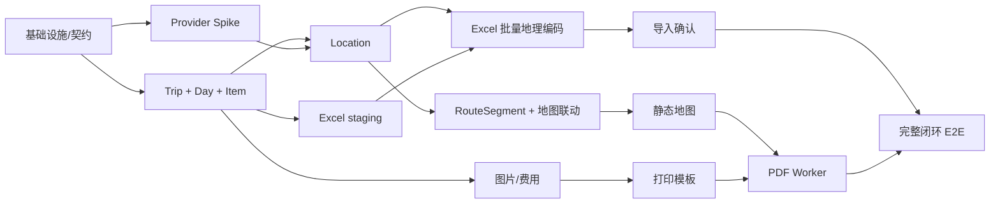

# On The Road 开发计划

> 版本：0.1
> 日期：2026-07-26
> 依赖设计：[DESIGN.md](./DESIGN.md)
> 计划口径：可直接进入排期的工作包；工期为理想人日，不含产品方等待时间。

## 0. 计划摘要

完整 P0 当前任务表合计约 **225 理想人日**（含 Spike、QA 自动化、Beta 样本运营与上线加固；排期预留按 220–230 管理）。建议按 1 周 Sprint 0 + 5 个两周功能 Sprint + 2 周稳定/灰度执行，以 **13 周目标、第 14 周显式缓冲**管理，前提是采用下列团队并由产品方在 Sprint 1 启动 Beta 招募：

- 产品经理/交付负责人：1 人
- UX/UI：前 8 周 1 人，后续 0.5 人
- 前端工程师：2 人
- 后端工程师：2 人
- Worker/平台工程师：1 人
- QA 自动化：从 Sprint 0 起 1 人
- SRE/安全顾问：0.3–0.5 人

若只有 3–4 人精简团队承担产品、设计、工程和 QA 多种角色，建议 **18–22 周**，并重新按人员技能做关键路径排程；若由一名全栈工程师串行完成，不应在未完成 Spike 后给出固定日期。真正的关键路径不是普通 CRUD，而是：

1. 地图供应商与坐标系策略；
2. 地点确认、路线重算的一致性；
3. Excel staging/去重；
4. 中文字体、静态地图和复杂分页的 PDF 技术验证。

因此 Sprint 0 必须先完成这四项技术 Spike，不能把 PDF 和 Provider 风险留到最后一周。

---

## 1. MVP 范围

### 1.1 P0 必须交付的闭环

- 旅行列表：创建、编辑、复制、软删除、搜索/筛选。
- 旅行向导：名称、日期、人数、多目的地、币种、预算；自动生成 TripDay。
- 每日时间线：Item 增删改复制、拖拽/键盘排序、时间/活动/食宿/交通/费用/备注。
- 交通方式：全部系统方式 + 旅行内自定义方式的新建、编辑、停用和视觉配置。
- Location：候选搜索、用户确认、纯文字暂存、地图点选、Marker 拖动、手工坐标、状态提示。
- 地图：按天和全局显示 Marker，按顺序生成 RouteSegment，交通方式视觉区分，时间线双向联动。
- 图片：多图直传、进度、预览、排序、说明、删除、灯箱和日封面。
- 费用：原币种、手工汇率、按天/目的地/类别/方式汇总、预算和剩余。
- Excel：xlsx/xls/csv、模板、映射、预览、校验、去重、批量地理编码、歧义确认、正式导入。
- PDF：A4 横/纵、选择模块、同源预览、封面/概览/全局地图/每日行程/食宿交通费用汇总、中文、图片、页码、真实下载。
- 移动端：按 DESIGN §4.11 完成核心 Item/地点/图片/任务/默认 PDF 闭环；复杂 Excel 映射和逐页排版预览明确为桌面端。
- 持久化、Job 状态、基础审计、错误/空/加载/失败状态。
- 5 天多目的地样例、运行/配置/测试文档。

### 1.2 MVP 明确不做

- 多人实时协作、评论、费用分摊。
- PDF/图片 OCR、自然语言或 AI 行程生成。
- 自动路线优化、景点/餐厅推荐。
- 实时汇率、天气、机酒预订。
- 离线地图与离线编辑。
- 公共分享、细粒度角色、版本历史 UI。
- 大于 5,000 行的批量导入 SLA。
- 在无合规 Provider 的情况下提供“伪实时”地点建议。

---

## 2. 第二阶段扩展项

按建议优先级：

### P1：产品增长与协作

- 只读/可编辑分享链接。
- Trip 成员、Owner/Editor/Viewer、评论和变更通知。
- 实时汇率与汇率快照来源。
- 天气、日历同步、航班/酒店信息接入。
- 版本历史、恢复和审计 UI。
- 模板市场和复制公开行程。

### P1：智能导入

- PDFImporter、ImageOCRImporter、TextImporter。
- AIParserImporter：输出标准 staging row，不直接写正式行程。
- 识别置信度、逐字段来源和人工复核。

### P2：智能规划

- 自动路线优化及“保持固定项”约束。
- 景点/餐厅推荐、营业时间和预约提醒。
- 多币种分摊和结算。
- 离线编辑、冲突合并和离线地图。
- 跨旅行复用自定义交通方式、费用分类和 PDF 主题。

### P2：平台化

- Spring Batch + Apache POI 大文件 Worker。
- 独立 PDF 渲染服务、模板版本管理。
- 多租户、区域化部署、数据驻留。
- Provider 自动路由、成本控制和 SLA 熔断。

---

## 3. 推荐项目目录结构

```text
on-the-road/
├── apps/
│   ├── web/                         # Next.js App Router
│   │   ├── app/
│   │   │   ├── (public)/
│   │   │   ├── (workspace)/trips/
│   │   │   ├── internal/print/     # 专用打印模板
│   │   │   └── error.tsx
│   │   ├── features/
│   │   │   ├── trips/
│   │   │   ├── itinerary/
│   │   │   ├── locations/
│   │   │   ├── map/
│   │   │   ├── expenses/
│   │   │   ├── imports/
│   │   │   └── exports/
│   │   └── components/
│   ├── api/                         # NestJS + Fastify
│   │   └── src/modules/
│   │       ├── identity/
│   │       ├── trips/
│   │       ├── itinerary/
│   │       ├── locations/
│   │       ├── routing/
│   │       ├── attachments/
│   │       ├── expenses/
│   │       ├── imports/
│   │       ├── exports/
│   │       ├── jobs/
│   │       └── audit/
│   ├── worker/                      # Nest Application Context + BullMQ
│   │   └── src/processors/
│   │       ├── geocoding/
│   │       ├── directions/
│   │       ├── import/
│   │       ├── media/
│   │       └── maintenance/
│   └── pdf-worker/                  # Chromium 独立资源边界
│       ├── src/
│       ├── fonts/
│       └── Dockerfile
├── packages/
│   ├── contracts/                   # OpenAPI/JSON Schema/生成客户端
│   ├── domain/                      # 实体、状态机、领域错误
│   ├── application/                 # Use cases / commands / queries
│   ├── database/                    # Drizzle schema、SQL、migrations
│   ├── providers/                   # 地图/地理编码/路线/静态图 adapter
│   ├── importer/                    # Importer 接口与规范化
│   ├── storage/                     # S3/MinIO abstraction
│   ├── observability/
│   ├── config/                      # enum/config/feature flags
│   ├── ui/                          # 设计系统
│   └── test-fixtures/
├── infra/
│   ├── compose/
│   ├── kubernetes/
│   ├── terraform/
│   └── monitoring/
├── docs/
│   ├── DESIGN.md
│   ├── DEVELOPMENT_PLAN.md
│   ├── adr/
│   ├── api/
│   └── runbooks/
├── scripts/
├── pnpm-workspace.yaml
├── turbo.json
└── .env.example
```

约束：

- `apps/*` 不相互 import；共享内容只从 `packages/*` 引入。
- UI 不直接 import 某地图供应商 SDK，统一通过 `features/map` 和 Provider client。
- 可扩展枚举集中在 `packages/config` 与数据库种子。
- Worker 消息只引用 ID/版本，不把完整敏感对象放入 Redis。

---

## 4. 交付里程碑

### Sprint 0（1 周）：决策与并行风险验证

目标：用最小实验验证最危险技术，不做假 UI。

- 冻结本文 Q1–Q14 的默认决策或 ADR。
- 建立 monorepo/CI；平台流并行启动 Compose，Spike 使用独立 harness，不等待完整基础设施串行完成。
- 生成 OpenAPI 客户端和统一 Problem Details。
- Spike A：高德/国际 Provider 的搜索、反查、坐标转换与 attribution。
- Spike B：MapLibre Marker 拖动、地图点选、路线线型。
- Spike C：SheetJS 安全解析 xlsx/xls/csv，5,000 行内存基线。
- Spike D：使用固定静态地图资产验证 Playwright + Noto Sans CJK + 50 页分页 PDF，并校验目录目标页。
- 先冻结最小 5 天契约 fixture，供四个 Spike 并行使用。

退出标准：四个 Spike 都有可重复运行的测试、测量结果和 Go/No-Go 决策。

### Sprint 1（2 周）：平台骨架、Trip/Day 与 Location 核心

- 完成 Compose、身份最小集、owner 访问控制、outbox/Job 基类和基础可观测性。
- Trip/Destination CRUD、向导和日期变更预览。
- 原子生成 TripDay、工作日人工覆盖。
- Provider contracts、Location/staging schema、候选签名和状态机。
- Storage abstraction 可并行启动，供后续媒体与导入复用。

演示出口：可创建并刷新后恢复一个 5 天/2 目的地 Trip；Day 原子生成，Location 契约测试离线可跑。

### Sprint 2（2 周）：行程编辑与地点确认

- Item 全字段 CRUD、复制、软删除、时间线和三栏/分段响应式骨架。
- 拖拽 + 键盘重排、乐观并发、自动保存和交通方式配置。
- 正式/开发 Geocoder adapter、能力发现、缓存、限流和错误映射。
- 候选输入、歧义选择、纯文字保存、重试。
- 地图点选、反向地理编码、Marker 拖动和手工坐标。
- 日/全局地图基础、Marker、图例和 fit bounds。
- 基础费用录入和日小计。
- 完成媒体安全处理基础，以及 Excel 模板、上传与 workbook inspect；尚不提交正式行程。

演示出口：刷新后可完整编辑一天行程；地点候选必须确认，地图点选/拖动会持久化且晚到响应不能覆盖。

### Sprint 3（2 周）：路线、图片、成本和 Excel staging

- RouteSegment 日内/跨日/交通内部段生成、失效、outbox 重算与示意线降级。
- 地图线型、轨迹详情、时间线双向联动、全屏和路线缺口提示。
- 预签名上传、对象元数据、进度、扫描状态、缩略图。
- 图片画廊、排序、说明、灯箱和日封面。
- Expense 独立模型、手工汇率、预算/实际/剩余。
- 按天/目的地/类别/方式/原币种统计。
- Excel 字段映射、staging row、标准化、校验、错误/重复预览。
- 在 E04 契约稳定后，以 fixture 并行开发批量解析和未确认地点 UI；真实 Provider 集成可跨 Sprint 边界完成。

演示出口：选择/修正地点后相邻路线自动更新；可导入混合中英文字段文件并看到准确校验结果，但尚未改变正式行程。

### Sprint 4（2 周）：Excel 闭环与 PDF 并行骨架

- 导入缺坐标批量地理编码、限流、进度和歧义确认。
- 确认导入、并发 fingerprint claim、分批事务、幂等和路线重算。
- PDF options、数据快照、同源预览。
- StaticMapProvider、全局/每日打印地图和 attribution。
- 前端并行实现专用 print template/章节；平台流并行实现 Playwright Worker、资源等待与沙箱骨架。
- 已批准 ImageURLs 进入受控 media 子任务，父 ImportJob 保持 `processing_media`。

演示出口：Excel 可幂等写入正式行程并重算路线；PDF 任务使用冻结快照完成地图与模板预演。

### Sprint 5（2 周）：PDF 闭环、移动端和产品加固

- CJK 字体、精确目录页码、A4 横/纵、分页、页眉页脚。
- PDF 校验、S3、真实下载、过期、取消/重试和预览进度。
- ImageURLs 媒体收敛与 ImportJob 最终状态完成。
- 错误、空、加载、取消、重试、断网恢复。
- 按 DESIGN §4.11 完成移动/平板边界、键盘操作和 WCAG AA 核心路径。
- 5 天示例走通导入 → 地图 → PDF 演示；安全、性能与恢复测试持续执行。

退出标准：功能冻结，完整闭环可演示；遗留项仅限稳定窗口内的验证/缺陷，不再添加功能。

### 稳定与灰度窗口（2 周；第 14 周为显式缓冲）

- G 类测试从各功能 Sprint 即时编写，本窗口完成最终矩阵、staging 容量复测、备份/恢复和队列调和演练。
- Beta cohort 招募最晚在 Sprint 1 启动；内部门禁可用合成 fixture，5%/25% 行为样本必须来自明确同意的真实 Beta 账号。
- 按 §13 的 5% → 25% → 100% 门禁逐级放量。
- 只接受阻断缺陷、数据完整性、安全与性能回归修复；新功能回到 P1。
- 若第 13 周仍未获得 Beta 最小样本，技术发布保持在受控 feature flag 后，公共 GA 延后；可以启用第 14 周缓冲，但不能用合成流量冒充真实用户样本。

### Sprint 与任务 ID 冻结映射

| 时间盒 | 主任务 ID | 跨期/并行说明 |
|---|---|---|
| Sprint 0 | A01–A04、A08–A12 | A02 为平台流；四个 Spike 只依赖轻量 harness/fixture，不串成一条链 |
| Sprint 1 | A05–A07、B01–B04、C01、C03、D01、G08 启动 | B02 完成后 B03 与 C03 由两名 BE 并行 |
| Sprint 2 | B05–B09、C02、C04–C06、D02、D04、E01–E02 | D02 主要由 Worker/平台流承担；E02 在 D02 通过后开始 |
| Sprint 3 | C07–C09、D03、D05、E03–E05，E06/E07 前置切片 | E06/E07 用稳定的 E04 契约并行，允许真实 Provider 集成延续到 Sprint 4 前 1 天 |
| Sprint 4 | E06–E09、F01–F03、F05 | Excel 与 PDF 由不同 BE/FE stream 并行；F03 和 F05 分别依赖 F01/F02 后并行 |
| Sprint 5 | F04、F06–F07、G01 增量冻结 | F07 用状态 mock 与 F04 并行；F06 汇合 F04/F05；G01 在各 Sprint 累积、此处冻结 |
| 稳定/灰度 | G01–G07 最终签署；G08 持续 | 自动化从功能 Sprint 起建设，不在最后两周从零开始 |

---

## 5. 按优先级排列的开发任务清单

估算单位为理想人日；`BE` 包含 API/Worker，`FE` 包含 Web，`PLAT` 为平台，`QA` 为测试设计/自动化。

### P0-A：基础与契约

| ID | 任务 | 角色 | 估算 | 依赖 | 完成标准 |
|---|---|---:|---:|---|---|
| A01 | 建立 monorepo、质量脚本和 CI | PLAT | 2 | - | install/lint/typecheck/unit/build 全绿 |
| A02 | Compose：PostGIS/Redis/MinIO/ClamAV | PLAT | 3 | A01 | 新环境一条命令可启动；扫描器不可用有明确健康状态 |
| A03 | 配置分层、Secret 校验、`.env.example` | BE | 1 | A01 | 缺必需配置快速失败且不泄密 |
| A04 | OpenAPI v1、Problem Details、生成客户端 | BE/FE | 2 | A01 | 契约变更由 CI 检测 |
| A05 | OIDC Provider 决策、开发身份、Secret/回调和 owner 守卫 | BE/PLAT | 5 | A03 | 本地 mock + staging IdP 可用；跨用户资源返回 404/403；密钥可轮换 |
| A06 | Outbox、BullMQ、Job 基类和幂等记录 | BE | 4 | A02 | 重复投递不重复副作用 |
| A07 | 结构化日志、Trace ID、基础指标 | PLAT | 2 | A01 | Web/API/Worker trace 可串联 |
| A08 | 地图/地理编码/坐标系 Spike | BE/FE | 3 | A12 | 自含轻量 harness 中至少 10 个中外 golden 点、候选/反查/转换可重复 |
| A09 | MapLibre 点选、拖动、线型和无底图 Spike | FE | 2 | A12 | fixture tile 与中性网格两种模式可渲染，不等待 A08/Compose |
| A10 | xlsx/xls/csv 5,000 行安全/内存 Spike | BE/QA | 2 | A12 | 三格式 fixture、资源上限和失败码有测量 |
| A11 | CJK + 静态地图 + 50 页 PDF Spike | FE/BE/QA | 4 | - | 自含固定地图资产下文本/逐页/裁切通过，目录条目页码逐条匹配章节锚点 |
| A12 | 最小 5 天契约 fixture 与 golden 资产 | PM/QA | 2 | - | Provider/Excel/PDF Spike 共用同一稳定数据集 |

### P0-B：Trip、Day 与编辑

| ID | 任务 | 角色 | 估算 | 依赖 | 完成标准 |
|---|---|---:|---:|---|---|
| B01 | Currency/Mode/Category 集中配置与 seed | BE | 2 | A02 | 全部要求枚举可查询 |
| B02 | Trip/Destination schema、repo、service | BE | 3 | A02,A04,B01 | CRUD/版本冲突测试全绿 |
| B03 | 日期生成与日期变更 preview/apply | BE | 3 | B02 | 闰年、跨月、缩短日期不丢数据 |
| B04 | 旅行列表与创建向导 | FE | 5 | A04,B02 | 创建后打开 Day 1 |
| B05 | Itinerary 全字段模型与 CRUD | BE | 4 | B03,C03 | 指定字段可持久化；软删除不级联销毁历史费用/附件 |
| B06 | Day 列表、时间线和 Item 编辑器 | FE | 7 | A04,B03,C03 | 用生成契约/mock 与 B05 并行，最终集成；桌面/移动核心编辑可用 |
| B07 | 原子重排、dnd-kit 与键盘替代 | BE/FE | 4 | B05,B06 | 并发冲突可回滚/提示 |
| B08 | 自动保存与离开提醒 | FE | 2 | B06 | saving/saved/error 状态真实 |
| B09 | 旅行内自定义交通方式 CRUD 与设置 UI | BE/FE | 3 | B01,B02 | 可新建/编辑/停用并立即用于 Item/路线；系统方式不可删除 |

### P0-C：地点、地图与路线

| ID | 任务 | 角色 | 估算 | 依赖 | 完成标准 |
|---|---|---:|---:|---|---|
| C01 | Provider contracts 与 fixture provider | BE | 2 | A04 | 契约测试可离线运行 |
| C02 | 生产/开发 Geocoder adapter | BE | 5 | C01 | 能力、限流、缓存、重试符合政策；公共 Nominatim 不做自动补全/常规批处理 |
| C03 | Location schema、staging location、候选签名与状态机 | BE | 4 | A04,B02 | resolved/ambiguous/failed 可重放；Import 确认前不落正式 Location |
| C04 | 地点输入、候选和失败恢复 UI | FE | 5 | C03 | 不静默选择不确定结果 |
| C05 | MapLibre 地图、Marker、图例与 fit bounds | FE | 5 | C01 | 无坐标空态正确 |
| C06 | 地图点选、反查和 Marker 拖动 | BE/FE | 5 | C03,C05 | 手调后 `manuallyAdjusted=true` |
| C07 | RouteSegment 领域逻辑、window generation 与 outbox 队列 | BE | 6 | A06,C03,B05 | 日内/跨日/transport 正确；无 Location 显式缺口；旧 rebuild/route 结果均无法覆盖新 generation |
| C08 | 不同 Mode 的轨迹绘制与详情 | FE | 4 | C05,C07 | 线型/图标/文字均可区分 |
| C09 | 地图—时间线双向联动 | FE | 3 | B06,C05 | 点击任一侧正确高亮另一侧 |

### P0-D：图片和费用

| ID | 任务 | 角色 | 估算 | 依赖 | 完成标准 |
|---|---|---:|---:|---|---|
| D01 | Storage abstraction、预签名 append-only 上传 | BE | 3 | A02,A05 | 随机 key + 条件写禁止覆盖；返回 objectVersion 与 SHA-256 |
| D02 | magic bytes、ClamAV/托管扫描 adapter、缩略图与 fail-closed | BE/PLAT | 6 | A02,A06,D01 | ready 必有 immutable objectVersion/checksum；非图片/超限/恶意文件 failed |
| D03 | 上传进度、画廊、排序、说明、灯箱 | FE | 5 | D01,D02 | 多图核心交互完整 |
| D04 | Expense/汇率 schema 与计算服务 | BE | 3 | B01,B05 | decimal/缺汇率测试全绿 |
| D05 | 费用编辑与统计页 | FE | 4 | D04 | 五种统计维度可核对 |

### P0-E：Excel 导入

| ID | 任务 | 角色 | 估算 | 依赖 | 完成标准 |
|---|---|---:|---:|---|---|
| E01 | 标准 xlsx 模板与中英别名表 | BE/PM | 2 | B01 | 模板可被自身导入 |
| E02 | 上传安全检查和 workbook inspect | BE | 4 | A06,D01,D02 | xlsx/xls/csv 均有 fixture |
| E03 | 映射建议和可编辑映射 UI | FE/BE | 4 | E02 | 示例值与目标字段清晰 |
| E04 | Row normalize/validate/staging + mapping hash | BE | 6 | E01,E02 | 日期/金额/币种/Mode/坐标错误精确到行；能查询跨 Job ledger |
| E05 | 预览、筛选与新增/更新/重复/错误计数 UI | FE | 4 | E03,E04 | 逐行 action 清楚；跳过错误需二次确认 |
| E06 | 批量地理编码、限流和进度 | BE | 5 | C02,E04 | 失败不导致整个 Job 失败 |
| E07 | 未确认地点地图处理 | FE/BE | 4 | C06,E04 | 基于批量解析契约/fixture 并行开发，最终接 E06；候选/点选/纯文字均可继续 |
| E08 | insert/update、owner-aware claim、幂等、取消续跑和路线重算 | BE | 6 | E04,E06,E07,C07 | insert/update 并发不重复；ExternalId 才 update；resumed_from 续跑不重写文字 |
| E09 | 持久化 ImportMediaTask、批准、SSRF-safe 下载、聚合与重试 | BE/FE | 6 | D02,D03,E04 | 每 URL 有审批/hash/attempt/retry-generation/终态；Redis 丢失可调和；父 Job 收敛前 processing_media |

### P0-F：PDF 导出

| ID | 任务 | 角色 | 估算 | 依赖 | 完成标准 |
|---|---|---:|---:|---|---|
| F01 | Export snapshot/options/media preflight/job API | BE | 3 | A06,B05 | 快照绑定 Attachment version/checksum；所有未排除的非 ready（含 failed）默认阻止，ready-only 明示遗漏 |
| F02 | StaticMapProvider 与打印地图资产 | BE/FE | 5 | C07 | Marker/路线/图例/attribution 完整 |
| F03 | 专用 print template 与章节 | FE | 6 | D03,D05,F01 | 全部必需模块可开关 |
| F04 | CJK 字体、分页、精确目录、页眉页脚 | FE/BE | 5 | A11,F03 | 中文提取/渲染通过；每个目录条目页码等于最终章节锚点物理页 |
| F05 | Playwright Worker、资源等待和沙箱 | BE/PLAT | 5 | A11,F01,F02 | 可与模板并行开发；失败/取消不暴露假下载 |
| F06 | PDF 校验、S3、下载和过期 | BE | 3 | F04,F05 | 文件名、真实 PDF、快照/模板复用键正确 |
| F07 | 预览、进度、取消、重试 UI | FE | 4 | F01,F05 | 基于状态契约并行开发；最终与 F06 集成且 Job 状态一致 |

### P0-G：上线质量

| ID | 任务 | 角色 | 估算 | 依赖 | 完成标准 |
|---|---|---:|---:|---|---|
| G01 | 从最小契约扩展为 5 天完整种子/Excel fixture | QA/PM | 3 | A12,B–F | 覆盖歧义、手调坐标、跨日路线、重复导入 |
| G02 | E2E 核心闭环 | QA | 6 | G01 | Chrome + 移动 viewport 全绿 |
| G03 | PDF 视觉回归和文本检查 | QA | 3 | F06 | 无关键截断/缺字/失图 |
| G04 | 安全测试与威胁项修复 | QA/BE | 4 | D–F | Critical/High 清零；Medium 有负责人和修复日期 |
| G05 | 性能、容量和队列恢复测试 | QA/PLAT | 4 | E,F | 按 DESIGN §17.4 固定环境/样本/阈值判绿 |
| G06 | 可观测 Dashboard、告警和 Runbook | PLAT | 3 | A07 | 告警可演练 |
| G07 | README、配置、Provider/PDF 运维文档 | 全体 | 3 | 全部 | 新成员按文档可运行 |
| G08 | Beta cohort、测试账号池和灰度样本运营 | PM/QA | 2 | B04 | Sprint 1 启动招募；记录同意、样本归属和退出机制；不足时 GA 明确延后 |

当前表内合计约 **225 理想人日**，Spike 后以 220–230 区间校准。13 周目标（第 14 周缓冲）依赖 2 FE + 2 BE + 1 Worker/平台 + 1 QA 的并行能力，以及 G08 按期获得 Beta 样本；3–4 人精简团队按 18–22 周重新排程。

---

## 6. 依赖与关键路径



不能随意压缩的关键路径：

- Provider/坐标系 → Location → Route → Static map → PDF。
- Excel staging → 批量 Location → 确认导入 → Route 重算。
- Attachment ready → 图片衍生图 → PDF。

---

## 7. 关键模块伪代码

### 7.1 创建 Trip 并生成 Day

```ts
async function createTrip(command, actor, idempotencyKey) {
  return db.transaction(async (tx) => {
    const replay = await idempotency.tryReplay(tx, actor.id, "createTrip", idempotencyKey);
    if (replay) return replay;

    assertDateRange(command.startDate, command.endDate);
    const trip = await tripRepo.insert(tx, command, actor.id);
    const destinations = await destinationRepo.insertMany(tx, trip.id, command.destinations);
    const dates = eachLocalDateInclusive(command.startDate, command.endDate);

    const days = await tripDayRepo.insertMany(
      tx,
      dates.map((date, index) => ({
        tripId: trip.id,
        dayNumber: index + 1,
        localDate: date,
        isWorkday: deriveWeekday(date),
        workdaySource: "derived",
      })),
    );

    await outbox.append(tx, "trip.created", trip.id, { tripId: trip.id });
    const response = { trip, destinations, days };
    await idempotency.complete(tx, actor.id, "createTrip", idempotencyKey, response);
    return response;
  });
}
```

### 7.2 候选搜索与缓存

```ts
async function searchPlaces(query, context) {
  // mapProfile 由部署/Trip 显式保存；MVP 不因一次失败静默切换 Provider。
  const provider = providerRouter.pick(context.mapProfile, "geocoding");
  if (context.trigger === "autocomplete" && !provider.capabilities().autocomplete) {
    throw capabilityError("AUTOCOMPLETE_NOT_SUPPORTED");
  }

  const key = geocodeCacheKey(provider.name, normalize(query), context);
  let candidates = await cache.get<NormalizedCandidate[]>(key);
  if (!candidates) {
    await limiter(provider.name).takeOrThrow();
    const raw = await retryTransient(() => provider.search({ query, ...context }));
    candidates = raw
      .map(providerNormalizer.toDomain)
      .map((item) => ({ ...item, score: contextualScore(item, context) }))
      .sort(descendingScore);
    await cache.set(key, candidates, provider.searchTtl());
  }

  // 缓存只保存规范候选；每次响应重新生成短时 candidateId。
  return signedOpaqueCandidates(candidates);
}
```

### 7.3 保存手工 Marker 并重算相邻路线

```ts
async function adjustCoordinates(locationId, point, actor, expectedVersion) {
  return db.transaction(async (tx) => {
    await locationRepo.requireOwned(tx, locationId, actor.id);
    assertWgs84(point);

    // 单条 UPDATE ... WHERE id=? AND version=? 完成真正的 CAS；
    // 不能把“先读 version、后无条件 UPDATE”误当作乐观锁。
    const updated = await locationRepo.updatePointIfVersion(tx, locationId, expectedVersion, {
      point,
      manuallyAdjusted: true,
      geocodingStatus: "resolved",
    });
    if (!updated) throw versionConflict("LOCATION_VERSION_CHANGED");

    const affectedPairs = await itineraryRepo.findAdjacentPairsByLocation(tx, locationId);
    const affectedDayIds = uniqueArrivalDaysAndBoundaries(affectedPairs);
    const routeGenerations = await tripDayRepo.bumpRouteGenerations(
      tx, affectedDayIds,
    );
    await routeRepo.markPairsObsolete(tx, affectedPairs);
    await outbox.append(tx, "location.coordinates-adjusted", locationId, {
      locationId,
      locationVersion: updated.version,
      affectedPairs,
      routeGenerations,
    });
    return updated;
  });
}
```

### 7.4 Item 重排

```ts
async function reorderDay(dayId, orderedIds, baseVersion, actor) {
  await db.transaction(async (tx) => {
    const day = await dayRepo.lockOwned(tx, dayId, actor.id);
    assertVersion(day, baseVersion);

    const currentIds = await itemRepo.listIds(tx, dayId);
    assertSameSet(currentIds, orderedIds);

    await itemRepo.assignSparseOrder(tx, dayId, orderedIds);
    const routeGenerations = await tripDayRepo.bumpRouteWindowGeneration(tx, dayId);
    await routeRepo.markDayAndBoundaryObsolete(tx, dayId);
    await dayRepo.bumpVersion(tx, dayId);
    await outbox.append(tx, "itinerary.reordered", dayId, {
      dayId,
      orderedIds,
      routeGenerations,
    });
  });
}
```

### 7.5 Excel 行标准化与确认导入

```ts
async function stageImport(jobId, mapping) {
  const job = await importRepo.requireJob(jobId);
  const mappingHash = stableHash(mapping);
  await importRepo.saveMapping(jobId, mapping, mappingHash);

  for await (const raw of importer.readRows(await storage.open(jobId))) {
    const normalized = importer.normalize(raw, mapping);
    const issues = validators.flatMap((v) => v(normalized));
    const fingerprint = stableFingerprint(normalized);
    const sourceRowKey = stableSourceRowKey(raw.sheetName, raw.rowNumber);
    const disposition = issues.length
      ? "error"
      : await duplicateDetector.classify({
          tripId: job.tripId,
          sourceSha256: job.sourceSha256,
          importerVersion: job.importerVersion,
          mappingHash,
          rowFingerprint: fingerprint,
          externalId: normalized.externalId,
        }); // "new" | "update" | "duplicate"

    await db.transaction(async (tx) => {
      const staged = await staging.write(tx, {
        jobId,
        raw,
        normalized,
        fingerprint,
        sheetName: raw.sheetName,
        rowNumber: raw.rowNumber,
        sourceRowKey,
        status: disposition,
        issues,
      });
      await mediaTasks.registerDiscoveredUrls(tx, {
        jobId,
        importRowId: staged.id,
        urls: normalized.imageUrls,
        initialStatus: "awaiting_approval",
      }); // 与 staging row 原子登记，只写加密 URL/hash，不发网络请求
    });
  }
}

async function commitImport(jobId, actor, idempotencyKey) {
  let job;
  try {
    job = await jobs.claimOwned(
      jobId, actor.id, "ready_to_import", "importing", idempotencyKey,
    );
    if (!job) return; // 已在无 Worker 状态直接 cancelled，或被其他 Worker claim
    for await (const chunk of staging.readyRows(jobId, 200)) {
      await jobs.throwIfCancelling(jobId); // chunk 前安全检查点
      await db.transaction(async (tx) => {
        await importRepo.lockJobInState(tx, jobId, "importing");
        for (const row of chunk) {
          if (row.status === "update" && row.overrideDecision) {
            throw validationError("UPDATE_CANNOT_OVERRIDE_FINGERPRINT_OWNER");
          }
          const decisionScope = row.status === "update"
            ? "default"
            : row.overrideDecision
              ? `override:${row.overrideDecision.id}`
              : "default";
          const ledgerKey = importLedgerKey(job, row.sourceRowKey, decisionScope);
          const replay = await importLedger.find(tx, ledgerKey);
          if (replay) {
            await importRepo.markSkipped(tx, row.id, "EXACT_SOURCE_ROW_REPLAY");
            if (replay.itineraryItemId) {
              // cancelled→resumed_from 或 source 重放：文字不再写，但获批图片
              // 必须重新绑定原正式 Item，不能在结尾被 cancelUnattached 吞掉。
              await mediaTasks.attachApprovedToItem(
                tx, jobId, row.id, replay.itineraryItemId,
              );
            }
            continue;
          }

          let updateTarget = null;
          if (row.status !== "update") {
            const claimed = await fingerprintClaims.tryInsert(tx, {
              tripId: job.tripId,
              rowFingerprint: row.fingerprint,
              claimScope: decisionScope,
              overrideDecisionId: row.overrideDecision?.id,
              importJobId: jobId,
              importRowId: row.id,
              overrideReason: row.overrideDecision?.reason,
            }); // INSERT ... ON CONFLICT DO NOTHING RETURNING id
            if (!claimed) {
              await importLedger.recordSkip(tx, ledgerKey, {
                sourceRowKey: row.sourceRowKey,
                decisionScope,
                overrideDecisionId: row.overrideDecision?.id,
                overrideReason: row.overrideDecision?.reason,
                reason: "TRIP_FINGERPRINT_CLAIMED",
              });
              await importRepo.markSkipped(tx, row.id, "TRIP_FINGERPRINT_CLAIMED");
              continue;
            }
          } else {
            assertStableExternalId(row.normalized);
            updateTarget = await itineraryRepo.lockByExternalId(
              tx, job.tripId, row.normalized.externalSource, row.normalized.externalId,
            );
            const owned = await fingerprintClaims.claimOrReuseForItem(tx, {
              tripId: job.tripId,
              rowFingerprint: row.fingerprint,
              claimScope: "default",
              itineraryItemId: updateTarget.id,
              importJobId: jobId,
              importRowId: row.id,
            });
            if (!owned) {
              await importRepo.markError(
                tx, row.id, "FINGERPRINT_OWNED_BY_OTHER_ITEM",
              );
              continue; // 不把 Item A 更新成与 Item B 相同的行
            }
          }

          const location = row.stagedLocation
            ? await locationRepo.createFromStaging(tx, job.tripId, row.stagedLocation)
            : null;
          const item = row.status === "update"
            ? await itineraryRepo.updateLocked(tx, updateTarget, {
                ...row.normalized,
                locationId: location?.id,
              })
            : await itineraryRepo.insertFromImport(tx, {
                ...row.normalized,
                locationId: location?.id,
              });

          await fingerprintClaims.attachItemIfPresent(tx, jobId, row.id, item.id);
          await importLedger.record(tx, ledgerKey, {
            importJobId: jobId,
            importRowId: row.id,
            itineraryItemId: item.id,
            action: row.status === "update" ? "update" : "insert",
            sourceRowKey: row.sourceRowKey,
            decisionScope,
            overrideDecisionId: row.overrideDecision?.id,
            overrideReason: row.overrideDecision?.reason,
          });
          await importRepo.markImported(tx, row.id, item.id);
          await mediaTasks.attachApprovedToItem(tx, jobId, row.id, item.id);
        }
        const routeGenerations = await tripDayRepo.bumpRouteWindowsForImportRows(
          tx, chunk.map((row) => row.id),
        );
        await routeRepo.markGenerationWindowsObsolete(tx, routeGenerations);
        await outbox.append(tx, "import.chunk-committed", jobId, {
          rowIds: chunk.map((row) => row.id),
          routeGenerations,
        });
      });
    }

    await jobs.throwIfCancelling(jobId); // 正式数据已提交，媒体前安全检查点
    await db.transaction(async (tx) => {
      await importRepo.lockJobInState(tx, jobId, "importing");
      await mediaTasks.cancelUnattached(tx, jobId, "ROW_NOT_IMPORTED");
      const approved = await mediaTasks.listApprovedAttached(tx, jobId);
      if (approved.length > 0) {
        await jobs.compareAndSet(tx, jobId, "importing", "processing_media");
        const queued = await mediaTasks.queue(tx, approved);
        for (const task of queued) {
          await outbox.append(tx, "import.media-requested", task.id, {
            mediaTaskId: task.id,
          });
        }
      } else {
        await jobs.completeFrom(tx, jobId, "importing", {
          withWarnings: await importRepo.hasWarnings(tx, jobId),
        });
      }
    });
    // 媒体聚合器按 DB 子任务总数，在所有 queued/... 进入 ready/failed 后，
    // 从 processing_media CAS 到 completed 或 completed_with_warnings。
  } catch (error) {
    if (isCancellationRequested(error) || await jobs.isCancelling(jobId)) {
      await jobs.cancelFromCheckpoint(jobId); // 只允许 cancelling -> cancelled
      return;
    }
    await jobs.failIfNotCancelling(jobId, classify(error));
    throw error;
  }
}
```

Media Worker 的队列 payload 只有 `mediaTaskId`。它先以 `queued`（或达到 `nextAttemptAt` 的 `retry_scheduled`）`-> fetching` CAS claim 数据库行，同时取得随机 `leaseToken`/expiry，并递增当前代 `attemptCount` 与累计 `lifetimeAttemptCount`；每一步只用 `WHERE lease_token=? AND version=?` 保存状态/error并续租。过期 lease 被 reconciler 原子改为 `retry_scheduled`、清空旧 token 并 bump version，旧 Worker 的晚到写必然失败。对象副作用使用 `taskId/retryGeneration` 的随机 append-only key + conditional put；失去 fencing 的 Worker 只能留下可清理孤儿，不能关联 Attachment。瞬时失败进入 `retry_scheduled`，只有永久失败/当代重试耗尽才进入 `failed`；人工 retry 先审计旧错误、递增 generation、把当代 attempt 归零并保留累计次数。`cancelling` 时停止创建新副作用、清理 quarantine，并把未运行任务直接 `cancelled`、活跃任务经 `cancelling` 收敛。

媒体聚合器锁定父 Job 后执行数据库计数：只要存在 `queued/fetching/quarantined/scanning/processing/retry_scheduled` 就保持 `processing_media`；全部进入 `ready/failed` 后才 CAS 为 `completed/completed_with_warnings`。取消已经把父状态改为 `cancelling` 时 CAS 必须失败，不能把任务“复活”为完成。Maintenance reconciliation 根据 `import_media_task` 的非终态/租约重投，而不是依赖 Redis 中仍有多少消息。

`resumeImport(cancelledJobId)` 不修改原终态：事务内校验源/staging 保留期，创建 `resumed_from_job_id=cancelledJobId` 的新 Job，复制未提交 staging row 与仍可重试的 media task。若已提交行在重放时命中 ledger，则复用 `ledger.itineraryItemId` 绑定新媒体 task，但不重写文字；若 staging/task 已清理则从原 source 重放并要求用户重新确认 URL，source 也过期则返回 `410 IMPORT_SOURCE_EXPIRED`。

### 7.6 RouteSegment 重建

```ts
async function rebuildRouteWindow(tripId, affectedDayId, expectedGenerations) {
  // 业务写事务已先 bump 当前/边界 Day 的 route_generation，并把值放入 outbox。
  // 这里可在事务外计算，但提交必须重新锁定并验证 generation。
  const trip = await tripRepo.get(tripId);
  const items = await itineraryRepo.listChronologicalWindow(tripId, affectedDayId);
  const desired: DesiredSegment[] = [];

  for (const item of items.filter((value) => value.dayId === affectedDayId)) {
    if (item.type === "transport" && item.startLocation && item.endLocation) {
      desired.push({
        kind: "item_transport",
        arrivalDayId: item.dayId,
        fromItemId: item.id,
        toItemId: item.id,
        fromItemRevision: [item.id, item.version, item.dayVersion, item.sortOrder],
        toItemRevision: [item.id, item.version, item.dayVersion, item.sortOrder],
        from: item.startLocation,
        to: item.endLocation,
        mode: item.transportMode ?? SYSTEM_OTHER_MODE,
      });
    }
  }

  for (const [fromItem, toItem] of adjacentPairs(items)) {
    const from = fromItem.endLocation ?? fromItem.location;
    const to = toItem.startLocation ?? toItem.location;
    desired.push({
      kind: "between_items",
      arrivalDayId: toItem.dayId, // 跨 Day 段归到达日
      fromItemId: fromItem.id,
      toItemId: toItem.id,
      fromItemRevision: [
        fromItem.id, fromItem.version, fromItem.dayVersion, fromItem.sortOrder,
      ],
      toItemRevision: [toItem.id, toItem.version, toItem.dayVersion, toItem.sortOrder],
      from,
      to,
      mode: toItem.transportMode ?? SYSTEM_OTHER_MODE,
    });
  }

  await db.transaction(async (tx) => {
    const lockedDays = await tripDayRepo.lockRouteWindow(tx, tripId, affectedDayId);
    if (!sameGenerations(lockedDays, expectedGenerations)) return; // 旧 rebuild 整体丢弃
    const sourceContext = {
      dayIds: lockedDays.map((day) => day.id),
      routeGenerations: expectedGenerations,
    };

    await routeRepo.markWindowObsolete(tx, tripId, affectedDayId, desired);
    await routeBlockerRepo.clearWindow(tx, tripId, affectedDayId);
    for (const segment of desired) {
      if (!segment.from || !segment.to) {
        // Item 连 Location 实体都没有时不建 RouteSegment，也不跨过它连接远端。
        await routeBlockerRepo.record(tx, segment, "LOCATION_MISSING", expectedGenerations);
        continue;
      }

      const sourceVersion = hash({
        routeGenerations: expectedGenerations,
        fromItem: segment.fromItemRevision,
        toItem: segment.toItemRevision,
        fromLocation: [segment.from.id, segment.from.version, segment.from.point],
        toLocation: [segment.to.id, segment.to.version, segment.to.point],
        modeId: segment.mode.id,
        kind: segment.kind,
        arrivalDayId: segment.arrivalDayId,
      });
      if (await routeRepo.existsCurrent(tx, segment, sourceVersion)) continue;

      if (!isConfirmed(segment.from) || !isConfirmed(segment.to)) {
        await routeRepo.upsertPending(
          tx, segment, sourceVersion, sourceContext, "LOCATION_NOT_CONFIRMED",
        );
        continue;
      }
      if (samePoint(segment.from, segment.to)) continue;

      const provider = directionsRouter.pick(trip.mapProfile, segment.mode);
      if (!provider) {
        await routeRepo.saveApproximate(
          tx, buildLineOrArc(segment), sourceVersion, sourceContext,
        );
        continue;
      }
      const persisted = await routeRepo.upsertPending(
        tx, segment, sourceVersion, sourceContext,
      );
      await outbox.append(tx, "route.segment-requested", persisted.id, {
        segmentId: persisted.id,
        sourceVersion,
      });
    }
  });
}

async function resolveRouteSegment({ segmentId, sourceVersion }) {
  const current = await routeRepo.get(segmentId);
  if (
    !current ||
    current.sourceVersion !== sourceVersion ||
    !(await routeRepo.isStillCurrentAdjacencyAndGeneration(current))
  ) return; // 排序、Item/Day/Location/Mode 任一变化即丢弃旧请求

  const provider = directionsRouter.pick(current.mapProfile, current.transportMode);
  const route = await provider.directions(current);
  await db.transaction(async (tx) => {
    // 全系统固定锁顺序：按 ID 排序的 Day window → RouteSegment，避免与 rebuild 死锁。
    const days = await tripDayRepo.lockByIds(
      tx, [...current.sourceContext.dayIds].sort(),
    );
    const locked = await routeRepo.lock(tx, segmentId);
    if (!locked || locked.sourceVersion !== sourceVersion) return;
    if (
      !sameSet(locked.sourceContext.dayIds, current.sourceContext.dayIds) ||
      !sameGenerations(days, locked.sourceContext.routeGenerations) ||
      !(await routeRepo.isStillCurrentAdjacency(tx, locked))
    ) {
      await routeRepo.markObsolete(tx, segmentId);
      return;
    }
    await routeRepo.resolveLocked(tx, {
      segmentId,
      expectedSourceVersion: sourceVersion,
      geometry: route.geometry,
      provider: provider.name,
    });
  }); // 最终提交再次锁 Day + 校验 generation/adjacency，不依赖网络调用前检查
}
```

Dispatcher 从 outbox 发布到 Redis 的 payload 只有 `{segmentId, sourceVersion}`，不传可能过期的完整 Segment。Worker 必须重读数据库并校验真实相邻关系；写回使用 CAS。

### 7.7 PDF Worker

```ts
async function renderPdf(jobId) {
  let job;
  const tempAssets = [];
  let uploadedArtifact = null;
  try {
    job = await exportRepo.claimQueued(jobId); // queued -> rendering_maps CAS
    if (!job) return; // queued 已被 API 直接取消，或被另一 Worker claim
    await exportRepo.throwIfCancelling(jobId);
    const maps = await staticMaps.renderAll(job.snapshot, job.options);
    tempAssets.push(...maps);

    await exportRepo.advance(jobId, "rendering_maps", "rendering_document");
    await exportRepo.throwIfCancelling(jobId);
    const token = await printTokens.issue(jobId, job.snapshotHash);
    const page = await isolatedBrowser.newPage();
    await page.goto(internalPrintUrl(jobId, token), { waitUntil: "networkidle" });
    await page.evaluate(async () => {
      await document.fonts.ready;
      await Promise.all([...document.images].map((img) => img.decode()));
      await window.__PRINT_READY__;
    });

    const pdf = await page.pdf(pdfOptions(job.options));
    await exportRepo.advance(jobId, "rendering_document", "validating");
    await exportRepo.throwIfCancelling(jobId);
    const validation = await pdfValidator.assertValid(pdf, job.snapshot);
    await exportRepo.advance(jobId, "validating", "uploading");
    await exportRepo.throwIfCancelling(jobId);
    uploadedArtifact = await storage.putExport(job, pdf);
    await exportRepo.throwIfCancelling(jobId);
    const completed = await exportRepo.completeIfUploading(
      jobId, uploadedArtifact, validation.pageCount,
    );
    if (!completed) {
      await storage.delete(uploadedArtifact); // 取消赢得竞争，不能留下可下载孤儿
      uploadedArtifact = null;
      await exportRepo.cancelFromCheckpoint(jobId);
    }
  } catch (error) {
    if (isCancellationRequested(error) || await exportRepo.isCancelling(jobId)) {
      if (uploadedArtifact) await storage.delete(uploadedArtifact);
      await exportRepo.cancelFromCheckpoint(jobId);
      return;
    }
    await exportRepo.failIfInActiveStage(jobId, classify(error));
    throw error;
  } finally {
    await storage.deleteTemporary(tempAssets);
  }
}
```

---

## 8. 示例数据实施计划

固定 seed：`上海 → 舟山/普陀山` 5 天（可替换，但需稳定用于测试）。

| Day | 地点 | 必含内容 | 交通 |
|---|---|---|---|
| 1 | 上海 | 抵达、酒店、晚餐、夜景 | 飞机/地铁/步行 |
| 2 | 上海 | 早餐、景点、午餐、活动、晚餐 | 公交/步行 |
| 3 | 上海 → 舟山 | 早餐、跨城、酒店、海鲜晚餐 | 高铁/巴士/轮船 |
| 4 | 普陀山 | 早餐、寺庙/步道、午餐、返回 | 公共轮船/步行 |
| 5 | 舟山 → 上海 | 早餐、返程、机场 | 出租车/飞机 |

数据要求：

- 至少 25 个 ItineraryItem，覆盖早餐/午餐/晚餐、住宿和活动。
- CNY + USD 两种原币种，并配置手工汇率。
- 每天至少 1 张可本地打包的测试图片，避免测试依赖失效外链。
- 至少 1 个同名地点为 `ambiguous`。
- 至少 1 个 Location 为 `manually_adjusted=true`，保留调整前后 fixture。
- 至少 1 段飞机虚线弧线、1 段步行点线、1 段公共交通实线、1 段船运蓝线。
- 同一份数据同时生成标准 Excel、含错误 Excel、重复 Excel 和 PDF golden fixture。

---

## 9. 测试策略

### 9.1 测试金字塔

| 层 | 范围 | 工具/方式 |
|---|---|---|
| 静态 | TypeScript strict、lint、OpenAPI diff、SQL lint | CI 每次提交 |
| 单元 | 日期、排序、状态机、费用、评分、fingerprint | Vitest/Jest |
| 属性测试 | 日期范围、金额换算、排序集合、坐标范围 | fast-check |
| 集成 | PostGIS、Redis/BullMQ、MinIO、outbox | Testcontainers |
| Provider contract | 同一 fixture 验证各 adapter | mock server + 少量受控 smoke |
| 组件 | 编辑器、候选、上传、错误态 | Testing Library |
| E2E | 核心闭环、移动端、键盘 | Playwright |
| 视觉 | 三栏、移动端、PDF 每页渲染 | screenshot/PDF page diff |
| 性能 | 30 天/300 Item、5,000 行、100 图片 PDF | k6 + Worker benchmark |
| 安全 | authz、CSRF、SSRF、上传、公式/ZIP bomb | 自动化 + 手工复核 |

### 9.2 必测边界

- 日期：同日旅行、跨月/年、闰日、缩短/延长且已有 Item。
- 时间：时段、单点、跨午夜、无具体时间。
- 排序：并发重排、漏 ID、多 ID、跨 Day ID。
- Location：中文/英文、同名跨国、零坐标、边界经纬度、反查失败、手调覆盖。
- Route：缺一端坐标、Item 完全无 Location 时形成 `LOCATION_MISSING` 缺口且不跨项偷连、缺 Mode→OTHER、Mode 变化、transport Start→End、Item 删除、拖动坐标、Provider 429、前日末项→次日首项和双日失效窗口；用 barrier 强制旧/new rebuild 逆序提交，旧 generation 不得产生 active/approximate 段。
- Currency：0 金额、缺汇率、高精度、不同小数位、汇率修改。
- Excel：空表、多 sheet、合并单元格、1900/1904 serial date、Day/Date 冲突、CSV BOM/编码、公式、损坏 ZIP、超限文件；同文件换 Job/幂等键、修改部分行后重传、staging 清理后重传、不同源并发 insert↔insert 及 update↔insert 同 fingerprint 均不重复，update 仅可复用同 Item owner，显式 insert override 必须有一次性决策与审计。
- Image：HEIC/错误 MIME、超大图、断点失败、同 key 覆盖被拒、ready 缺 objectVersion/checksum 被拒、删除中仍被 PDF 引用。
- ImageURLs：未批准不下载、每 URL 持久任务/审批/错误/attempt/retry-generation 可查，staging/Item 清理不级联抹掉 task 审计；私网/重定向 SSRF 被拒、Redis 清空及 lease ABA 后可调和；第 4 次耗尽后人工 retry 进入新 generation、当代 attempt 归零且累计次数保留；取消后 staging 清理再从 source 续跑时，ledger 命中文字行把新媒体 task 绑定原 Item；错误状态 409、密文过期 410；PDF `require_all` 阻止所有未排除的非 ready（含 failed），`ready_only` 明示遗漏。
- PDF：中英混排、长 URL/备注、超高图片、空图片、横纵、100+ 页、资源超时；渲染/验证/上传各阶段取消竞争不会产生 completed 或孤儿下载。

### 9.3 PDF 验证

每次构建至少验证：

1. 文件以 `%PDF-` 开头且 parser 可打开。
2. 页数 > 0，文件名符合 `旅行名称-开始日期-结束日期.pdf`。
3. 文本提取能找到旅行名、Day 1、中文地点、费用汇总。
4. 逐页渲染 PNG，检测空白页、缺图标记和关键区域裁切。
5. 地图资产清单包含 Marker、Route、Legend、Attribution。
6. 图片宽高比例在允许误差内。
7. 页眉、页脚和页码在抽样页存在。
8. 每个目录条目的打印页码与对应章节锚点在最终 PDF 的物理页逐条一致。
9. `ready_only` PDF 含“未包含资源”清单且数量与快照一致；`require_all` 在任何未排除媒体 `status != ready`（含 failed）时不创建 ExportJob。

### 9.4 可靠性测试

- API 提交成功但队列投递前进程退出：outbox 能恢复。
- Worker 完成副作用但 ACK 前退出：重复任务不重复导入/导出。
- 同一 ImportJob 连续产生多个 `import.chunk-committed`：每个 outbox event 都被处理一次，不因 eventType/aggregate 相同被吞掉。
- Redis 清空后：数据库 Job reconciliation 能重新入队。
- Provider 超时/429/5xx：正确退避，UI 可重试且不丢文字。
- S3 短暂失败：Job 保留检查点，不显示成功。
- PostgreSQL 主从切换：API 失败可解释，任务不会双提交。

---

## 10. 验收追踪矩阵

| AC | 验收要求 | Owner | 对应实现 | 自动化证据 |
|---:|---|---|---|---|
| 01 | 创建多目的地旅行 | PM + Trip DRI | B02–B04 | create Trip API + E2E |
| 02 | 按日期生成 Day 1…N | Trip DRI | B03 | leap/year property test + E2E |
| 03 | 每天添加多条行程 | Itinerary DRI | B05–B06 | CRUD integration + E2E |
| 04 | 编辑全部指定字段 | Itinerary DRI | B05–B06 | OpenAPI schema + persisted round-trip |
| 05 | 拖拽调整当天顺序 | FE + Itinerary DRI | B07 | mouse/touch/keyboard reorder E2E |
| 06 | 上传和查看多图 | Media DRI | D01–D03 | real upload + reload + lightbox E2E |
| 07 | 设置食宿信息 | Itinerary DRI | B05–B06 | accommodation/dining integration |
| 08 | 交通、耗时和费用 | Itinerary + Expense DRI | B05,D04–D05 | item/cost calculation suite |
| 09 | 地点文字搜索候选 | Map DRI | C01–C04 | provider contract + ambiguity E2E |
| 10 | 选择候选自动保存坐标 | Map DRI | C03–C04 | Location persisted/reload test |
| 11 | 地图点选地点 | Map DRI | C05–C06 | map click + reverse failure E2E |
| 12 | 拖动 Marker 修正 | Map DRI | C06 | version/CAS + manuallyAdjusted test |
| 13 | 地图显示 Marker | Map DRI | C05 | all/day/destination fixture E2E |
| 14 | 按顺序显示 A→B 轨迹 | Routing DRI | C07–C08 | daily + cross-day + transport segment E2E |
| 15 | 轨迹区分交通方式 | Map DRI | B09,C08 | visual token/legend contract + screenshot |
| 16 | 地图与时间线联动 | FE DRI | C09 | bidirectional focus E2E |
| 17 | Excel 预览、校验、映射 | Import DRI | E01–E05 | xlsx/xls/csv golden suite |
| 18 | 缺坐标自动批量解析 | Import + Map DRI | E06 | quota/cache/progress integration |
| 19 | 未解析地点人工确认 | Import + Map DRI | E07 | candidate/map/text staging E2E |
| 20 | 下载 Excel 模板 | Import DRI | E01 | template round-trip test |
| 21 | PDF 含文字、图片和地图 | Export DRI | F01–F07,E09 | parser + text + asset manifest + 目录锚点页码 test |
| 22 | PDF 中文与分页合理 | Export + QA DRI | F03–F06 | CJK extraction + per-page visual diff + 目录物理页一致性 |
| 23 | 刷新后数据不丢失 | 各模块 DRI | B–F | reload/re-enter/worker-retry E2E |
| 24 | 桌面与移动端可用 | UX + FE DRI | B06,C05,G02 | DESIGN §4.11 手机 P0 操作矩阵 + viewport/touch/keyboard E2E；桌面专属项有明确引导 |
| 25 | 主要按钮有真实交互 | QA DRI | 全部 | no-op button inventory + E2E |
| 26 | 运行、配置和测试说明 | PLAT DRI | G07 | clean-machine rehearsal |

额外 P0 质量门禁：

| ID | 门禁 | Owner | 证据 |
|---|---|---|---|
| QG-01 | 同/不同源并发 insert/update、换幂等键、清 staging 后不重复；override 成功/skip ledger 均带 decision+reason | Import DRI | owner-aware barrier + one-time decision/replay + DDL CHECK integration |
| QG-02 | Job 空闲/活跃阶段取消、上传竞争、cancelled→新 Job 续跑、Redis 丢失调和 | Worker DRI | CAS + resume/ledger + orphan-cleanup failure-injection suite |
| QG-03 | 无 Key 时 fixture/显式搜索/中性地图/PDF 降级真实可用 | Map + Export DRI | offline E2E |
| QG-04 | Attachment 经 upload/scan/process；ready 必有 immutable version/checksum且 key 不可覆盖 | Media DRI | ClamAV + conditional-put + corrupt fixture |
| QG-05 | 每 URL durable/fenced task 经批准/SSRF 防护后关联；可调和聚合；PDF 不静默漏图 | Media + Import DRI | expired-lease race + DB reconciliation + fetch/export preflight suite |
| QG-06 | 旅行内自定义 Mode 可 CRUD、可绘制、可导出 | Itinerary + Map DRI | settings + route/PDF E2E |
| QG-07 | Marker 手调后晚到 geocode 不覆盖 | Map DRI | concurrent CAS integration |
| QG-08 | Outbox 同 aggregate 多事件均处理一次 | Worker DRI | inbox/outbox integration |
| QG-09 | 达到 DESIGN §17.4 上线前六项 staging 容量门禁 | PLAT + QA | versioned benchmark report；月度 SLO 单独上线观察 |
| QG-10 | 旧 rebuild/Directions 不覆盖新 generation；统一 Day→Segment 锁序无死锁 | Routing DRI | inverse-completion barrier + concurrent lock-order integration |

验收不能仅看 UI 提示；导入必须查询到正式 Item，PDF 必须能下载并被独立 PDF parser 打开。

---

## 11. Definition of Ready / Done

### 11.1 Story Ready

- 产品规则、空/错/加载/权限状态明确。
- API/事件/数据迁移影响已评审。
- 外部 Provider 配额、测试环境和降级方式已知。
- 可测验收条件和 fixture 已准备。
- 涉及隐私/上传/远程 URL/PDF 的 Story 完成威胁项检查。

### 11.2 Story Done

- 代码评审通过；无新增高风险债务。
- unit/integration/contract/E2E 按风险覆盖。
- OpenAPI、migration、事件 schema 向后兼容。
- 日志、指标、错误码和审计满足设计。
- 无障碍键盘路径和移动布局已验证。
- 文档、配置、feature flag 和回滚方案更新。

### 11.3 MVP Release Done

- 验收矩阵 P0 全绿。
- CVSS Critical/High 安全缺陷为零；Medium 必须有负责人、缓解措施和承诺修复日期。
- Provider 限流与 attribution 审核通过。
- 数据库迁移、备份恢复、队列恢复、对象清理演练通过。
- 5 天样例能完整导入、编辑、地图确认、重算、导出。
- 生产 Dashboard、告警和 Runbook 可用。
- DESIGN §17.4 上线前容量报告和 §13 已实际完成阶段的灰度 Go/No-Go 记录已归档；月度 SLO 仅建立监控与 burn-rate 告警，不要求用不足一个月的数据伪造通过。

---

## 12. 风险登记

| 风险 | 概率/影响 | 早期信号 | 缓解 | Owner |
|---|---|---|---|---|
| 公共 Nominatim 被误作自动补全 | 高/高 | 429、阻断、政策不符 | capability flag；生产 Provider；1 req/s + 缓存 | BE/PM |
| 中国/国际坐标系混用 | 中/高 | Marker 偏移、路线不对齐 | WGS84 领域标准；adapter 转换；golden 点测试 | Map owner |
| PDF 中文缺字或分页失控 | 中/高 | CI golden 差异、大文档空白 | Sprint 0 Spike；固定字体；分页 suite | FE/PDF |
| Excel 恶意/畸形文件耗尽资源 | 中/高 | Worker OOM、队列阻塞 | 限额、隔离 Worker、流式解析、超时 | BE/Sec |
| 模糊去重覆盖用户数据 | 中/高 | 导入后内容丢失 | MVP 只新增/跳过；更新需外部 ID | PM/BE |
| 图片 URL 导致 SSRF | 中/高 | 私网请求/异常重定向 | 默认关闭；受控下载和网络 allowlist | Sec |
| 地图/路线成本超预算 | 中/中 | cache miss、日配额增长 | 缓存、Provider dashboard、直线降级 | PM/PLAT |
| 拖拽与地图在移动端冲突 | 中/中 | 误拖、页面无法滚动 | 手机分段视图、拖拽手柄、键盘/按钮替代 | UX/FE |
| Job 状态只存在 Redis | 低/高 | Redis 故障后任务消失 | PostgreSQL 状态 + outbox + reconciliation | BE |
| 导出时数据继续修改 | 中/中 | PDF 前后页版本不一致 | 完整 Export snapshot + snapshotHash + templateVersion | BE |
| Scope 蔓延导致闭环延迟 | 高/中 | AI/协作提前进入 Sprint | P0 gate；二期 backlog 独立 | PM |

---

## 13. 部署、灰度和回滚计划

### 13.1 环境

- Local：Compose + fixture Provider。
- CI：短生命周期 Testcontainers；不依赖公共地图服务。
- Staging：与生产同类托管资源，使用独立 Provider Key/配额。
- Production：Web/API/Worker 分开伸缩，PDF 独立节点池。

### 13.2 上线顺序

1. 部署向后兼容数据库 migration。
2. 部署 API/Worker，新功能默认 feature flag off。
3. 部署 Web。
4. 内部账号启用，运行 5 天完整闭环。
5. 5% → 25% → 100% 逐步开放；观察错误率、队列 age 和 Provider 429。
6. 稳定一个发布周期后执行 contract migration。

### 13.3 灰度 Go / No-Go

G08 的 PM 为 cohort Owner，负责在 Sprint 1 建立同意记录、测试账号池和每阶段样本看板；QA 负责校验事件去重，避免把同一 Trip 重复计数。合成负载只能证明容量，不能计入 5%/25% 的真实活跃样本。若 cohort 不足，版本可保持内部可用，但 GA 日期自动顺延并由产品方更新承诺。

| 阶段 | 最小观察/样本 | 继续条件 |
|---|---|---|
| 内部 | 24 小时；10 个独立 fixture 闭环、Import/PDF 各 10 个 | 可使用合成数据；0 数据丢失/越权/假成功；核心 5xx < 0.5% |
| 5% Beta | 至少 24 小时；20 个真实活跃 Trip、Import/PDF 各 20 个 | 来自 G08 cohort；系统原因 Job 失败 < 2%；最老可运行任务 < 5 分钟；Provider 429 < 1% |
| 25% Beta | 至少 48 小时；50 个真实活跃 Trip、Import/PDF 各 50 个 | 来自 G08 cohort；同上，且无新增 High 漏洞、无 ledger/路线/PDF 完整性差异 |
| 100% | 产品、QA、工程共同签署 | 所有 QG 与性能门禁归档 |

任一阶段出现以下情况立即暂停放量并关闭相关 feature flag：任何数据丢失/越权、恶意文件绕过、重复正式导入、PDF 状态成功但产物不可打开、核心 5xx > 2% 持续 10 分钟、最老可运行 Job > 10 分钟持续 15 分钟，或 Provider 429 > 5% 持续 15 分钟。数据/schema 不兼容时不自动回滚，进入事件响应；纯应用回归按下节回滚镜像。

### 13.4 回滚

- Web/API 镜像回滚不能依赖立即回滚数据库；migration 必须兼容上一版本。
- Worker 消息带 schemaVersion；旧 Worker 不理解的新消息进入隔离队列。
- Provider 通过动态配置切换或降级，不需要重新发布前端。
- PDF 模板版本绑定 ExportJob；回滚不影响已创建任务的可重放性。

---

## 14. 可观测性与运维验收

上线前至少建立：

- API、Geocoding、Import、PDF、Storage 五个 Dashboard。
- 告警：核心 5xx、最老队列任务、Import/PDF 失败率、Provider 429、对象上传失败、outbox 积压。
- Runbook：
  - Provider 故障与切换；
  - Redis 丢失后的 Job 恢复；
  - PDF Worker OOM/卡死；
  - Import 卡在 geocoding；
  - 孤儿对象清理；
  - PostgreSQL 恢复；
  - 泄露 Provider Key 的轮换。
- 合成监控每天运行一次“fixture Trip → 导出 PDF”，但不得对公共 Nominatim 做周期批量请求。

---

## 15. 可以立即开始的前十项

在产品方未回复确认问题时，按推荐默认值和上文依赖并行启动：

1. 建立 ADR-001：日期范围权威，TotalDays 由日期派生。
2. 建立 ADR-002：WGS84 为领域坐标，Provider Adapter 负责转换。
3. 建立 ADR-003：公共 Nominatim 仅显式搜索，不做自动补全。
4. 建立 monorepo、CI 和 Compose。
5. 固化 OpenAPI 错误格式、ID/时间/并发/幂等约定。
6. 实现 Trip/Day migration 和日期属性测试。
7. 实现 Provider contract 与离线 fixture。
8. 完成 MapLibre 拖动/点选 Spike。
9. 完成 SheetJS 5,000 行安全/内存 Spike。
10. 完成 CJK + 地图 + 50 页 Playwright PDF Spike。

Sprint 0 完成后用实测结果把 13 周目标/第 14 周缓冲重新校准；若任一 Spike 为 No-Go，应先调整方案而不是保持原日期。
